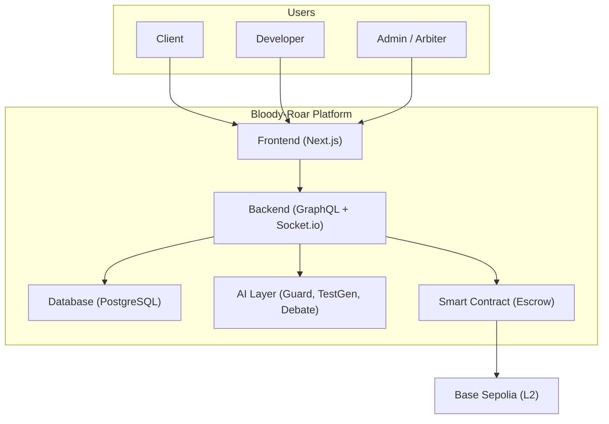
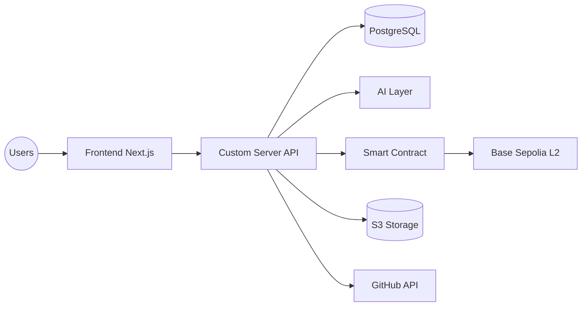
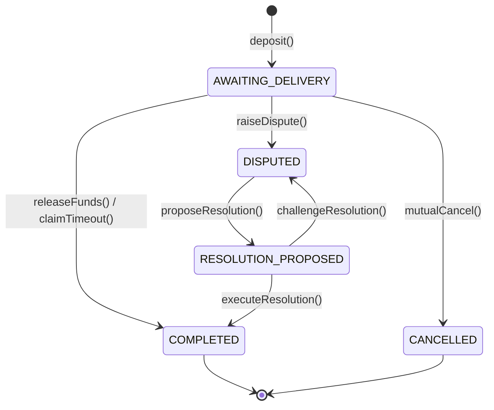

International School
Capstone Project 1
CMU-SE 450 – C1SE.42

Project Proposal
Version 1.0
Date: August 23rd, 2026

**Bloody-Roar: Decentralized Bounty Marketplace**

Submitted by
Nguyen Trong Khoi
Nguyen Huu Tam Kien
Do Van Hieu
Doan Thi Ngoc Han
Nguyen Thi Bao Tram

Approved by 
Le Kim Hoang

Proposal Review Panel Representative:	
													
		Name					Signature				Date

Capstone Project 1- Mentor:	
													
		Name					Signature				Date

# PROJECT INFORMATION

| Field | Description |
| --- | --- |
| **Project acronym** | Bloody-Roar |
| **Project Title** | Decentralized Bounty Marketplace |
| **Start Date** | 18 Aug 2026 |
| **End Date** | 30 Oct 2026 |
| **Lead Institution** | International School, Duy Tan University |
| **Project Mentor** | Le Kim Hoang |
| **Scrum master / Project Leader** | Nguyen Trong Khoi Email: trongkhoidev@gmail.com |
| **Partner Organization** | Duy Tan University |

**Team members**

| Name | Email | Role |
| --- | --- | --- |
| Nguyen Trong Khoi | trongkhoidev@gmail.com | Backend Lead & AI Engineer |
| Nguyen Huu Tam Kien | [TODO] | Smart Contract Engineer |
| Do Van Hieu | Dovanhieu2305@gmail.com | Backend Engineer |
| Doan Thi Ngoc Han | [TODO] | UI/UX Designer & QA |
| Nguyen Thi Bao Tram | [TODO] | UI/UX Designer & Tester |

# DOCUMENT APPROVALS
The following signatures are required for approval of this document.

**Nguyen Trong Khoi**
Student ID: 29211154867
Scrum Master / Backend Lead
Signature: ___________________ Date: ____________

**Nguyen Huu Tam Kien**
Student ID: [TODO]
Team Member
Signature: ___________________ Date: ____________

**Do Van Hieu**
Student ID: 29211153547
Team Member
Signature: ___________________ Date: ____________

**Doan Thi Ngoc Han**
Student ID: [TODO]
Team Member
Signature: ___________________ Date: ____________

**Nguyen Thi Bao Tram**
Student ID: [TODO]
Team Member
Signature: ___________________ Date: ____________

# REVISION HISTORY

| Version | Date | Comments | Author |
| --- | --- | --- | --- |
| 1.0 | August 23rd, 2026 | Initial Release | C1SE.42 Team |

# 1. Introduction

## 1.1. Purpose of Document
- The document provides an overview of the Bloody-Roar project, detailing its purpose, scope, and technical vision.
- It identifies the core business needs and the systemic problems in the freelance market related to trust and dispute resolution.
- It proposes comprehensive solutions, outlines the system architecture, and details project resources, schedules, and budgets.

## 1.2. Project Goal
Bloody-Roar is a decentralized bounty marketplace designed to replace trust in individuals or centralized organizations with trust in technology. In this ecosystem, Clients post tasks with bounties, and Developers apply to solve them. Payments are secured via a trustless smart contract escrow on Base Sepolia (L2). Furthermore, Artificial Intelligence is deeply integrated to protect sensitive information in chats, automatically generate verifiable test cases, and fairly resolve disputes through a Multi-Agent Debate system.

## 1.3. Objectives and Scope
**Objectives (SMART):**
- **M1:** Build a marketplace allowing Clients to post tasks and Developers to browse, apply, and be selected — completed before Sep 10, 2026.
- **M2:** Deploy trustless escrow on Base Sepolia (L2) — pass 14+ unit tests, deploy to testnet before Oct 5, 2026.
- **M3:** Integrate 5 AI modules (Guard, Test Gen, Dispute Assistant, Multi-Agent Debate, Model Router) — achieve >95% accuracy on a 50+ case test set.
- **M4:** Identity verification + GitHub integration — verified badge + auto-payment upon PR merge.
- **M5:** Real-time chat + notifications + admin/analytics — 100% room-based chat, notification delay < 1s.
- **M6:** Testing, CI/CD, production deployment — >80% coverage, deploy to production before Oct 30, 2026.

**Scope:**
- *Included:* Marketplace CRUD, Smart Contract Escrow (L2), Real-time chat (Socket.io), 5 AI modules, Thirdweb Auth + GitHub OAuth, Notifications, Admin Dashboard, Testing/Deploy.
- *Excluded:* Docker Sandbox, Advanced KYC (Sumsub/SBT), Mobile native app, Multi-chain support (Base Sepolia only for MVP).

# 2. Problem Definition
In the current freelance market, both Clients and Developers suffer from an "Asymmetric Trust" problem: "Who pays first?".
- If the Client pays first, the Developer might disappear or deliver poor code, resulting in financial loss.
- If the Client holds the funds until the end, the Developer fears being scammed after completing the work.

## 2.1. Business need
- Elimination of the high 10–20% intermediary fees charged by traditional platforms (Upwork, Fiverr, Freelancer), which reduces the Developer's actual income.
- A secure environment where funds are locked transparently without centralized control.
- A zero-stake entry barrier for developers, avoiding upfront cryptocurrency deposits that hinder students or new developers.
- Automated protection against accidental leaks of API keys, private keys, or PII in chat rooms (60% of developers express concerns about leaking secrets).
- Fair, unbiased, and prompt dispute resolution.

## 2.2. Solution
Bloody-Roar solves these issues by acting as a decentralized marketplace.
- **Smart Contract Escrow:** Uses lazy-deposit EIP-712 off-chain signatures to prevent upfront gas costs, locking funds securely on-chain only when a developer is hired.
- **AI Guard:** Automatically redacts sensitive data (API keys, PII) in real-time chats using 20+ Regex patterns and LLM scanning.
- **AI Test Generator:** Defines clear "Definition of Done" criteria by generating BDD test cases (given/when/then) directly from the bounty description.
- **AI Multi-Agent Debate:** Analyzes disputes via a 5-agent debate system to propose fair payout ratios to an Admin, removing bias from dispute resolution.
- **GitHub Integration:** Automatically triggers `releaseFunds` when a Pull Request is merged.

# 3. Current Status of Art

The team surveyed 4 groups of existing solutions in the market.

| Feature | Bloody-Roar | Upwork | Gitcoin | TalentLayer |
| --- | --- | --- | --- | --- |
| Escrow via Smart Contract | Yes | No | Yes | Yes |
| Lazy-Deposit (no upfront deposit) | Yes | No | Limited | Limited |
| Zero-Stake for Developers | Yes | No | Limited | Limited |
| AI Guard (protects secrets) | Yes | No | No | No |
| AI Test Case Generator | Yes | No | No | No |
| AI Dispute (Multi-Agent Debate) | Yes | No | No | No |
| Transaction Fee | L2 gas (very cheap) | 10–20% | 5% | Protocol dependent |

Our platform overcomes competitors' limitations by providing a truly trustless, low-fee environment augmented by cutting-edge AI pipelines, while giving developers full freedom without requiring them to deposit collateral.

# 4. Engineering Approach

## 4.1. System context diagram

## 4.2. System context description
- **Client (The Hirer):** Posts tasks with bounty details. Signs EIP-712 commitments off-chain. Selects developers, approves fund releases, and can raise disputes.
- **Developer (The Worker):** Browses and searches tasks. Applies for zero-stake bounties. Chats in real-time. Receives funds automatically upon Client approval or via a 30-day timeout claim.
- **Admin / Arbiter:** Reviews AI-generated dispute reports and Multi-Agent debate logs. Proposes resolution ratios and manages user bans/KYC statuses.
- **Backend Server:** A custom Next.js server integrating GraphQL Yoga and Socket.io for API and real-time communications.
- **AI Layer:** Utilizes Vercel AI SDK with models like Groq (llama-3.1-8b, llama-3.3-70b) and Gemini to redact secrets, generate test cases, and debate disputes.
- **Smart Contract:** An escrow contract (`BloodyRoarEscrow.sol`) deployed on Base Sepolia handles `deposit`, `releaseFunds`, `mutualCancel`, `claimTimeout`, and `executeResolution`.

## 4.3. Logical Architecture & State Machines

**Logical Architecture Diagram:**

**Smart Contract Escrow State Machine:**

## 4.4. Technical Constraints
**Technical to develop:**
- **Programming language:** TypeScript, JavaScript, Solidity 0.8.24.
- **Library/Framework:** Next.js 14+ App Router, Tailwind CSS v4, shadcn/ui, Vercel AI SDK, Hardhat, OpenZeppelin v5.
- **Technology:** GraphQL Yoga, Pothos, Socket.io, Thirdweb Auth (SIWE - Sign-In With Ethereum).
- **Database:** PostgreSQL 16 (with Prisma ORM), AWS S3 for storage.
- **Version Control System:** GitHub (Monorepo with Bun workspaces).
- **Team Management:** GitHub Projects, Discord.
- **Testing:** Vitest, Playwright E2E, Chai (for Smart Contracts).

**Environments:**
- **Internet Connection:** Required.
- **Operation System:** Modern web browsers (Chrome, Safari, Edge) - Mobile-first responsive design.

**Other Constraints:**
- **Resource:** 5 people.
- **Budget:** Limited (Relying heavily on free-tiers: Groq, Neon/Supabase, Cloudflare, Alchemy).
- **Time:** The project must be completed within 10 weeks (5 Sprints).

## 4.5. Potential Risks and Mitigation Strategies
| Risk | Severity | Mitigation Strategy |
| --- | --- | --- |
| Smart contract vulnerabilities (reentrancy, access control) | High | Use OpenZeppelin v5, 14+ unit tests, strict security audit, `pause()` circuit breaker. |
| Slow AI integration / low accuracy | High | Phased development with buffer, ModelRouter auto-fallback, AI only proposes and doesn't finalize. |
| Socket.io connection loss | Medium | Auth middleware, auto-reconnect, store chat history in DB, E2E testing. |
| Secrets / PII leaked in chat | High | 2-layer AI Guard (Regex + LLM), avoid hardcoding secrets, use environment variables. |

# 5. Tasks and Deliverables

| No. | Task name | Description |
| --- | --- | --- |
| 1. | **Sprint 0: Foundation** | Setup Bun Monorepo, Prisma schema (17 models), Next.js custom server, Hardhat environment, and design system. |
| 2. | **Sprint 1: Auth & Marketplace** | Implement Thirdweb SIWE login, issue CRUD, apply/assign flows, and Escrow smart contract with 14+ tests. |
| 3. | **Sprint 2: Escrow, Chat & AI** | Escrow E2E integration on-chain, Socket.io real-time chat, AI Guard (Regex + LLM) for secrets, and AI Test Gen. |
| 4. | **Sprint 3: Dispute & GitHub** | AI Multi-Agent Debate (5 agents), GitHub OAuth, GitHub App webhook for auto-payments, notifications, and analytics. |
| 5. | **Sprint 4: Polish & Deploy** | CI/CD (GitHub Actions), EAS reputation on-chain, contract audit, responsive UI polish, and production deployment on Railway/Fly.io. |

**Expected Outcomes / Deliverables:**
- **Application:** Production web app on Railway/Fly.io. Smart contract on Base Sepolia testnet. GraphQL API + Real-time Socket.io. 5 AI modules active.
- **Source Code:** Monorepo containing ~50 commits and ~15,000 LoC.
- **Technical Documentation:** PROPOSAL.md, PRODUCT_BACKLOG.md, API Docs, AI Architecture docs, README.
- **Media:** End-to-End flow demo video, AI Guard demo, and Dispute resolution demo.

# 6. Project Management

## 6.1. Cost/Budget for Project

| Full Name | Role | Salary Rate (USD/hour) |
| --- | --- | --- |
| Nguyen Trong Khoi | Scrum Master / Backend Lead | 2 |
| Nguyen Huu Tam Kien | Smart Contract Engineer | 2 |
| Do Van Hieu | Backend Engineer | 2 |
| Doan Thi Ngoc Han | UI/UX Designer & QA | 2 |
| Nguyen Thi Bao Tram | UI/UX Designer & Tester | 2 |

*Table 2. Cost person/hours*

| No | Criteria | Price | Total (USD) |
| --- | --- | --- | --- |
| 1 | Working hours (1050 hrs) | 2 | 2100 |
| 2 | Other cost (Cloud/AI) | 150 | 150 |
| | **Total** | | **2250** |

*Table 3. Total cost estimation*

| Description | Amount | Unit |
| --- | --- | --- |
| Number of members | 5 | Person |
| Number of working hours per day | 3 | Hours |
| The cost per hour per member | 2 | USD |
| The number of working days | 70 | Days (10 weeks) |

*Table 4. Description*
- *Explanation:* Amount of working hours = 5 members * 3 hours * 70 days = 1050 hours.

## 6.2. Tentative Schedule

### 6.2.1. Master Plan

| NO | Task Name | Duration | Start | Finish |
| --- | --- | --- | --- | --- |
| 1 | **Sprint 0: Foundation** | 14 days | 18 Aug 2026 | 31 Aug 2026 |
| 2 | **Sprint 1: Auth & Marketplace** | 14 days | 01 Sep 2026 | 14 Sep 2026 |
| 3 | **Sprint 2: Escrow, Chat & AI** | 14 days | 15 Sep 2026 | 28 Sep 2026 |
| 4 | **Sprint 3: Dispute & GitHub** | 14 days | 29 Sep 2026 | 12 Oct 2026 |
| 5 | **Sprint 4: Polish & Deploy** | 14 days | 13 Oct 2026 | 26 Oct 2026 |
| 6 | **Final Release & Defense** | 4 days | 27 Oct 2026 | 30 Oct 2026 |

### 6.2.3. Scrum Process
- **Scrum** is an iterative and incremental agile software development framework for managing software projects and product development.
- Scrum focuses on project management institutions where it is difficult to plan ahead.
- **Benefit of the methodology:**
  - Project can respond easily to change.
  - Problems are identified early via Daily Standups.
  - Customers get the most beneficial work first.
  - Work done will better meet the customer's needs.
  - Improved productivity and ability to maintain a predictable schedule for delivery.

# 7. Project Constraints 

| Constraint | Constraints Description | Guidelines for Acceptance |
| --- | --- | --- |
| **Economic** | The platform aims to be highly cost-effective compared to traditional platforms (10-20% fees). | Clients pay a minimal 2.5% fee on successful escrows. Developers pay absolutely nothing. Free-tier AI models (Groq) minimize operational costs. |
| **Environmental** | Web3 operations can be energy-intensive. | Deploying on Base Sepolia (L2) drastically reduces the carbon footprint and energy consumption compared to L1 Proof-of-Work chains. |
| **Ethical** | Ensuring user privacy and preventing data leaks in chats. Respecting user data. | AI Guard automatically redacts API keys, passwords, and PII from real-time messages. No raw secrets are logged in the database. |
| **Public health, safety** | Prolonged screen time can cause eye strain. | The application includes a modern UI with full Dark Mode support to protect users' vision during extended work hours. |
| **Social and Global** | Breaking down geographical and trust barriers in the global freelance economy. | Allows anyone with internet access and a Web3 wallet to work securely and get paid fairly, empowering individuals from developing nations. |
| **Cultural** | The platform targets a global audience. | UI is designed with scalable i18n principles for future localization into Vietnamese and other languages. Currently defaults to English. |
| **Sustainability** | The system must be easy to maintain, scale over time, and support multiple developers contributing simultaneously. | Built as a TypeScript Monorepo using Next.js and Prisma, ensuring strict type-safety, maintainability, code modularity, and high scalability. |

# 8. Conclusion
Bloody-Roar creates a secure, trustless environment that promises to revolutionize the freelance marketplace. By combining Smart Contract escrows with advanced Artificial Intelligence agents, the platform eliminates exorbitant intermediary fees, protects user privacy, and ensures fair, unbiased dispute resolutions. The project is expected to be completed within 10 weeks at an estimated effort cost of not more than $2250, providing a robust, highly competitive solution for clients and developers globally.

# 9. References
[1]. Schwaber, K., & Sutherland, J. (2020). The Scrum Guide. https://www.scrum.org/resources/scrum-guide
[2]. Vercel AI SDK Documentation. https://sdk.vercel.ai/docs
[3]. Ethereum Attestation Service (EAS). https://docs.attest.org
[4]. Du, Y., et al. (2023). Improving Factuality and Reasoning in Language Models through Multiagent Debate. arXiv:2305.14325.
[5]. OpenZeppelin Contracts v5. https://docs.openzeppelin.com/contracts/5.x
[6]. Prisma ORM Documentation. https://www.prisma.io/docs
[7]. GraphQL Yoga Documentation. https://the-guild.dev/graphql/yoga-server
[8]. Socket.io Documentation. https://socket.io/docs

# 10. Attachment
- Project Source Code Repository (GitHub)
- Figma UI/UX Design File
- Deployed Smart Contract Address (Base Sepolia)
