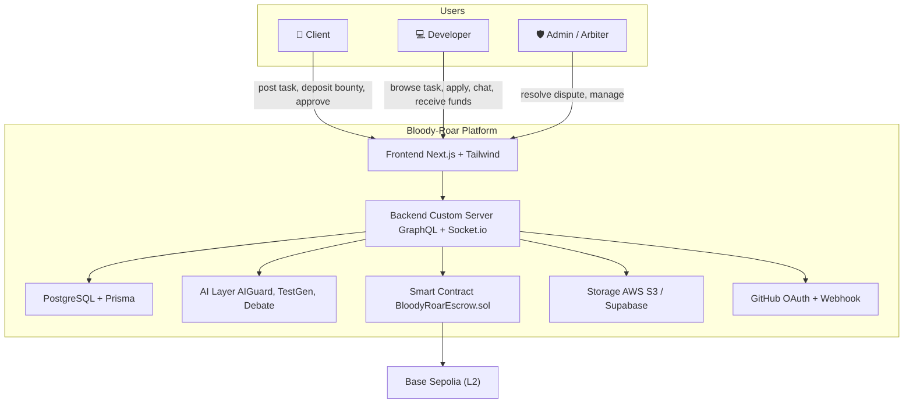
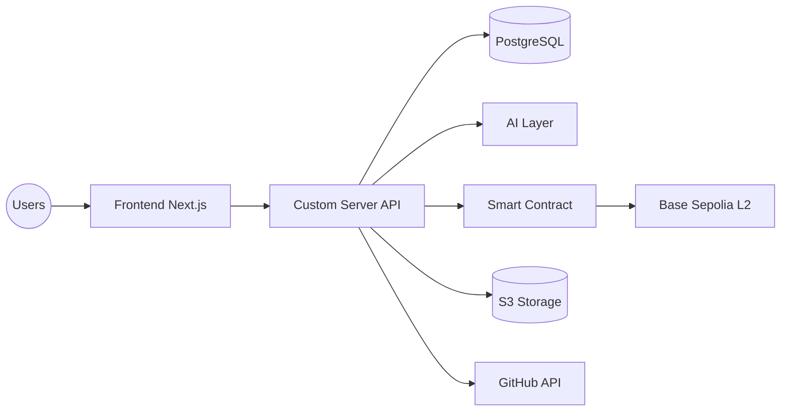
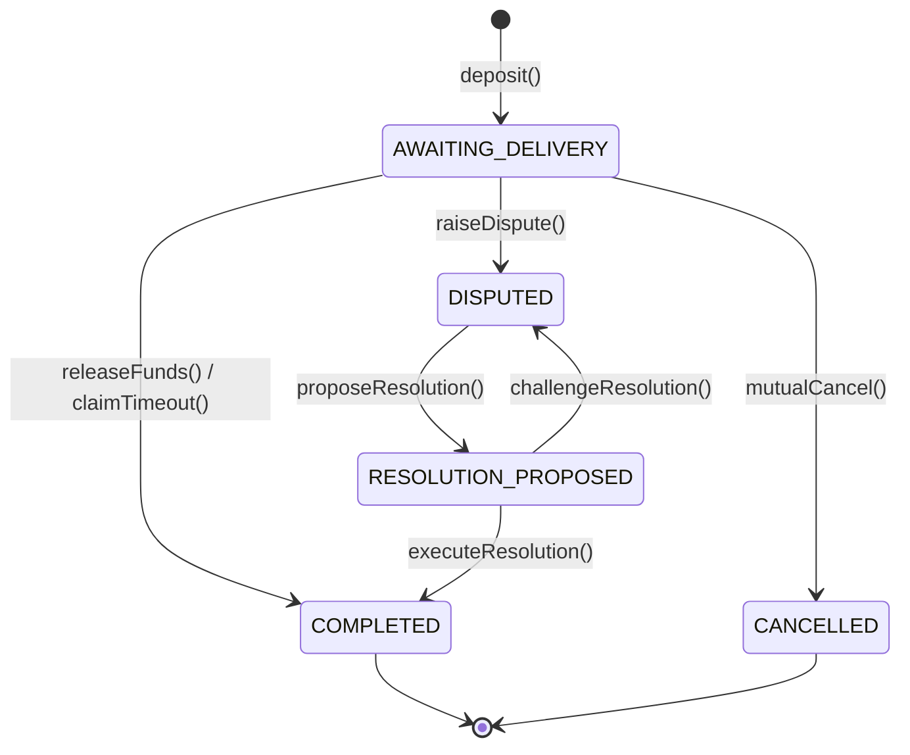
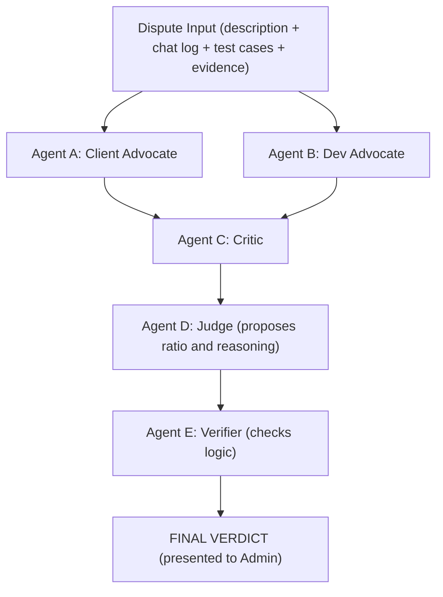

# CAPSTONE PROJECT 1 — PROPOSAL DOCUMENT
**Bloody-Roar — Decentralized Bounty Marketplace**
*(Replace Trust with Mathematics and Artificial Intelligence)*

**University:** International School, Duy Tan University
**Course:** Capstone Project 1 — CMU-SE 450 — C1SE.42
**Version:** 1.0
**Date:** 23/08/2026

**Supervisor:** Le Kim Hoang

## 1. Project Title
**Bloody-Roar — Decentralized Bounty Marketplace**
*Replace trust with mathematics and artificial intelligence.*
A smart solution for the freelance market, where trust in individuals or organizations is replaced by trust in technology — a smart contract escrow on Base Sepolia (L2) ensures payments, while AI protects sensitive information and resolves disputes.

## 2. Team Members
Team C1SE.42 consists of 5 members, with roles clearly divided by expertise:
- **Nguyen Trong Khoi**
  - Student ID: 29211154867
  - Email: trongkhoidev@gmail.com
  - Main Role: Backend Lead & AI Engineer (Smart Contract integration, AI Guard, AI Test Gen, AI Dispute Debate, Model Router).
- **Nguyen Huu Tam Kien**
  - Student ID: [TODO]
  - Email: [TODO]
  - Main Role: Smart Contract Engineer & Backend Support (Solidity, Hardhat, EIP-712, Oracle/Relayer, EAS Attestation, contract audit).
- **Do Van Hieu**
  - Student ID: 29211153547
  - Email: Dovanhieu2305@gmail.com
  - Main Role: Backend Engineer & Frontend Support (GraphQL, Auth middleware, Marketplace, Escrow, Dispute, Notifications, Analytics, GitHub OAuth).
- **Doan Thi Ngoc Han**
  - Student ID: [TODO]
  - Email: [TODO]
  - Main Role: UI/UX Designer & QA Engineer (Figma, shadcn/ui, responsive design, Playwright E2E).
- **Nguyen Thi Bao Tram**
  - Student ID: [TODO]
  - Email: [TODO]
  - Main Role: UI/UX Designer & Test Engineer (Component library, design tokens, Vitest unit/integration, accessibility).

## 3. Supervisor(s)
- **Full Name:** Le Kim Hoang
- **Department:** Information Technology — CMU-SE 450
- **Email:** lekimhoang@dtu.edu.vn
- **Co-supervisor from Enterprise:** None for MVP v1.

## 4. Problem Statement
**What difficulties are users/customers facing?**
In the current freelance market, both Clients and Developers face the "Who pays first?" problem — known as Asymmetric Trust:
- If the Client pays first → The Developer might disappear, deliver poor code, or fail to deliver → money is lost.
- If the Client holds the money until the end → The Developer fears being scammed: finishing the code but getting the job canceled and receiving nothing.

**Impact of this problem:**
- High intermediary fees of 10–20% on platforms like Upwork, Fiverr, and Freelancer — reducing the Developer's actual income.
- Disputes are resolved by centralized platforms → often biased, delayed, and lacking transparency.
- Many blockchain platforms require Developers to deposit 10–20% of the job's value → a barrier for students or new Developers.
- No protective mechanism if a Developer accidentally sends API keys / private keys / PII in the chat.

**Why did the team choose to solve this problem?**
Because this is a real-world problem with a clear economic impact, aligning perfectly with the team's Software Engineering and Information Security background. The team aims to experience full-stack development — from UX design, backend development, smart contract programming, to AI integration — within a single capstone project.

**Illustrated with Data:**
- The global freelance market reached ~$500 billion in 2024 (Statista). The 10–20% intermediary fee equals $50–100 billion "blown away" annually.
- 73% of freelancers have experienced a situation where a Client "ghosted" them after receiving the code (Upwork Community Survey 2023).
- 60% of developers express concerns about leaking secrets when communicating with Clients via chat (GitHub Security Survey).

## 5. Survey / Existing Solutions
The team surveyed 4 groups of existing solutions in the market:
1. **Centralized Freelance Platforms (Upwork, Fiverr, Freelancer)**
   - *Solution:* The platform holds money in escrow, charges 10–20% fees, and uses humans to resolve disputes.
   - *Bloody-Roar's Difference:* Escrow via smart contracts, extremely low L2 fees, fair AI-based dispute resolution.
2. **Blockchain Bounty Platforms (Gitcoin, Bounties Network)**
   - *Solution:* On-chain payments.
   - *Bloody-Roar's Difference:* Gitcoin focuses on quadratic funding. Bloody-Roar features AI Guard, AI Test Gen, and Multi-Agent Debate.
3. **Smart Contract Marketplaces (TalentLayer)**
   - *Solution:* A "build-on-top" protocol with a built-in reputation network.
   - *Bloody-Roar's Difference:* Bloody-Roar custom designs its own smart contracts and freely customizes its AI pipeline instead of relying on a third-party protocol.
4. **Standalone Anti-Sybil Solutions (Gitcoin Passport, Worldcoin)**
   - *Solution:* Identity reputation scoring.
   - *Bloody-Roar's Difference:* Planned for integration in the future; currently utilizing GitHub OAuth for the MVP.

**Table 1. Comparison of Existing Platforms**

| Feature | Bloody-Roar | Upwork | Gitcoin | TalentLayer |
| --- | --- | --- | --- | --- |
| Smart Contract Escrow | Yes | No | Yes | Yes |
| Lazy-Deposit (no upfront deposit) | Yes | No | Limited | Limited |
| Zero-Stake for Developers | Yes | No | Limited | Limited |
| AI Guard (protects secrets) | Yes | No | No | No |
| AI Test Case Generator | Yes | No | No | No |
| AI Dispute (Multi-Agent Debate) | Yes | No | No | No |
| Transaction Fee | L2 gas (very cheap) | 10–20% | 5% | Protocol dependent |

## 6. Objectives and Scope

**Objectives (SMART):**
- **M1:** Build a marketplace allowing Clients to post tasks and Developers to browse, apply, and be selected — completed before Sep 10, 2026.
- **M2:** Deploy trustless escrow on Base Sepolia (L2) — pass 14+ unit tests, deploy to testnet before Oct 5, 2026.
- **M3:** Integrate 5 AI modules (Guard, Test Gen, Dispute Assistant, Multi-Agent Debate, Model Router) — achieve >95% accuracy on a 50+ case test set.
- **M4:** Identity verification + GitHub integration — verified badge + auto-payment upon PR merge.
- **M5:** Real-time chat + notifications + admin/analytics — 100% room-based chat, notification delay < 1s.
- **M6:** Testing, CI/CD, production deployment — >80% coverage, deploy to production before Oct 30, 2026.

**Scope:**
- *Included:* Marketplace CRUD, Smart Contract Escrow (L2), Real-time chat (Socket.io), 5 AI modules, Thirdweb Auth + GitHub OAuth, Notifications, Admin Dashboard, Testing/Deploy.
- *Excluded:* Docker Sandbox, Advanced KYC (Sumsub/SBT), Mobile native app, Multi-chain support (Base Sepolia only for MVP).

## 7. Key Features & Requirements

**Key Features:**
1. **F1:** Web3 Wallet Login (SIWE) + profile updates + reputation score.
2. **F2:** Post/browse/search tasks, zero-stake apply, assign, cancel tasks.
3. **F3:** Smart Contract Escrow (EIP-712 sign, deposit, release, cancel, claim timeout, dispute, resolution, pause).
4. **F4:** Room-based real-time chat + file sharing (S3 presigned URLs).
5. **F5:** AI Guard to automatically redact API keys / PII in chats.
6. **F6:** AI Test Case Generator to auto-generate test cases from bounty descriptions.
7. **F7:** AI Dispute Assistant to resolve disputes via a 5-agent debate.

**Functional Requirements (FR):**
- **FR01 - Authentication:** MetaMask/WalletConnect login via Thirdweb, store JWT.
- **FR02 - Marketplace:** Client posts task, signs EIP-712. Developer applies with zero-stake.
- **FR03 - Escrow:** deposit, releaseFunds (takes 2.5% fee), mutualCancel, claimTimeout (30 days), raiseDispute.
- **FR04 - Real-time Chat:** Independent rooms `task:{id}`, text and file support.
- **FR05 - AI Guard:** 20+ Regex patterns + LLM scanning to redact sensitive information.
- **FR06 - AI Test Gen:** Generate BDD test cases (given/when/then) as acceptance criteria.
- **FR07 - Dispute Resolution:** Either party raises a dispute, AI analyzes, Admin finalizes the payout ratio.
- **FR08 - GitHub Auth:** GitHub webhook `pull_request.merged` auto-triggers releaseFunds.
- **FR09 - Notifications:** Real-time alerts for new applicants, disputes, and messages.
- **FR10 - Admin & Analytics:** General statistics, user/dispute management.

**Non-Functional Requirements (NFR):**
- **NFR01 - Performance:** GraphQL API < 500ms, Chat delivery < 200ms.
- **NFR02 - Security:** OpenZeppelin v5 (Pausable, ReentrancyGuard, Ownable). AI Guard does not log raw secrets.
- **NFR03 - Usability:** Mobile-first responsive design, axe-core audit.
- **NFR04 - Scalability:** Modular monorepo architecture (User, Issue, Chat, Escrow...).
- **NFR05 - Maintainability:** Type-safe, ESLint, Prettier.

## 8. Constraints and Assumptions
**Constraints:**
- *Time:* 10 weeks (5 Sprints × 2 weeks).
- *Personnel:* 5 part-time members.
- *Budget:* Limited, prioritizing free-tier services (Groq, Neon, Alchemy, Cloudflare).
- *Network:* Base Sepolia testnet.
- *Browser:* Modern Chrome/Safari.

**Assumptions:**
- Users have a Web3 wallet and an Internet connection.
- GitHub App webhooks run stably; Groq's free-tier (14,400 req/day) is sufficient for the MVP.
- AI Guard False Positive (FP) rate < 3%, False Negative (FN) rate < 1%.
- Users understand and accept that "AI only proposes, Admin finalizes the verdict".

## 9. Target Users / Stakeholders
- **Client:** Startup founders, PMs, individuals needing to outsource tasks. Benefit: No fear of losing money, AI-generated test cases for clear requirements.
- **Developer:** Students, freelancers. Benefit: Zero-stake, funds safely locked, 30-day auto-claim feature.
- **Admin / Arbiter:** Platform operators. Review AI reports to finalize disputes.

## 10. Technology Stack
- **Frontend:** Next.js 14+ App Router, Tailwind CSS v4, shadcn/ui.
- **Backend:** Next.js Custom Server, GraphQL Yoga, Pothos, Thirdweb Auth, Socket.io.
- **Database & Storage:** PostgreSQL 16, Prisma ORM, AWS S3.
- **AI / ML:** Vercel AI SDK, Groq (llama-3.1-8b, llama-3.3-70b), Gemini.
- **Blockchain:** Solidity 0.8.24, Hardhat, OpenZeppelin v5, Base Sepolia L2, EAS (Ethereum Attestation Service).
- **DevOps/Testing:** Bun, GitHub Actions, Railway, Vitest, Playwright E2E.

## 11. Methodology & Development Plan
- **Development Model:** Agile Scrum (5 Sprints × 2 weeks = 10 weeks).
- **Sprint Plan:**
  - *Sprint 0:* Foundation (Monorepo, Prisma, Next.js server, Hardhat, Design).
  - *Sprint 1:* Auth + Marketplace (Web3 login, CRUD, Apply, Escrow contract tests).
  - *Sprint 2:* Escrow + Chat + AI (Escrow E2E, Socket.io, AI Guard, AI Test Gen).
  - *Sprint 3:* Dispute + GitHub Auth + Analytics (AI Debate, Webhook, Notifications, Dashboards).
  - *Sprint 4:* Polish + Deploy (CI/CD, EAS reputation, audit, deploy production).

## 12. System Architecture Overview

### 12.1. Architecture Description
Bloody-Roar utilizes a Monorepo Modular Monolith architecture.
- **Frontend Layer:** Next.js App Router (RSC + Client Components).
- **Backend Layer:** Next.js Custom Server paired with GraphQL Yoga + Socket.io.
- **Data Layer:** PostgreSQL (Prisma) + AWS S3 + Base Sepolia blockchain.

### 12.2. System Context Diagram

### 12.3. Logical Architecture Diagram

### 12.4. Smart Contract Escrow State Machine

### 12.5. AI Multi-Agent Debate Architecture

## 13. Potential Risks and Mitigation Strategies

**Table 2. Risk Management Plan**

| Risk | Severity | Mitigation Strategy |
| --- | --- | --- |
| Smart contract vulnerabilities (reentrancy, access control) | High | Use OpenZeppelin v5, 14+ unit tests, security audit, `pause()` circuit breaker. |
| Slow AI integration / low accuracy | High | Phased development with buffer, ModelRouter auto-fallback, AI only proposes and doesn't finalize. |
| Socket.io connection loss | Medium | Auth middleware, auto-reconnect, store chat history in DB, E2E testing. |
| L2 Gas fee fluctuations | Low | Base Sepolia is extremely cheap; monitor gas oracle. |
| 10-week schedule delay | High | 2-week Scrum sprints, prioritize P0 features, drop non-essential P1/P2 features for MVP. |
| Secrets / PII leaked in chat | High | 2-layer AI Guard (Regex + LLM), avoid hardcoding secrets, use environment variables. |

## 14. Expected Outcomes / Deliverables
- **Application:** Production web app on Railway/Fly.io. Smart contract on Base Sepolia testnet. GraphQL API + Real-time Socket.io. 5 AI modules (Guard, TestGen, Debate, Analyzer, Router).
- **Source Code:** Monorepo (Next.js, Hardhat, Prisma). ~50 commits, ~15,000 LoC.
- **Technical Documentation:** PROPOSAL.md, PRODUCT_BACKLOG.md, API Docs, AI Architecture docs, README.
- **Video Demo:** End-to-End flow demo, AI Guard, and Dispute resolution process.
- **Final Report:** 30+ page capstone report, 15–20 slide defense presentation.

## 15. References
- [1] Schwaber, K., & Sutherland, J. (2020). The Scrum Guide. https://www.scrum.org/resources/scrum-guide
- [2] Vercel. (2024). Vercel AI SDK Documentation. https://sdk.vercel.ai/docs
- [3] Ethereum Attestation Service (EAS). (2024). EAS Documentation. https://docs.attest.org
- [4] Du, Y., et al. (2023). Improving Factuality and Reasoning in Language Models through Multiagent Debate. arXiv:2305.14325.
- [5] OpenZeppelin. (2024). OpenZeppelin Contracts v5. https://docs.openzeppelin.com/contracts/5.x
- [6] Prisma. (2024). Prisma ORM Documentation. https://www.prisma.io/docs
- [7] GraphQL Yoga. (2024). GraphQL Yoga Documentation. https://the-guild.dev/graphql/yoga-server
- [8] Socket.io. (2024). Socket.io Documentation. https://socket.io/docs
