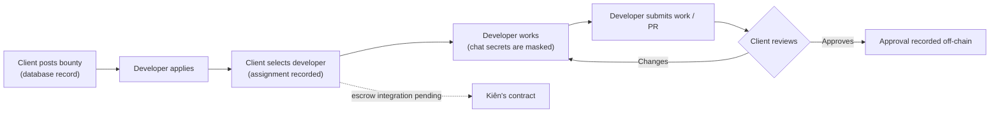
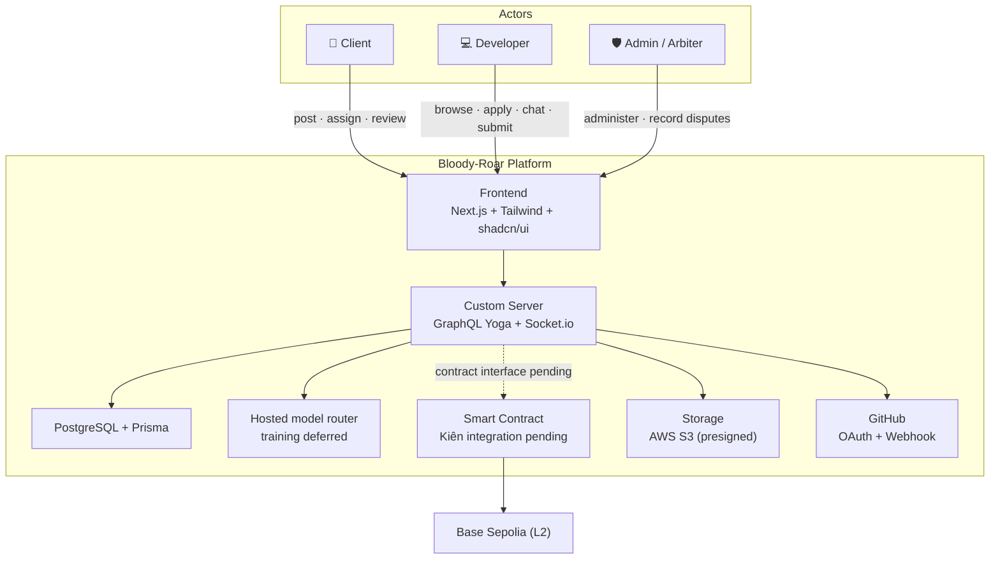
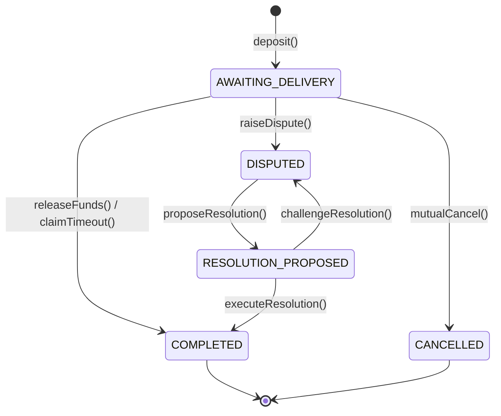

# 🩸 Bloody-Roar — Decentralized Bounty Marketplace

> *"Replace trust with mathematics and artificial intelligence."*

[](https://bun.sh)
[](https://nextjs.org)
[](https://the-guild.dev/graphql/yoga-server)
[](https://www.prisma.io)
[](https://soliditylang.org)
[](https://sepolia.basescan.org)
[](./LICENSE)

**Bloody-Roar** is a decentralized bounty marketplace. The current app supports wallet sign-in, task discovery and posting, applications, client selection of a developer, private persistent chat, work submissions, profile/GitHub verification, notifications, and off-chain dispute records. On-chain escrow and payout actions are waiting for Kiên's contract interface. AI features call hosted models through a replaceable model router; model training and self-hosting are deferred.

> 🔗 **Network:** Base Sepolia is the target network (`chainId: 84532`). The web app currently records bounties off-chain and does not submit escrow transactions.

---

## Table of Contents

1. [The Problem](#the-problem)
2. [How It Works](#how-it-works)
3. [Key Features](#key-features)
4. [System Architecture](#system-architecture)
5. [Smart Contract Escrow](#smart-contract-escrow)
6. [Tech Stack](#tech-stack)
7. [Project Structure](#project-structure)
8. [Getting Started](#getting-started)
9. [Smart Contracts](#smart-contracts)
10. [Development Guide](#development-guide)
11. [Available Scripts](#available-scripts)
12. [Data Model](#data-model)
13. [License](#license)

---

## The Problem

Freelance markets face a fundamental **"asymmetric trust"** problem: *who pays first?*

| Client pays upfront                                                     | Client holds payment until the end                                                       |
| ----------------------------------------------------------------------- | ---------------------------------------------------------------------------------------- |
| Developer may disappear or deliver poor work — the client loses money. | Developer fears the client will "ghost", take the code, cancel the job, and pay nothing. |

Traditional platforms (Upwork, Fiverr, Freelancer) solve this by acting as a **centralized escrow middleman** — which introduces high fees (10–20%), centralized power over disputes, and zero transparency.

**Bloody-Roar's intended answer:** use wallet identity, clear acceptance criteria, and an escrow contract. This implementation covers the marketplace and off-chain workflow; contract calls remain pending Kiên's interface, and AI outputs are advisory only.

---

## How It Works

Three actors drive the platform:

| Role                                    | Does                                                   | Guaranteed by                                                     |
| --------------------------------------- | ------------------------------------------------------ | ----------------------------------------------------------------- |
| **Client** (Người thuê)        | Posts a bounty, selects a developer, reviews submissions | Database records until escrow is integrated |
| **Developer** (Lập trình viên) | Applies, chats, submits work or a GitHub PR              | SIWE wallet identity; payout is not active yet |
| **Admin / Arbiter** (Trọng tài) | Reviews disputes and records a proposed resolution      | Off-chain record; contract execution is pending |

The core lifecycle:



---

## Key Features

### 🔒 Smart-Contract Escrow — integration pending

The Prisma model and planned user flow are documented, but the app does not send escrow or payout transactions yet. Those controls will be connected after the contract interface and deployment details are supplied by Kiên.

### 💤 Lazy-Deposit — planned

The task form stores a whitelisted token and bounty amount in the database. EIP-712 commitments and deposits are not active yet.

### 🤝 Zero-Stake (for Developers)

No 10–20% collateral required. Verified identity (GitHub OAuth, later EAS attestations) acts as reputation collateral instead of capital.

### 🛡️ Secret masking in chat

The real-time chat path runs deterministic secret/PII rules first, then asks a configured hosted model to suggest additional exact redactions before persistence and broadcast. If the model is unavailable, the local rules still apply. Provider calls are logged with hashes and usage metadata, not raw messages. File contents are not scanned.

### 🧪 AI Test-Case Generator

Clients can generate BDD-style acceptance-test drafts for an open task, edit them, and approve them before developers see them. AI suggestions are not executed tests and do not alter the task automatically.

### ⚖️ Disputes — off-chain records

Task participants can create a dispute record. An administrator can ask a hosted model to summarize task, chat, submission, and acceptance-test evidence, review the suggested client-refund ratio, then manually record a proposal and challenge window. AI does not resolve the dispute or execute a payment.

### 👤 Trust & Reputation

Wallet identity is verified with SIWE. GitHub OAuth links a verified account; EAS attestations and Gitcoin Passport remain roadmap items.

---

## System Architecture



---

## Smart Contract Escrow

The existing contract code and database mirror are separate from the web flows implemented here. The marketplace currently does not submit transactions; connect those flows after Kiên provides the ABI, deployed address, and event interface.

The planned contract state machine is:

`BloodyRoarEscrow.sol` manages every bounty through a five-state machine:

| State                   | Definition                | Transition                                                      |
| ----------------------- | ------------------------- | --------------------------------------------------------------- |
| `AWAITING_DELIVERY`   | Task active, funds locked | Client calls`deposit()` (requires verified worker)            |
| `COMPLETED`           | Funds distributed         | Client`releaseFunds()` **or** 30-day `claimTimeout()` |
| `CANCELLED`           | Mutual cancel, refunded   | Both parties approve`mutualCancel()`                          |
| `DISPUTED`            | Funds frozen              | Either party calls`raiseDispute()`                            |
| `RESOLUTION_PROPOSED` | Arbiter proposed a split  | `proposeResolution()` → 24h timelock                         |



Safety requirements for the contract are tracked in the contract project. They are not active in the web app until the integration is complete.

---

## Tech Stack

| Layer           | Technology                                                                                |
| --------------- | ----------------------------------------------------------------------------------------- |
| Package Manager | **Bun** (monorepo workspaces)                                                       |
| Frontend        | **Next.js 14** App Router + Custom Server                                           |
| Styling         | **Tailwind CSS v4** + **shadcn/ui**                                           |
| API             | **GraphQL Yoga** + **Pothos** (code-first)                                    |
| Auth            | **Thirdweb Auth** (SIWE / JWT)                                                      |
| Database        | **PostgreSQL** + **Prisma**                                                   |
| State / Forms   | **Zustand** + **TanStack Query** · **React Hook Form** + **Zod** |
| Real-time       | **Socket.io**                                                                       |
| Guard           | Local rules + optional hosted-model scan (training deferred) |
| Storage         | **AWS S3** (presigned URLs) / Supabase                                              |
| Blockchain      | **Solidity 0.8.24** + **Hardhat** (Base Sepolia L2)            |
| Testing         | **Vitest** + **Playwright** + **Hardhat/Chai**                          |
| Logging         | **Pino**                                                                            |

---

## Project Structure

```
capstone1/
├── apps/
│   ├── web/                        # Next.js app (custom server)
│   │   ├── server.ts               # Entry: GraphQL + Socket.io
│   │   └── src/
│   │       ├── app/                # App Router pages
│   │       ├── graphql/            # Pothos schema + context
│   │       │   ├── schema.ts       # Builder + root types (hello query)
│   │       │   ├── context.ts      # DB + auth context (JWT stub)
│   │       │   └── modules/        # Feature modules (Sprint 1+)
│   │       ├── socket/             # Socket.io handlers
│   │       ├── ai/prompts/         # Prompt templates (Guard, Test Gen)
│   │       └── lib/                # Pino logger, helpers
│   └── contracts/                  # Hardhat suite
│       ├── contracts/BloodyRoarEscrow.sol
│       ├── test/BloodyRoarEscrow.test.ts
│       └── scripts/deploy.ts
├── packages/
│   ├── database/                   # Prisma client + schema + seed
│   │   ├── prisma/schema.prisma    # 17 models · 12 enums
│   │   └── src/index.ts            # Singleton Prisma client
│   └── shared/                     # Shared types, constants, utils
│       └── src/{types,constants,utils}
├── docker-compose.yml              # PostgreSQL
├── .env.example                    # Environment template
└── package.json                    # Bun workspaces root
```

---

## Getting Started

### 1. Prerequisites

- [Bun](https://bun.sh) ≥ 1.1.x
- [Docker Desktop](https://www.docker.com/products/docker-desktop/) (PostgreSQL)
- Node.js ≥ 20 (Hardhat)

### 2. Clone & Install

```bash
git clone <repo-url> && cd capstone1
bun install
```

### 3. Environment Setup

```bash
cp .env.example .env
# Fill in at minimum:
#   DATABASE_URL  — default works with Docker Compose
#   AUTH_PRIVATE_KEY — Thirdweb Auth signing key; keep it private
#   NEXT_PUBLIC_APP_URL — http://localhost:4000 for local development
```

### 4. Start the Database and App

```bash
./start.sh
```

The starter script exports the root `.env` to Prisma commands, waits for the local database, applies migrations, seeds development records, and then runs `bun run dev`. If you manage those services yourself, export the root `.env` before running database commands.

| Endpoint           | URL                               |
| ------------------ | --------------------------------- |
| App                | http://localhost:4000             |
| GraphQL Playground | http://localhost:4000/api/graphql |
| Health             | http://localhost:4000/api/health  |

`GITHUB_CLIENT_ID`, `GITHUB_CLIENT_SECRET`, `GITHUB_CALLBACK_URL`, and a random 32-byte `GITHUB_TOKEN_ENCRYPTION_KEY` enable GitHub linking. AWS credentials enable S3 uploads; local development uses an authenticated file-upload fallback. Marketplace flows and secret masking do not need AI provider keys. Run `bun run --cwd apps/web test` for the frontend/unit tests.

---

## Smart Contracts

```bash
cd apps/contracts
bun install

bun run compile           # hardhat compile
bun run test              # hardhat test
bun run node              # start local node (http://127.0.0.1:8545)
bun run deploy:local      # deploy to localhost

# Deploy to Base Sepolia Testnet (current target)
bun run deploy:base-sepolia    # npx hardhat run scripts/deploy.ts --network baseSepolia

# Deploy to Ethereum Mainnet (production — Sprint 4)
bun run deploy:mainnet    # npx hardhat run scripts/deploy.ts --network mainnet
```

> Set `BASE_SEPOLIA_RPC_URL` + `DEPLOYER_PRIVATE_KEY` in `.env` before deploying to Base Sepolia.

---

## Development Guide

### Adding a GraphQL Module (Sprint 1+)

1. Create `apps/web/src/graphql/modules/{feature}/`.
2. Add `{feature}.module.ts` with Pothos types + queries + mutations.
3. Import it in `src/graphql/schema.ts` (uncomment the corresponding line).

```typescript
// apps/web/src/graphql/modules/user/user.module.ts
import { builder } from "../../schema";

const UserObject = builder.prismaObject("User", {
  fields: (t) => ({
    id: t.exposeID("id"),
    name: t.exposeString("name", { nullable: true }),
    walletAddress: t.exposeString("walletAddress"),
  }),
});

builder.queryField("me", (t) =>
  t.prismaField({
    type: UserObject,
    nullable: true,
    resolve: async (query, _root, _args, ctx) =>
      ctx.user
        ? ctx.db.user.findUnique({ ...query, where: { id: ctx.user.id } })
        : null,
  })
);
```

### Database Changes (Prisma)

```bash
# Edit packages/database/prisma/schema.prisma, then:
bun run db:migrate    # create + apply migration
bun run db:generate   # regenerate Prisma client
```

### shadcn/ui (Sprint 0 — UI setup)

```bash
cd apps/web
bunx shadcn@latest init
bunx shadcn@latest add button input select dialog card table badge tabs toast dropdown-menu avatar skeleton
```

---

## Available Scripts

| Command                       | Description                       |
| ----------------------------- | --------------------------------- |
| `bun run dev`               | Start Next.js custom server (dev) |
| `bun run build`             | Build Next.js for production      |
| `bun run start`             | Start the production server       |
| `bun run lint`              | Run ESLint                        |
| `bun run typecheck`         | Run TypeScript type checking      |
| `bun run format`            | Format with Prettier              |
| `bun run db:generate`       | Regenerate Prisma client          |
| `bun run db:migrate`        | Run Prisma migrations             |
| `bun run db:seed`           | Seed database with sample data    |
| `bun run db:studio`         | Open Prisma Studio                |
| `bun run db:push`           | Push schema without migration     |
| `bun run contracts:compile` | Compile smart contracts           |
| `bun run contracts:test`    | Run Hardhat tests                 |
| `bun run contracts:deploy`  | Deploy contracts to localhost     |

---

## Data Model

17 Prisma models (Sprint 0, complete):

| Model            | Description                                                          |
| ---------------- | -------------------------------------------------------------------- |
| `User`         | Client / Developer / Admin accounts (wallet, GitHub KYC, reputation) |
| `Session`      | JWT Session management                                               |
| `Issue`        | Bounty tasks posted by clients                                       |
| `Application`  | Developer applications to issues                                     |
| `Token`        | Supported ERC-20 tokens (e.g. USDT)                                  |
| `Escrow`       | On-chain escrow state mirrored in DB                                 |
| `Transaction`  | Blockchain transaction log                                           |
| `Message`      | Chat messages (AI Guard aware)                                       |
| `Attachment`   | File attachments in chat and issues                                  |
| `AILog`        | Audit log of AI actions and guard results                            |
| `Submission`   | Developer task submissions                                           |
| `Review`       | Client review of submissions                                         |
| `Dispute`      | Formal disputes with AI analysis                                     |
| `TestCase`     | AI-generated test cases per issue                                    |
| `Attestation`  | On-chain identity/reputation attestations                            |
| `Notification` | Real-time notification records                                       |
| `AdminLog`     | Audit log for admin actions                                          |

---

## License

Internal use only
