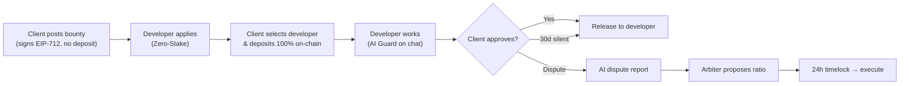
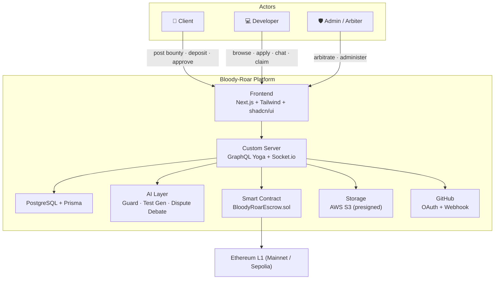
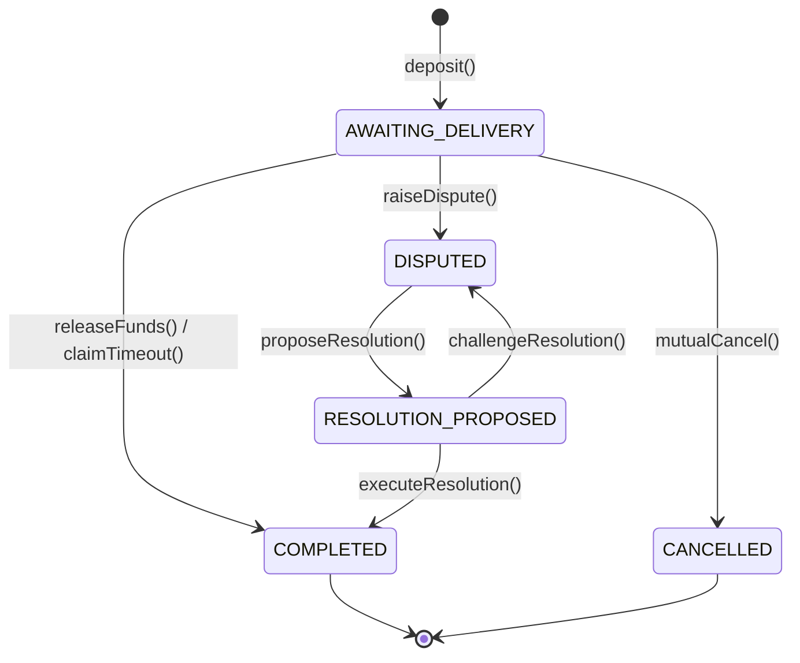

# 🩸 Bloody-Roar — Decentralized Bounty Marketplace

> *"Replace trust with mathematics and artificial intelligence."*

[](https://bun.sh)
[](https://nextjs.org)
[](https://the-guild.dev/graphql/yoga-server)
[](https://www.prisma.io)
[](https://soliditylang.org)
[](https://sepolia.etherscan.io)
[](./LICENSE)

**Bloody-Roar** is a *trustless* freelance marketplace where a **Client** posts a bug/feature bounty with a USDT reward, a **Developer** applies and delivers the work, and **payment is guaranteed by a smart-contract escrow** on **Ethereum L1** — while **AI** protects secrets in chat, generates acceptance test cases, and assists with dispute resolution. No trust required — only code and math.

> 🔗 **Network:** Currently deployed on **Ethereum Sepolia Testnet** (`chainId: 11155111`). Production target: Ethereum Mainnet.

---

## Table of Contents

1. [The Problem](#the-problem)
2. [How It Works](#how-it-works)
3. [Key Features](#key-features)
4. [System Architecture](#system-architecture)
5. [Smart Contract Escrow](#smart-contract-escrow)
6. [Tech Stack](#tech-stack)
7. [Project Structure](#project-structure)
8. [Getting Started](#getting-started)
9. [Smart Contracts](#smart-contracts)
10. [Development Guide](#development-guide)
11. [Available Scripts](#available-scripts)
12. [Data Model](#data-model)
13. [License](#license)

---

## The Problem

Freelance markets face a fundamental **"asymmetric trust"** problem: *who pays first?*

| Client pays upfront                                                     | Client holds payment until the end                                                       |
| ----------------------------------------------------------------------- | ---------------------------------------------------------------------------------------- |
| Developer may disappear or deliver poor work — the client loses money. | Developer fears the client will "ghost", take the code, cancel the job, and pay nothing. |

Traditional platforms (Upwork, Fiverr, Freelancer) solve this by acting as a **centralized escrow middleman** — which introduces high fees (10–20%), centralized power over disputes, and zero transparency.

**Bloody-Roar's answer:** replace *trust in people/organizations* with *trust in technology* — a **smart-contract escrow** that holds funds transparently and an **AI layer** that verifies code and arbitrates disputes.

---

## How It Works

Three actors drive the platform:

| Role                                    | Does                                                   | Guaranteed by                                                     |
| --------------------------------------- | ------------------------------------------------------ | ----------------------------------------------------------------- |
| **Client** (Người thuê)        | Posts a bounty, selects a developer, approves delivery | Smart-contract escrow — funds can't be withdrawn without consent |
| **Developer** (Lập trình viên) | Applies, delivers the fix, gets paid                   | 30-day auto-claim if the client goes silent                       |
| **Admin / Arbiter** (Trọng tài) | Reviews disputes, proposes a payout ratio              | 24h challenge timelock + on-chain audit trail                     |

The core lifecycle:



---

## Key Features

### 🔒 Smart-Contract Escrow

Funds live in `BloodyRoarEscrow.sol`, not with the platform. Payouts are automatic and auditable on-chain.

### 💤 Lazy-Deposit (for Clients)

Clients post a bounty by signing an **off-chain EIP-712 commitment** (no gas). 100% of the bounty is only locked on-chain when they *actually select a developer*.

### 🤝 Zero-Stake (for Developers)

No 10–20% collateral required. Verified identity (GitHub OAuth, later EAS attestations) acts as reputation collateral instead of capital.

### 🛡️ AI Guard

A two-layer (regex + LLM) scanner masks API keys, private keys, and PII in real-time chat and uploads before they are broadcast.

### 🧪 AI Test-Case Generator

When a client posts a bounty, AI generates BDD test cases (`given/when/then`) to define *"done"* upfront — preventing scope disputes.

### ⚖️ AI Dispute Assistant

On dispute, a **multi-agent debate** (Client Advocate, Dev Advocate, Critic, Judge, Verifier) analyzes chat, code, and commits to propose a fair payout ratio — the human arbiter only approves.

### 👤 Trust & Reputation (roadmap)

GitHub OAuth verified badge (MVP) → EAS on-chain attestations (v1.5) → Gitcoin Passport anti-Sybil (v2).

---

## System Architecture



---

## Smart Contract Escrow

`BloodyRoarEscrow.sol` manages every bounty through a five-state machine:

| State                   | Definition                | Transition                                                      |
| ----------------------- | ------------------------- | --------------------------------------------------------------- |
| `AWAITING_DELIVERY`   | Task active, funds locked | Client calls`deposit()` (requires verified worker)            |
| `COMPLETED`           | Funds distributed         | Client`releaseFunds()` **or** 30-day `claimTimeout()` |
| `CANCELLED`           | Mutual cancel, refunded   | Both parties approve`mutualCancel()`                          |
| `DISPUTED`            | Funds frozen              | Either party calls`raiseDispute()`                            |
| `RESOLUTION_PROPOSED` | Arbiter proposed a split  | `proposeResolution()` → 24h timelock                         |



Safety features: OpenZeppelin `Pausable` + `ReentrancyGuard` + `Ownable`, a 2.5% platform fee, a 30-day claim timeout, and a 24-hour challenge window that protects against a compromised arbiter. Contracts are deployed on **Ethereum Mainnet** (production) and **Sepolia** (testnet).

---

## Tech Stack

| Layer           | Technology                                                                                |
| --------------- | ----------------------------------------------------------------------------------------- |
| Package Manager | **Bun** (monorepo workspaces)                                                       |
| Frontend        | **Next.js 14** App Router + Custom Server                                           |
| Styling         | **Tailwind CSS v4** + **shadcn/ui**                                           |
| API             | **GraphQL Yoga** + **Pothos** (code-first)                                    |
| Auth            | **Thirdweb Auth** (SIWE / JWT)                                                      |
| Database        | **PostgreSQL** + **Prisma**                                                   |
| State / Forms   | **Zustand** + **TanStack Query** · **React Hook Form** + **Zod** |
| Real-time       | **Socket.io**                                                                       |
| AI              | **Vercel AI SDK** (Groq + Gemini free + OpenAI fallback)                            |
| Storage         | **AWS S3** (presigned URLs) / Supabase                                              |
| Blockchain      | **Solidity 0.8.24** + **Hardhat** (Ethereum L1: Mainnet / Sepolia)            |
| Testing         | **Vitest** + **Playwright** + **Hardhat/Chai**                          |
| Logging         | **Pino**                                                                            |

---

## Project Structure

```
capstone1/
├── apps/
│   ├── web/                        # Next.js app (custom server)
│   │   ├── server.ts               # Entry: GraphQL + Socket.io
│   │   └── src/
│   │       ├── app/                # App Router pages
│   │       ├── graphql/            # Pothos schema + context
│   │       │   ├── schema.ts       # Builder + root types (hello query)
│   │       │   ├── context.ts      # DB + auth context (JWT stub)
│   │       │   └── modules/        # Feature modules (Sprint 1+)
│   │       ├── socket/             # Socket.io handlers
│   │       ├── ai/prompts/         # Prompt templates (Guard, Test Gen)
│   │       └── lib/                # Pino logger, helpers
│   └── contracts/                  # Hardhat suite
│       ├── contracts/BloodyRoarEscrow.sol
│       ├── test/BloodyRoarEscrow.test.ts
│       └── scripts/deploy.ts
├── packages/
│   ├── database/                   # Prisma client + schema + seed
│   │   ├── prisma/schema.prisma    # 10 models · 7 enums
│   │   └── src/index.ts            # Singleton Prisma client
│   └── shared/                     # Shared types, constants, utils
│       └── src/{types,constants,utils}
├── docker-compose.yml              # PostgreSQL
├── .env.example                    # Environment template
└── package.json                    # Bun workspaces root
```

---

## Getting Started

### 1. Prerequisites

- [Bun](https://bun.sh) ≥ 1.1.x
- [Docker Desktop](https://www.docker.com/products/docker-desktop/) (PostgreSQL)
- Node.js ≥ 20 (Hardhat)

### 2. Clone & Install

```bash
git clone <repo-url> && cd capstone1
bun install
```

### 3. Environment Setup

```bash
cp .env.example .env
# Fill in at minimum:
#   DATABASE_URL  — default works with Docker Compose
#   JWT_SECRET    — any random string ≥ 32 chars
```

### 4. Start Database

```bash
docker compose up -d
bun run db:generate
bun run db:migrate
bun run db:seed
```

### 5. Start Development Server

```bash
bun run dev
```

| Endpoint           | URL                               |
| ------------------ | --------------------------------- |
| App                | http://localhost:3000             |
| GraphQL Playground | http://localhost:3000/api/graphql |
| Health             | http://localhost:3000/api/health  |

---

## Smart Contracts

```bash
cd apps/contracts
bun install

bun run compile           # hardhat compile
bun run test              # hardhat test
bun run node              # start local node (http://127.0.0.1:8545)
bun run deploy:local      # deploy to localhost

# Deploy to Ethereum Sepolia Testnet (current target)
bun run deploy:sepolia    # npx hardhat run scripts/deploy.ts --network sepolia

# Deploy to Ethereum Mainnet (production — Sprint 4)
bun run deploy:mainnet    # npx hardhat run scripts/deploy.ts --network mainnet
```

> Set `ALCHEMY_RPC_URL_TESTNET` (or `INFURA_RPC_URL_TESTNET`) + `DEPLOYER_PRIVATE_KEY` in `.env` before deploying to Sepolia.

---

## Development Guide

### Adding a GraphQL Module (Sprint 1+)

1. Create `apps/web/src/graphql/modules/{feature}/`.
2. Add `{feature}.module.ts` with Pothos types + queries + mutations.
3. Import it in `src/graphql/schema.ts` (uncomment the corresponding line).

```typescript
// apps/web/src/graphql/modules/user/user.module.ts
import { builder } from "../../schema";

const UserObject = builder.prismaObject("User", {
  fields: (t) => ({
    id: t.exposeID("id"),
    name: t.exposeString("name", { nullable: true }),
    walletAddress: t.exposeString("walletAddress"),
  }),
});

builder.queryField("me", (t) =>
  t.prismaField({
    type: UserObject,
    nullable: true,
    resolve: async (query, _root, _args, ctx) =>
      ctx.user
        ? ctx.db.user.findUnique({ ...query, where: { id: ctx.user.id } })
        : null,
  })
);
```

### Database Changes (Prisma)

```bash
# Edit packages/database/prisma/schema.prisma, then:
bun run db:migrate    # create + apply migration
bun run db:generate   # regenerate Prisma client
```

### shadcn/ui (Sprint 0 — UI setup)

```bash
cd apps/web
bunx shadcn@latest init
bunx shadcn@latest add button input select dialog card table badge tabs toast dropdown-menu avatar skeleton
```

---

## Available Scripts

| Command                       | Description                       |
| ----------------------------- | --------------------------------- |
| `bun run dev`               | Start Next.js custom server (dev) |
| `bun run build`             | Build Next.js for production      |
| `bun run start`             | Start the production server       |
| `bun run lint`              | Run ESLint                        |
| `bun run typecheck`         | Run TypeScript type checking      |
| `bun run format`            | Format with Prettier              |
| `bun run db:generate`       | Regenerate Prisma client          |
| `bun run db:migrate`        | Run Prisma migrations             |
| `bun run db:seed`           | Seed database with sample data    |
| `bun run db:studio`         | Open Prisma Studio                |
| `bun run db:push`           | Push schema without migration     |
| `bun run contracts:compile` | Compile smart contracts           |
| `bun run contracts:test`    | Run Hardhat tests                 |
| `bun run contracts:deploy`  | Deploy contracts to localhost     |

---

## Data Model

10 Prisma models (Sprint 0, complete):

| Model            | Description                                                          |
| ---------------- | -------------------------------------------------------------------- |
| `User`         | Client / Developer / Admin accounts (wallet, GitHub KYC, reputation) |
| `Issue`        | Bounty tasks posted by clients                                       |
| `Application`  | Developer applications to issues                                     |
| `Escrow`       | On-chain escrow state mirrored in DB                                 |
| `Transaction`  | Blockchain transaction log                                           |
| `Message`      | Chat messages (AI Guard aware)                                       |
| `Dispute`      | Formal disputes with AI analysis                                     |
| `TestCase`     | AI-generated test cases per issue                                    |
| `Notification` | Real-time notification records                                       |
| `AdminLog`     | Audit log for admin actions                                          |

---

## License

Internal use only
