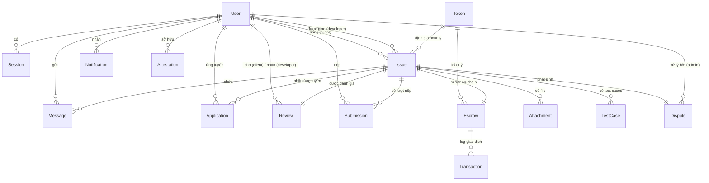

# 🩸 Bloody-Roar — Kế Hoạch Công Việc KHÔI (Backend Lead & AI Engineer)

> **Vai trò:** Backend Lead kiêm AI Engineer.
> **Mốc chính:** **10/9 — hoàn thành vòng MVP cốt lõi** (Auth · Homepage · Prisma schema · Realtime Chat theo room).
> **Liên quan:** [`TEAM_PLAN.md`](./TEAM_PLAN.md) · [`PRODUCT_BACKLOG.md`](./PRODUCT_BACKLOG.md) · [`RESEARCH.md`](./RESEARCH.md) · [`PROPOSAL.md`](./PROPOSAL.md)

---

## MỤC LỤC

1. [Mục tiêu trước 10/9 (phạm vi bắt buộc)](#1-mục-tiêu-trước-109-phạm-vi-bắt-buộc)
2. [Thảo luận thiết kế Database (đầy đủ & chi tiết)](#2-thảo-luận-thiết-kế-database)
3. [Todo list chi tiết đến 10/9](#3-todo-list-chi-tiết-đến-109)
4. [Definition of Done — 10/9](#4-definition-of-done--109)
5. [Sau 10/9 (tham khảo, chưa cần làm)](#5-sau-109-tham-khảo-chưa-cần-làm)
6. [Ràng buộc chung](#6-ràng-buộc-chung)
7. [Nhật ký thực hiện & phần việc tiếp theo (23/8 → 24/8)](#7-nhật-ký-thực-hiện--phần-việc-tiếp-theo-238--248)

---

## 1. Mục tiêu trước 10/9 (phạm vi bắt buộc)

Tới **10/9**, Khôi phải **done BE** cho 4 mảng sau. Tất cả AI/Smart-contract/Dispute dời sau 10/9.

| # | Deliverable | Nội dung bắt buộc | Kết quả chấp nhận |
| --- | --- | --- | --- |
| **A** | **Login / Authentication** | Endpoint đăng nhập bằng ví (SIWE) + cấp JWT + xác thực user | Đăng nhập bằng ví → nhận JWT → gọi được `me` |
| **B** | **Homepage** | Trang chủ hiển thị danh sách bounty + chi tiết task | Xem danh sách task, lọc/tìm kiếm, xem chi tiết |
| **C** | **Prisma schema (đầy đủ)** | Thiết kế **toàn bộ** bảng + field + migrate + seed một lần | Migrate sạch, client type-safe, **không phải migrate lại** |
| **D** | **Realtime Chat (Socket.io, theo room)** | 2 người nhắn tin qua lại trong 1 task (room) | 2 trình duyệt nhắn tin realtime, lịch sử lưu DB |

> **Chat phải chạy theo ROOM** (`task:{issueId}`), mỗi task 1 phòng riêng — đã chốt.
> **Nguyên tắc:** làm đúng thứ tự **C → A → B → D**. DB là nền (phải đủ ngay từ đầu để tránh migration), auth chặn mọi thứ, homepage dùng DB + auth, chat dùng DB + auth + Socket.

---

## 2. Thảo luận thiết kế Database

> **Mục tiêu phần này:** phân tích **toàn bộ nhu cầu dữ liệu** của hệ thống (smart contract, backend, AI, frontend), thiết kế đầy đủ mọi bảng + mọi field ngay từ đầu, để **hạn chế tối đa việc phải thêm migration về sau**. Schema hoàn chỉnh đã được viết trong `packages/database/prisma/schema.prisma` (**17 bảng · 16 enum**) và đã pass `prisma validate`. **Schema đã FROZEN từ 24/8** (xem §7.5).

### 2.1 Nguyên tắc thiết kế

1. **Một bảng `User` cho 3 vai** (Client/Developer/Admin) — phân biệt bằng `role`.
2. **Ví (walletAddress) là định danh gốc** — login bằng ví Web3 → key upsert duy nhất.
3. **Multi-token qua bảng `Token`** — tiền dùng `Decimal` + lưu `tokenId` (địa chỉ + decimals tập trung ở `Token`).
4. **Trạng thái = enum** — không dùng chuỗi tự do.
5. **Quan hệ 1-1 dùng `@unique`** — `Escrow`, `Dispute`, `Review` mỗi issue tối đa 1.
6. **`@index` trên cột truy vấn nóng.**
7. **Soft-delete/flag thay vì xóa cứng** — `isBanned`, `isDeleted`, `deletedAt`, `revokedAt`.
8. **Log AI + log giao dịch ở bảng riêng** — audit + tối ưu chi phí.
9. **Thiết kế đủ bảng + field cho Sprint SAU ngay từ đầu** — chỉ migrate một lần.

### 2.2 Phân tích nhu cầu dữ liệu theo tính năng

| Domain | Tính năng (từ docs) | Dữ liệu cần | Bảng tương ứng |
| --- | --- | --- | --- |
| **Auth** | Login ví, giữ session, profile | wallet, profile, token/refresh, nonce | `User`, `Session` |
| **Marketplace** | Đăng task, duyệt/lọc/tìm, chi tiết, ảnh | task, category, bounty, skill, ảnh, lượt xem, hạn | `Issue`, `Token`, `Attachment` |
| **Ứng tuyển** | Apply, chọn developer | hồ sơ ứng tuyển | `Application` |
| **Chat** | Nhắn tin theo room, gửi file, đã đọc | tin nhắn, file, đã đọc, đã xóa | `Message`, `Attachment` |
| **Escrow** | Ký quỹ, thanh toán, hoàn tiền | trạng thái on-chain, token, fee, tx | `Escrow`, `Token`, `Transaction` |
| **Dispute** | Tranh chấp, AI phân tích, chia tiền | lý do, báo cáo AI, tỷ lệ, challenge | `Dispute` |
| **AI** | Guard, Test Gen, Debate + audit | test cases, log call, token usage | `TestCase`, `AILog` |
| **GitHub** | OAuth KYC, link repo, PR → auto-pay | identity, token, repo, PR/submission | `User`, `Issue`, `Submission` |
| **Notification** | Thông báo realtime | sự kiện, người gây, link, đã đọc | `Notification` |
| **Admin** | Quản lý user, nhật ký | hành động admin | `AdminLog` |
| **Reputation** | Đánh giá sau job, certi on-chain | rating, attestation | `Review`, `Attestation`, `User` |

### 2.3 Sơ đồ quan hệ tổng thể (ERD)



### 2.4 Danh mục toàn bộ bảng

| Bảng | Mục đích | Cần trước 10/9 | Trạng thái |
| --- | --- | --- | --- |
| `User` | Tài khoản 3 vai | ✅ (auth) | ✅ Có |
| `Session` | Refresh token / logout / nonce | ✅ (auth) | 🆕 Thêm |
| `Token` | Registry + whitelist ERC-20 | ✅ (homepage hiển thị token) | 🆕 Thêm |
| `Issue` | Bounty / task | ✅ (homepage) | ✅ Có (sửa token) |
| `Attachment` | File cho issue + message | ✅ (chat file) | 🆕 Thêm |
| `Message` | Tin nhắn chat theo room | ✅ (chat) | ✅ Có (sửa) |
| `Application` | Ứng tuyển | Sau 10/9 | ✅ Có |
| `Escrow` | Mirror ký quỹ on-chain | Sau 10/9 | ✅ Có (sửa token) |
| `Transaction` | Log giao dịch on-chain | Sau 10/9 | ✅ Có (sửa enum) |
| `Dispute` | Tranh chấp + AI report | Sau 10/9 | ✅ Có (sửa) |
| `TestCase` | Test cases AI | Sau 10/9 | ✅ Có |
| `AILog` | Audit mọi call AI | Sau 10/9 | 🆕 Thêm |
| `Submission` | Lượt nộp bài / PR | Sau 10/9 | 🆕 Thêm |
| `Review` | Đánh giá sau job | Sau 10/9 | 🆕 Thêm |
| `Attestation` | EAS on-chain reputation/certi | Sau 10/9 | 🆕 Thêm |
| `Notification` | Thông báo realtime | Sau 10/9 | ✅ Có (sửa) |
| `AdminLog` | Nhật ký admin | Sau 10/9 | ✅ Có |

> **17 bảng** — 7 bảng mới so với bản gốc: `Session`, `Token`, `Attachment`, `AILog`, `Submission`, `Review`, `Attestation`.

### 2.5 Chi tiết từng bảng (field-level)

> Schema đã được viết và pass `prisma validate`. Các bảng mới trình bày dạng Prisma snippet; bảng sửa trình bày dạng field table.

#### 🔑 `User` — tài khoản

| Field | Type | Constraint | Ý nghĩa |
| --- | --- | --- | --- |
| `id` | String | @id cuid | PK |
| `walletAddress` | String | @unique | Định danh gốc từ ví |
| `role` | UserRole | default DEVELOPER | Vai mặc định |
| `name` / `email` / `avatar` / `bio` / `skills` / `location` | — | — | Profile |
| `githubUsername` / `githubId` | String? | @unique | GitHub KYC |
| `githubAccessTokenEncrypted` | String? | — | Token OAuth mã hóa (gọi GitHub API) |
| `isGithubVerified` | Boolean | default false | Đã verify GitHub |
| `reputationScore` | Float | default 0 | Uy tín tổng (tính từ `Review`) |
| `completedTaskCount` | Int | default 0 | Số task hoàn thành |
| `passportScore` | Float? | — | Gitcoin Passport (anti-Sybil, v2) |
| `isBanned` / `bannedReason` / `bannedAt` | — | — | Soft-ban |
| `lastLoginAt` | DateTime? | — | Analytics user active |
| `createdAt` / `updatedAt` | DateTime | — | Audit |

*Relations:* postedIssues, assignedIssues, applications, sentMessages, notifications, escrowsAsClient/Dev, raisedDisputes/resolvedDisputes, sessions, uploads, reviewsGiven/reviewsReceived, submissions, attestations.

#### 🔑 `Token` — registry + whitelist ERC-20

```prisma
model Token {
  id        String  @id @default(cuid())
  symbol    String  // "USDT", "USDC", "DAI"
  name      String  // "Tether USD"
  address   String  // ERC-20 contract address
  decimals  Int     // 6 (USDT/USDC), 18 (DAI/ETH)
  chainId   Int
  isActive  Boolean @default(true) // whitelist on/off
  isNative  Boolean @default(false)
  sortOrder Int     @default(0)
  logoUrl   String?
  createdAt DateTime @default(now())
  updatedAt DateTime @updatedAt

  issues  Issue[]
  escrows Escrow[]

  @@unique([chainId, address])
  @@index([isActive])
  @@map("tokens")
}
```

#### 🔑 `Session` — phiên đăng nhập

```prisma
model Session {
  id          String    @id @default(cuid())
  userId      String
  user        User      @relation(fields: [userId], references: [id], onDelete: Cascade)
  refreshHash String    @unique // hash refresh token (không lưu bản rõ)
  nonce       String?   @unique // SIWE nonce (chống replay)
  userAgent   String?
  ip          String?
  expiresAt   DateTime
  revokedAt   DateTime?
  createdAt   DateTime  @default(now())

  @@index([userId])
  @@map("sessions")
}
```

#### 🔑 `Issue` — bounty / task

| Field | Type | Constraint | Ý nghĩa |
| --- | --- | --- | --- |
| `id` | String | @id cuid | PK |
| `title` / `description` | String | — | Tiêu đề + mô tả Markdown |
| `category` | IssueCategory | — | Phân loại (lọc homepage) |
| `status` | IssueStatus | default OPEN | Vòng đời task |
| `bountyAmount` | Decimal | — | Tiền thưởng (đơn vị hiển thị) |
| `tokenId` | String | FK → Token | **Token trả thưởng** (multi-token) |
| `commitmentSignature` / `commitmentNonce` / `commitmentExpiresAt` | — | — | Chữ ký EIP-712 (lazy-deposit) |
| `requiredSkills` | String[] | — | Công nghệ yêu cầu |
| `difficulty` / `timeEstimate` | String? | — | Độ khó + thời gian |
| `expiresAt` | DateTime? | — | Hạn đóng bounty |
| `isDraft` / `publishedAt` | — | — | Nháp / publish |
| `viewCount` | Int | default 0 | Lượt xem |
| `githubRepo` / `githubInstallationId` | String? | — | GitHub repo |
| `clientId` | String | FK | Người đăng |
| `developerId` | String? | FK | Người được giao |
| `createdAt` / `updatedAt` / `assignedAt` / `completedAt` | DateTime | — | Audit |

#### 🔑 `Attachment` — file đính kèm

```prisma
model Attachment {
  id         String   @id @default(cuid())
  issueId    String?  // file của task (ảnh lỗi)
  issue      Issue?   @relation(fields: [issueId], references: [id], onDelete: Cascade)
  messageId  String?  // file gửi trong chat
  message    Message? @relation(fields: [messageId], references: [id], onDelete: Cascade)
  uploaderId String
  uploader   User     @relation(fields: [uploaderId], references: [id])
  fileName   String
  fileUrl    String
  fileSize   Int
  fileMime   String
  etag       String?
  createdAt  DateTime @default(now())

  @@index([issueId])
  @@index([messageId])
  @@index([uploaderId])
  @@map("attachments")
}
```

#### 🔑 `Message` — tin nhắn chat (theo ROOM)

| Field | Type | Constraint | Ý nghĩa |
| --- | --- | --- | --- |
| `id` | String | @id cuid | PK |
| `content` | String | — | Nội dung (có thể bị AI Guard mask) |
| `type` | MessageType | default TEXT | TEXT / FILE / SYSTEM |
| `wasModified` / `originalHash` | — | — | AI Guard audit |
| `issueId` | String | FK | **Room `task:{issueId}`** |
| `senderId` | String | FK | Người gửi |
| `clientMessageId` | String? | — | Idempotency (chống trùng retry) |
| `replyToId` | String? | — | Trả lời 1 message |
| `readAt` | DateTime? | — | Đã đọc (unread count) |
| `editedAt` | DateTime? | — | Đã chỉnh sửa |
| `isDeleted` / `deletedAt` | — | — | Soft delete |
| `createdAt` | DateTime | — | Audit |

> **Chat theo room:** 1 issue = 1 room. Client + developer của issue join `task:{issueId}`.

#### 🔑 `Application` — ứng tuyển

`status` (ApplicationStatus) · `message` · `issueId` FK · `developerId` FK · timestamps · `@@unique([issueId, developerId])`.

#### 🔑 `Escrow` — mirror ký quỹ on-chain

| Field | Type | Constraint | Ý nghĩa |
| --- | --- | --- | --- |
| `id` / `status` | — | EscrowStatus | Trạng thái |
| `txHashDeposit` / `txHashRelease` / `txHashCancel` | String? | — | Tx hash |
| `contractAddress` / `onChainIssueId` | String? | — | On-chain ref |
| `tokenId` | String | FK → Token | **Token khóa** (snapshot) |
| `arbiterAddress` | String? | — | Arbiter on-chain |
| `platformFeeBps` | Int | default 250 | Snapshot phí lúc deposit |
| `bountyAmount` / `platformFeeAmount` / `developerPayout` / `clientRefund` | Decimal | — | Số tiền |
| `depositedAt` / `releasedAt` / `timeoutClaimAt` | DateTime? | — | Timelock 30 ngày |
| `issueId` | String | @unique | 1-1 Issue |
| `clientId` / `developerId` | String | FK | Hai bên |

#### 🔑 `Transaction` — log giao dịch

`txHash` (@unique) · `type` (TransactionType) · `status` (TransactionStatus) · `from`/`to`/`blockNumber`/`gasUsed`/`gasPrice`/`chainId` · `escrowId` FK.

#### 🔑 `Dispute` — tranh chấp

`status` · `reason` · `aiReport` (Json) · `suggestedRatio`/`aiConfidenceScore` · `proposedClientRatio`/`finalClientRatio` · `proposedAt`/`challengeDeadline`/`resolvedAt` · `challengedById`/`challengedAt`/`resolutionNote` · `issueId` (@unique) · `escrowId` (@unique) · `raisedById`/`resolvedById`.

#### 🔑 `TestCase` — test cases AI

`title`/`description`/`given`/`when`/`then` · `isEdgeCase`/`priority`/`source` · `isApproved`/`clientNotes` · `issueId` FK.

#### 🔑 `Submission` — lượt nộp bài / PR

```prisma
model Submission {
  id             String           @id @default(cuid())
  issueId        String
  issue          Issue            @relation(fields: [issueId], references: [id], onDelete: Cascade)
  developerId    String
  developer      User             @relation(fields: [developerId], references: [id])
  description    String?
  pullRequestUrl String?
  prNumber       Int?             // GitHub PR number
  prState        String?          // open / merged / closed
  commitSha      String?
  status         SubmissionStatus @default(SUBMITTED)
  submittedAt    DateTime         @default(now())
  mergedAt       DateTime?
  reviewedAt     DateTime?
  reviewNotes    String?

  @@index([issueId])
  @@index([developerId])
  @@map("submissions")
}
```

#### 🔑 `Review` — đánh giá sau job

```prisma
model Review {
  id          String   @id @default(cuid())
  issueId     String   @unique
  issue       Issue    @relation(fields: [issueId], references: [id], onDelete: Cascade)
  clientId    String
  client      User     @relation("ReviewClient", fields: [clientId], references: [id])
  developerId String
  developer   User     @relation("ReviewDeveloper", fields: [developerId], references: [id])
  rating      Int      // 1-5 sao
  comment     String?
  createdAt   DateTime @default(now())

  @@index([developerId])
  @@map("reviews")
}
```

#### 🔑 `Attestation` — EAS on-chain reputation/certi

```prisma
model Attestation {
  id             String          @id @default(cuid())
  attestationUid String          @unique // EAS UID
  schemaUid      String          // EAS schema UID
  developerId    String
  developer      User            @relation(fields: [developerId], references: [id])
  issueId        String?
  reviewId       String?
  type           AttestationType @default(COMPLETION)
  data           Json            // { completedTask, rating, skills }
  chainId        Int
  attester       String          // địa chỉ ký (platform)
  revokedAt      DateTime?
  createdAt      DateTime        @default(now())

  @@index([developerId])
  @@index([issueId])
  @@map("attestations")
}
```

#### 🔑 `AILog` — audit mọi call AI

`task`/`model`/`provider` · `issueId`/`disputeId` · `latencyMs`/`promptTokens`/`completionTokens`/`costUsd` · `inputHash`/`outputHash` · `status`/`errorMessage` · `createdAt`.

#### 🔑 `Notification` — thông báo

`type`/`title`/`body` · `isRead` · `data` (Json) · `actorId` (ai gây ra) · `link` (deep link) · `userId` FK.

#### 🔑 `AdminLog` — nhật ký admin

`action`/`target`/`targetId`/`details` (Json)/`adminId`/`createdAt`.

### 2.6 Enum đầy đủ (16)

| Enum | Giá trị |
| --- | --- |
| `UserRole` | `CLIENT` · `DEVELOPER` · `ADMIN` |
| `IssueStatus` | `OPEN` · `IN_PROGRESS` · `COMPLETED` · `CANCELLED` · `DISPUTED` |
| `IssueCategory` | `BUG_FIX` · `FEATURE` · `SMART_CONTRACT` · `AUDIT` · `UI_UX` · `DATA_SCIENCE` · `DEVOPS` · `DOCUMENTATION` · `OTHER` |
| `ApplicationStatus` | `PENDING` · `ACCEPTED` · `REJECTED` · `WITHDRAWN` |
| `EscrowStatus` | `AWAITING_DELIVERY` · `COMPLETED` · `CANCELLED` · `DISPUTED` · `RESOLUTION_PROPOSED` |
| `DisputeStatus` | `OPEN` · `ANALYZING` · `PROPOSED` · `RESOLVED` · `CHALLENGED` |
| `NotificationType` | `NEW_APPLICANT` · `APPLICATION_ACCEPTED` · `APPLICATION_REJECTED` · `TASK_ASSIGNED` · `PAYMENT_RECEIVED` · `DISPUTE_RAISED` · `DISPUTE_RESOLVED` · `MESSAGE_RECEIVED` |
| `MessageType` | `TEXT` · `FILE` · `SYSTEM` |
| `TransactionType` | `DEPOSIT` · `RELEASE` · `CANCEL` · `DISPUTE` · `RESOLVE` |
| `TransactionStatus` | `PENDING` · `CONFIRMED` · `FAILED` |
| `SubmissionStatus` | `SUBMITTED` · `UNDER_REVIEW` · `APPROVED` · `REJECTED` |
| `AttestationType` | `COMPLETION` · `SKILL` · `CERTIFICATION` |
| `TestCasePriority` 🆕 | `CRITICAL` · `NORMAL` · `LOW` (thay String "critical"/"normal"/"low") |
| `TestCaseSource` 🆕 | `AI` · `MANUAL` (thay String "AI"/"manual") |
| `PRState` 🆕 | `OPEN` · `MERGED` · `CLOSED` (thay String prState của Submission) |
| `AILogStatus` 🆕 | `SUCCESS` · `ERROR` · `FALLBACK` (thay String status của AILog) |

### 2.7 Index & unique constraints (tổng hợp)

| Bảng | Index / Unique | Lý do |
| --- | --- | --- |
| User | `walletAddress` unique, `githubId` unique | Identity key |
| Token | unique(`chainId`,`address`), `isActive` | Chống trùng token, lọc whitelist |
| Session | `refreshHash` unique, `nonce` unique, `userId` index | Thu hồi token + chống replay login payload |
| Issue | `status`, `category`, `clientId`, `developerId`, `tokenId` | Lọc homepage |
| Message | `issueId`, `senderId`, `clientMessageId` | Lịch sử chat + chống trùng |
| Attachment | `issueId`, `messageId`, `uploaderId` | List file |
| Application | unique(`issueId`,`developerId`) | 1 dev/1 task |
| Escrow | `issueId` unique, `tokenId` | 1-1 |
| Transaction | `txHash` unique | Chống trùng tx |
| Dispute | `issueId` unique, `escrowId` unique | 1-1 |
| TestCase | `issueId` | List test |
| Submission | `issueId`, `developerId` | List lượt nộp |
| Review | `issueId` unique, `developerId` | 1 review/task |
| Attestation | `attestationUid` unique, `developerId` | Chống trùng + list certi |
| AILog | `task`, `issueId`, `createdAt` | Audit chi phí |
| Notification | `userId`, `isRead` | List + unread |
| AdminLog | `adminId` | Audit |

### 2.8 Các quyết định thiết kế đã chốt

| # | Quyết định | Kết quả |
| --- | --- | --- |
| 1 | **Multi-token** | Bảng `Token` (registry + whitelist `isActive`); `Issue`/`Escrow` dùng `tokenId` FK. Smart contract (Kiên) cần thêm modifier `onlyWhitelistedToken` + hàm `setTokenStatus`. |
| 2 | **Reputation/certi on-chain** | Bảng `Attestation` riêng (EAS); `Review` lưu rating off-chain; `User.passportScore` cho Gitcoin Passport (v2). |
| 3 | `Transaction.type/status` | Enum (không còn String) |
| 4 | `User.role` enum đơn | `role` là vai mặc định; Client/Developer thực tế xác định qua `Issue.clientId/developerId` |
| 5 | Message read/soft-delete/idempotency | `readAt`, `isDeleted`, `clientMessageId` |
| 6 | File chuyển sang `Attachment` | Bỏ field file khỏi `Message` |
| 7 | Auth | `Session` (refresh + nonce SIWE) |
| 8 | GitHub | `githubAccessTokenEncrypted` (User) + `Submission` (PR/webhook) |

### 2.9 Fields quan trọng cho từng lớp

#### 🔗 Smart Contract / Escrow
- `Token.address` + `Token.decimals` — contract `deposit()` nhận địa chỉ token; decimals để quy đổi raw units.
- `Escrow.platformFeeBps` + `arbiterAddress` — snapshot phí + arbiter khi audit.
- `Issue.commitmentSignature`/`commitmentNonce`/`commitmentExpiresAt` — EIP-712 chống replay.
- `Transaction.from`/`to`/`gasPrice`/`blockNumber` — audit tx đầy đủ.

#### ⚙️ Backend
- `Session.nonce` — SIWE chống replay; `refreshHash` — revoke/logout.
- `Message.clientMessageId` (idempotency), `readAt` (unread), `isDeleted` (soft delete).
- `Notification.actorId` + `link` — hiển thị ai gây ra + deep link.
- `Dispute.challengedById`/`challengedAt`/`resolutionNote` — theo dõi challenge + giải trình.

#### 🤖 AI
- `AILog.promptTokens`/`completionTokens`/`costUsd` — tính chi phí; `issueId`/`disputeId` truy vết; `errorMessage` debug fallback.
- `TestCase.source` — phân biệt AI vs manual.

#### 🖥️ Frontend / UX
- `Issue.viewCount`/`isDraft`/`publishedAt`/`expiresAt` — lượt xem, nháp, hạn.
- `Message.editedAt`/`replyToId` — "(đã chỉnh sửa)", trả lời.
- `User.lastLoginAt` — thống kê active.
- `Attachment.etag` — kiểm tra toàn vẹn file.

### 2.10 Kết luận thiết kế

- **17 bảng, 16 enum, đầy đủ field cho smart contract + backend + AI + frontend** — đã viết + pass `prisma validate`.
- **ĐÃ ĐÓNG BĂNG (FROZEN) 24/8** — migration init duy nhất `20260824120000_init`, DB Supabase đã reset + seed lại. Không sửa schema nữa trừ khi có lý do bắt buộc.
- **Trước 10/9 chỉ cần dùng:** `User`, `Session`, `Token`, `Issue`, `Message`, `Attachment` + enum `UserRole/IssueStatus/IssueCategory/MessageType`. Phần còn lại **đã có sẵn** nên Sprint sau KHÔNG cần migrate thêm bảng.
- **Mục tiêu:** chạy `migrate` một lần duy nhất — **ĐÃ ĐẠT**.

---

## 3. Todo list chi tiết đến 10/9

> **Cập nhật 24/8.** Còn ~2.5 tuần. Thứ tự ưu tiên: **C (DB) → A (Auth) → B (Homepage) → D (Chat)**. C + A đã xong, B backend đã xong (24/8).

### ✅ Đã xong

- Monorepo Bun, `packages/shared`, Docker Compose (port 5433), Pino logger, `.env.example`
- Custom server Next.js (Socket.io) + GraphQL Yoga qua App Router `/api/graphql` (GraphiQL ở dev)
- Shared types/constants/Zod
- **Prisma schema đầy đủ 17 bảng + 16 enum — FROZEN 24/8**
- **C — DB:** migrate + generate + seed chạy sạch (migration duy nhất `20260824120000_init`, reset + seed Supabase), DB đủ 17 bảng + seed (3 user, 1 token, 3 issue, 3 message)
- **A — Auth:** nonce + login (Thirdweb SIWE) + verifyJWT middleware + GraphQL `me`/`updateProfile` + E2E login test (9/9 pass)
- **B — Homepage backend (24/8):** `issues` (filter/search/sort/cursor) + `issue(id)` + `createIssue` + errors chuẩn `extensions.code` + E2E issue test (10/10 pass)

### 📅 Tuần 1 (20/8 → 26/8): Database + Authentication

| # | Task | Chi tiết / logic | Trạng thái / Đã thực hiện thế nào | Est |
| --- | --- | --- | --- | --- |
| C-1 | Chạy migrate + generate + seed | `bun run db:migrate` (một lần) + `db:generate` + `db:seed` | ✅ **Done:** 17 bảng + 16 enum. Migration duy nhất `20260824120000_init`. Generator output absolute (`env("POTHOS_OUTPUT")`). Seed OK. | 1h |
| C-2 | Review schema cùng Hiếu + đóng băng | Rà constraints/index, chốt §2.8 | ✅ **Done (24/8, tự chốt):** enum hoá `TestCasePriority`/`TestCaseSource`/`PRState`/`AILogStatus`; `Transaction.gasUsed`/`gasPrice` → `BigInt`; `Message` index composite `(issueId, createdAt)`; thêm `onDelete: Cascade` cho `Dispute.issue`/`Dispute.escrow`/`Transaction.escrow`. Tái tạo migration init + reset + seed Supabase. **Schema FROZEN.** | 1h |
| A-1 | `nonce` endpoint (SIWE) | `POST /api/auth/nonce` trả nonce, lưu `Session.nonce` | ✅ **Done:** Trả `thirdwebAuth().payload()`. | 1h |
| A-2 | `login` endpoint | Verify chữ ký (Thirdweb) → upsert `User` theo `walletAddress` → tạo `Session` + cấp JWT | ✅ **Done:** Verify → upsert (DTO public fields) → generate JWT. Lưu Session (`nonce` = SIWE @unique, `refreshHash` = sha256). Chặn replay tốt. | 3h |
| A-3 | JWT verify middleware | 1 hàm verify dùng chung cho GraphQL context + Socket | ✅ **Done:** `verifyJWT()` dùng `authenticate(token)` + lookup revoke qua `refreshHash` O(1). | 2h |
| A-4 | GraphQL `me` + `updateProfile` | `me` trả user từ JWT; update profile | ✅ **Done:** Gọi qua `user.module.ts`. JWT hỏng trả null. | 2h |

> **Cột mốc cuối tuần 1:**
> - ✅ DB migrate + seed sạch, typecheck/lint pass 100%.
> - ✅ Login ví → JWT → Session lưu DB (chống replay + revoke).
> - ⏳ Đang chờ: E2E Test Login thật bằng ví.

### 📅 Tuần 2 (27/8 → 2/9): Homepage + Marketplace — backend xong sớm 24/8

| # | Task | Chi tiết / logic | AC | Est |
| --- | --- | --- | --- | --- |
| B-1 | GraphQL `issues` query | List: filter (`category`, `status`, bounty range, skill) + sort + cursor pagination | List + filter + phân trang | ✅ **Done 24/8** (`issue.module.ts`: `issues(first, after, category, status, bountyMin/Max, skill, search, sortBy, sortOrder)` → `IssueConnection{edges, pageInfo, totalCount}`) |
| B-2 | GraphQL `issue(id)` query | Chi tiết + client + applicants + token | Trả đúng task | ✅ **Done 24/8** (kèm `applicationCount`, tự tăng `viewCount`, ẩn draft với người lạ) |
| B-3 | GraphQL `createIssue` | Zod validate → insert + chọn `tokenId` (whitelist) | Tạo task + đính kèm ảnh | ✅ **Done 24/8** (Zod + `requireAuth` + check `Token.isActive`; `bountyAmount` expose `Float`; attachment upload dời sang lúc làm S3/Supabase Storage — schema `Attachment` đã sẵn) |
| B-4 | Homepage UI | Card list (title, bounty+symbol, category, skills, viewCount) | Trang chủ render list | 3h — Hân/Trâm |
| B-5 | Filter/search UI | Lọc category/status + search keyword | Lọc + search OK | 2h — Hân/Trâm |
| B-6 | Issue detail UI | Mô tả, bounty, người đăng, ảnh đính kèm | Xem chi tiết task | 2h — Hân/Trâm |

> **Cột mốc cuối tuần 2:** homepage hiển thị task thật từ DB, lọc/tìm/chi tiết hoạt động.

### 📅 Tuần 3 (3/9 → 10/9): Realtime Chat + Tổng kiểm

| # | Task | Chi tiết / logic | AC | Est |
| --- | --- | --- | --- | --- |
| D-1 | Socket auth middleware | Verify JWT từ `handshake.auth.token` (dùng lại A-3) | ✅ **Done (25/8):** Chặn anonymous, disconnect nếu thiếu/sai JWT | 1h |
| D-2 | Room management | `task:join`/`task:leave` + **kiểm tra quyền** (user là client/developer của issue) | ✅ **Done (25/8):** Hàm `canAccessIssue()` dùng chung, join đúng `task:{issueId}` | 2h |
| D-3 | Message handler | Zod validate → lưu `Message` (theo `issueId`, kèm `clientMessageId`) → emit `message:new` tới room `task:{issueId}`; file gửi qua `Attachment` | ✅ **Done (25/8):** Idempotency re-emit cũ; Zod + Prisma create, emit kèm `senderAvatar` | 2h |
| D-4 | GraphQL `messages(issueId)` | Load lịch sử chat đúng thứ tự + attachment + đánh dấu đã đọc | ✅ **Done (25/8):** Cursor pagination; tự reset `readAt` cả trong DB lẫn bộ nhớ trả về | 1h |
| D-5 | Chat UI | Khung chat + auto-scroll + gửi/nhận + gửi file | 2 người nhắn qua lại realtime | 3h |
| D-6 | Test tích hợp 2 người | 2 trình duyệt (2 ví) → join cùng room → nhắn tin → nhận realtime + reload vẫn còn lịch sử | End-to-end chat OK | 2h |
| D-7 | Tổng kiểm | `bun run lint` + `typecheck` + test | Không lỗi | 1h |

> **Cột mốc 10/9:** đầy đủ A/B/C/D, chat theo room hoạt động, BE logic hoàn chỉnh.

---

## 4. Definition of Done — 10/9

- [x] **DB:** 17 bảng + 16 enum, `migrate` + `seed` chạy sạch, không còn `TODO`, không phải migrate lại. **Schema FROZEN 24/8.**
- [x] **Auth:** đăng nhập bằng ví → JWT → `me` đúng user; request sai JWT bị chặn (GraphQL + Socket).
- [x] **Homepage (backend):** `issues` (filter + search + sort + cursor pagination) + `issue(id)` + `createIssue` — E2E test pass (`scripts/e2e-issue.ts`). *(UI B-4→B-6 do Hân/Trâm.)*
- [x] **Chat:** 2 người nhắn qua lại **trong cùng room** realtime, lịch sử lưu DB và load lại được, chặn user không liên quan. (Backend hoàn tất D-1 đến D-4).
- [x] **BE:** `bun run lint` + `bun run typecheck` pass (25/8). *(Không còn lỗi nào).*

---

## 5. Sau 10/9 (tham khảo, chưa cần làm)

| Mảng | Nội dung chính | Bảng dùng |
| --- | --- | --- |
| Ứng tuyển & assign | `Application` flow, chọn developer | Application, Issue |
| Escrow | Thirdweb SDK + EIP-712 + whitelist token + Transaction logger | Escrow, Token, Transaction |
| AI Guard | Regex (20+) + `RegexScanner` + `AIGuardService` | Message, AILog |
| AI Test Gen | `TestGenerator` sinh test cases | TestCase, AILog |
| Model Router | Chọn model free + fallback | AILog |
| AI Dispute | `DebateOrchestrator` (5 agent) + `DisputeAnalyzer` | Dispute, AILog |
| GitHub | OAuth + webhook PR → auto-pay | User, Issue, Submission |
| Reputation | Review → attest EAS on-chain + Gitcoin Passport | Review, Attestation, User |
| CI/CD | GitHub Actions + Dockerfile + Deploy + Sentry | — |

---

## 6. Ràng buộc chung

1. **Thứ tự bắt buộc:** DB → Auth → Homepage → Chat.
2. **Chat theo room** (`task:{issueId}`) — không chat 1-1 tự do.
3. **Migrate một lần** — schema đủ 17 bảng + field ngay từ đầu.
4. **Không call AI trực tiếp** — mọi AI call qua `ModelRouter` (sau 10/9).
5. **AI chỉ đề xuất, không tự chốt** — verdict phải Admin approve.
6. **Free-tier trước** — Groq/Gemini free, OpenAI chỉ fallback.
7. **Type-safe xuyên suốt** — DB → GraphQL → FE dùng chung types.
8. **Không log secrets** — token GitHub mã hóa, AI Guard chỉ log hash.
9. **`.env` không commit.**
10. **Validate bằng Zod** — mọi input FE phải qua Zod.
11. **Push phải sạch** — `lint` + `typecheck` pass trước khi push.

---

## 7. Nhật ký thực hiện & phần việc tiếp theo (23/8 → 24/8)

> **Trạng thái hiện tại (24/8):** Foundation + **C (Database, FROZEN)** + **A (Auth)** + **B backend (Homepage)** đã **done và test E2E pass**. Còn duy nhất **D (Chat)** — tuần 3 (3/9 → 10/9). UI Homepage (B-4→B-6) do Hân/Trâm.

### 7.1 Các việc đã làm — thực hiện thế nào

| Mảng | Đã làm gì | Thực hiện thế nào (file / cơ chế) |
| --- | --- | --- |
| **Foundation** | Monorepo, custom server, logger, DB dev | `server.ts` (Next + GraphQL Yoga + Socket.io cùng HTTP server), `lib/logger.ts` (Pino), `docker-compose.yml` (Postgres port **5433**) |
| **C — Schema** | 17 bảng + 12 enum | `packages/database/prisma/schema.prisma` |
| **C — Generator** | Type-safe GraphQL↔Prisma | `generator pothos` (provider `prisma-pothos-types`), output qua `env("POTHOS_OUTPUT")`; `@pothos/plugin-prisma` nằm trong `packages/database` devDeps để generator resolvable |
| **C — Migrate/Seed** | DB 17 bảng + dữ liệu mẫu | Migration duy nhất `20260823035635_init`; `seed.ts` (admin/client/dev, USDC, 3 issue, 3 message) |
| **A-1 nonce** | Endpoint trả login payload | `app/api/auth/nonce/route.ts` → `thirdwebAuth().payload()` |
| **A-2 login** | Verify chữ ký → upsert User → JWT → Session | `app/api/auth/login/route.ts`: `verify()` → `upsert` (DTO `USER_PUBLIC_SELECT`) → `generate()` → `session.create` (`nonce`=SIWE nonce `@unique`, `refreshHash`=sha256(token)) |
| **A-3 middleware** | Verify JWT dùng chung | `lib/auth.ts` → `verifyJWT()` (authenticate + revoke check qua `refreshHash`); dùng ở `graphql/context.ts` + `socket/handlers.ts` |
| **A-4 me/updateProfile** | User module GraphQL | `graphql/modules/user/user.module.ts` (`prismaFieldWithInput`, Zod) |
| **0. E2E Login Test** | Kịch bản tự động test luồng Auth | `apps/web/scripts/e2e-login.ts`: Dùng `PrivateKeyWallet`, fetch nonce, ký payload, đăng nhập, gọi GraphQL `me`, test replay protection, check DB `sessions` & `users` (tất cả 9/9 assertions pass). |
| **1. DB Cloud (Pre-C2)** | Thiết lập Supabase | Cấu hình Supabase PostgreSQL (IPv4 Pooler: `aws-0-ap-northeast-2...`), đẩy schema 17 bảng, seed dữ liệu mẫu để team Hân/Trâm dùng chung qua `DATABASE_URL`. |

### 7.2 Đối chiếu code với tài liệu cũ

**✅ Đúng theo doc (đã giữ đúng thiết kế):**
- Thứ tự **C → A → B → D**; auth chặn mọi thứ; type-safe xuyên suốt; Zod validate.
- `Session.refreshHash @unique` (revoke), `Session.nonce` (chống replay) — đúng §2.5/§2.8.
- Login bằng ví (SIWE Thirdweb) → JWT → `me`; sai JWT bị chặn (GraphQL + Socket) — đúng AC §1.A.
- "Migrate một lần" — đã tái tạo migration init duy nhất khớp schema (hết drift).

**⚠️ Điểm lệch/chốt mới so với doc cũ (đã cập nhật vào §2):**
1. `Session.nonce` thêm `@unique` (doc §2.5 cũ chưa có) — để `findUnique` chặn replay login payload.
2. **Auth dùng JWT của Thirdweb (1 token)** — doc A-2 ghi "access + refresh". Hiện chỉ phát 1 JWT; **refresh/logout chưa làm** (dời sau 10/9, dùng `thirdwebAuth.refresh()`).
3. Docker Postgres đổi port **5432 → 5433** (tránh xung đột Homebrew Postgres local).
4. Generator Pothos dùng `env("POTHOS_OUTPUT")` thay đường dẫn tương đối (tránh sinh thư mục rác `packages/apps/`).

### 7.3 Các fix phát sinh trong review

1. **Schema drift** — `nonce @unique` từng bị áp bằng `db push` mà không có migration → đã tái tạo migration init sạch.
2. **Chống replay login payload** — check `nonce @unique` sau `verify()`, trước `generate()`.
3. **DTO login** — `USER_PUBLIC_SELECT`, không lộ `email`/`githubAccessTokenEncrypted`/`isBanned`.
4. **`auth.ts` lazy-init** — không crash server khi thiếu `AUTH_PRIVATE_KEY`.
5. **`AUTH_PRIVATE_KEY`** — dùng key random (không phải Hardhat mặc định).
6. **Generator path** — `.env` `POTHOS_OUTPUT=../../../apps/web/...` (3 cấp, resolve theo schema dir).
7. **FE Lưu ý (cho Hân/Trâm)** — Endpoint `GET /api/auth/nonce` yêu cầu truyền `?address=...` (địa chỉ ví user) để server ký đúng payload cho user thay vì ví admin. FE lưu ý gọi đúng format: `fetch('/api/auth/nonce?address=' + walletAddress)`.
8. **Circular Dependency trong GraphQL Schema** — Fix lỗi server crash khi boot bằng cách tách `builder` instance ra file `graphql/builder.ts` riêng biệt.
9. **Load `.env` an toàn** — Dùng `import.meta.dir` kết hợp `fs.existsSync` trong `env.ts` để load đúng file `.env` root bất chấp CWD khi chạy script.
10. **Pothos Zod Plugin** — Gỡ bỏ `@pothos/plugin-zod` vì thừa thãi (chỉ dùng manual validation) và gây lỗi khởi tạo `zod.looseObject`.

### 7.4 Phần việc tiếp theo (đặt ra ngày 23/8)

| Bước | Nội dung | Est | Kết quả |
| --- | --- | --- | --- |
| ✅ **0. E2E login test** | Kịch bản tự động E2E test cho Auth | 1h | ✅ Pass toàn bộ |
| ✅ **1. C-2** | Review schema + đóng băng: enum hoá `priority/source/status/prState`, `gasUsed/gasPrice` → BigInt, index `Message(issueId, createdAt)`, thống nhất `onDelete` | 1h | ✅ Xong 24/8 (tự chốt, xem §7.5) |
| ✅ **2. B — Homepage backend** | B-1 `issues` query (filter+sort+cursor) → B-2 `issue(id)` → B-3 `createIssue` | 13h | ✅ Xong sớm 24/8 (UI B-4→B-6 do Hân/Trâm) |
| **3. D — Chat** | D-1 socket auth → D-2 room + quyền → D-3 message handler → D-4 `messages(issueId)` → D-5 UI → D-6 test 2 user → D-7 tổng kiểm | 12h | ⏳ Tuần 3 (3/9 → 10/9) |

### 7.5 Nhật ký 24/8 — Merge main + đóng băng schema + Homepage backend

**1. Đồng bộ main (PR #1 #2 #3 đã merge):**
- Pull `origin/main` vào `Khoi/backend` (fast-forward, không conflict — do 3 nhánh sửa vùng file khác nhau; giải thích chi tiết: Git chỉ bắt conflict khi 2 nhánh cùng sửa cùng dòng).
- Hiếu thêm `apps/web/src/app/api/graphql/route.ts` (App Router) + `directUrl` cho Supabase.
- **Fix trùng lặp `/api/graphql`:** bỏ GraphQL khỏi custom `server.ts` (giờ chỉ lo Socket.io), App Router route.ts chịu trách nhiệm serve GraphQL cho cả dev lẫn prod.
- **Fix bug nghiêm trọng context:** `createContext` viết cho Node `IncomingMessage` sẽ crash ở chế độ Web Fetch API của App Router (Yoga v5 truyền `{ request: Request }`, không có `req/res`). Đã đổi sang `request.headers.get("authorization")` + bỏ `req/res` khỏi `GraphQLContext`.
- Thêm `DIRECT_URL` vào `.env`/`.env.example` (port 5433 local khớp docker; Supabase dùng pooler 5432).
- Commit: `c3cf027 fix: resolve GraphQL routing conflicts and config drift`.

**2. C-2 — Đóng băng schema (tự chốt, không đợi):**
- Thêm 4 enum: `TestCasePriority`, `TestCaseSource`, `PRState`, `AILogStatus` (16 enum tổng).
- `Transaction.gasUsed`/`gasPrice` `String?` → `BigInt?`.
- `Message` đổi `@@index([issueId])` → `@@index([issueId, createdAt])` (composite phục vụ load lịch sử chat đúng thứ tự).
- Thống nhất `onDelete: Cascade`: thêm cho `Dispute.issue`, `Dispute.escrow`, `Transaction.escrow` (Issue subtree cascade hoàn chỉnh; User relations để Restrict vì user soft-ban không hard-delete).
- Tái tạo migration init duy nhất `20260824120000_init` (via `prisma migrate diff --from-empty`), reset + seed lại Supabase, `prisma validate` + `generate` pass.

**3. B — Homepage backend (xong sớm so với kế hoạch tuần 2):**
- File mới `apps/web/src/graphql/modules/issue/issue.module.ts`:
  - **B-1** `issues(first, after, category, status, bountyMin/Max, skill, search, sortBy, sortOrder)` → `IssueConnection { edges { node, cursor }, pageInfo, totalCount }`. Cursor = base64(issue.id), orderBy luôn kèm `{ id: "asc" }` tiebreaker cho phân trang ổn định với mọi sort.
  - **B-2** `issue(id)`: chi tiết + `token` + `client` + `developer` + `applicationCount`; tự tăng `viewCount`; draft chỉ hiện với chủ task; không tồn tại → null.
  - **B-3** `createIssue(input)`: `requireAuth` → Zod validate → check `Token.isActive` → insert (status OPEN, publishedAt now). `bountyAmount` expose GraphQL `Float` (Decimal → toNumber).
  - `Token` object + `User` ref tái sử dụng; relations include 1 query duy nhất (không N+1).
- File mới `apps/web/src/graphql/errors.ts`: `gqlError(message, code, details)` + `parseOrThrow(schema, data)` — throw `GraphQLError` với `extensions.code` (`UNAUTHORIZED`/`FORBIDDEN`/`BAD_USER_INPUT`/`INVALID_TOKEN`) thay vì plain Error (Yoga mask plain Error thành "Unexpected error.", FE không phân loại được).
- Đổi tên input type: `MutationCreateIssueInput` → `CreateIssueInput`, `MutationUpdateProfileInput` → `UpdateProfileInput` (option `typeOptions.name` của with-input plugin).
- Shared: thêm `ISSUE_STATUSES`, `ISSUE_SORT_BY` constants (FE filter dùng chung).
- E2E test mới `apps/web/scripts/e2e-issue.ts` — 10 nhóm assertion: auth chặn, BAD_USER_INPUT, INVALID_TOKEN, tạo OK, viewCount tăng, filter/search/sort, cursor pagination 2 trang, cleanup. **Pass toàn bộ.**

**4. Kiểm tra tổng:** `typecheck` + `lint` pass; E2E login (9/9) + E2E issue (10/10) pass; `migrate status` = 1 migration, schema up to date.

### 7.6 Phần việc tiếp theo (từ 24/8)

| Bước | Nội dung | Est |
| --- | --- | --- |
| **1. D — Chat (tuần 3)** | D-1/D-4 Backend Chat đã hoàn tất (25/8) → D-5 UI (Hân/Trâm) → D-6 test 2 user realtime → D-7 tổng kiểm | 12h |
| **2. Nếu còn thời gian** | `updateIssue`/`cancelIssue` mutation; `tokens` query (FE cần dropdown chọn token khi tạo task); hỗ trợ FE Hân/Trâm tích hợp GraphQL | 3h |
| **3. Sau 10/9** | Application flow, Escrow + EIP-712, AI Guard/ModelRouter, GitHub OAuth, Attestation | — |

> **Lưu ý cho team FE (Hân/Trâm):** endpoint `POST /api/graphql` (đã có GraphiQL ở `/api/graphql` khi dev). Query mẫu xem trong `scripts/e2e-issue.ts`. Lỗi trả về có `extensions.code` — xử lý theo code (`UNAUTHORIZED` → redirect login, `BAD_USER_INPUT` → hiển thị lỗi field).
