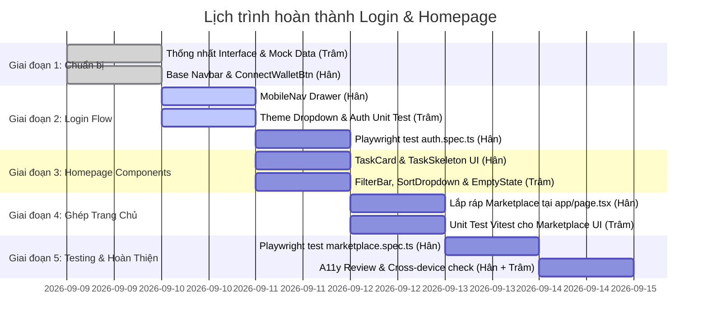

# 📋 Kế Hoạch Triển Khai Chi Tiết: Hoàn Thiện Login & Homepage (Marketplace)

> **Dự án:** Bloody-Roar — Decentralized Bounty Marketplace  
> **Phân hệ phụ trách:** Frontend (Web Client)  
> **Người thực hiện:** **Hân** (UI/UX Designer & QA Lead) & **Trâm** (UI/UX Designer & Test Lead)  
> **Mục tiêu:** Hoàn thiện 100% luồng Xác thực (Login / Connect Wallet) và Trang chủ Marketplace (Homepage) trước khi sang các tính năng chuyên sâu (Task Detail, Create Task, Chat, Escrow), đảm bảo **không xung đột mã nguồn (Zero Git Conflict)**.

---

## 1. TỔNG QUAN VÀ NGUYÊN TẮC PHỐI HỢP

### 1.1 Nguyên tắc chống xung đột (Conflict-Free Collaboration)
1. **File Ownership tuyệt đối:** Mỗi file chỉ có **MỘT** người trực tiếp chỉnh sửa (xem bảng phân chia file bên dưới).
2. **Hợp đồng giao diện (Interface Contract):** Thống nhất props và mock data trước khi code logic.
3. **Mock Data First:** Nếu Backend (GraphQL/Khôi & Hiếu) chưa hoàn tất endpoint, sử dụng mock data chuẩn TypeScript schema để UI không bao giờ bị nghẽn.
4. **Quy tắc Git Branch:**
   - Hân: nhánh `feature/han-auth-homepage`
   - Trâm: nhánh `feature/tram-components-testing`
   - Merge vào `develop` theo PR tuần tự sau khi typecheck & test xanh.

### 1.2 Bảng phân quyền file (File Ownership Matrix)

| File / Thư mục | Người sở hữu | Trách nhiệm |
|---|---|---|
| `apps/web/src/app/page.tsx` | **Hân** | Trang chủ Marketplace (Layout, Hero, tích hợp TaskGrid & Filter) |
| `apps/web/src/components/layout/Navbar.tsx` | **Hân** | Thanh điều hướng chính (đã có base, tích hợp MobileNav) |
| `apps/web/src/components/layout/MobileNav.tsx` | **Hân** | Menu mobile drawer / hamburger |
| `apps/web/src/components/auth/ConnectWalletBtn.tsx` | **Hân** | Logic & UI kết nối ví Thirdweb (SIWE) |
| `apps/web/src/components/marketplace/TaskCard.tsx` | **Hân** | Thẻ hiển thị task bounty với styling chuẩn dark/cyber |
| `apps/web/src/components/marketplace/TaskSkeleton.tsx` | **Hân** | Skeleton loading cho TaskCard |
| `apps/web/src/components/marketplace/TaskFilterBar.tsx` | **Trâm** | Bộ lọc category, status, skill pills |
| `apps/web/src/components/marketplace/TaskSortDropdown.tsx` | **Trâm** | Dropdown sắp xếp theo bounty, ngày tạo |
| `apps/web/src/components/marketplace/EmptyTasksState.tsx` | **Trâm** | UI hiển thị khi không tìm thấy task phù hợp |
| `apps/web/src/lib/mock-data/issues.mock.ts` | **Trâm** | Bộ mock data chuẩn cho danh sách issues/tasks |
| `apps/web/src/test/e2e/auth.spec.ts` | **Hân** | Kịch bản test E2E cho Auth & Navbar (Playwright) |
| `apps/web/src/test/e2e/marketplace.spec.ts` | **Hân** | Kịch bản test E2E cho Marketplace Homepage (Playwright) |
| `apps/web/src/components/marketplace/*.test.tsx` | **Trâm** | Unit/Component test cho TaskCard, FilterBar (Vitest) |
| `apps/web/src/components/forms/` | **Trâm** | Bộ form controls tái sử dụng (hỗ trợ search/filter) |

---

## 2. CHI TIẾT CÁC CÔNG VIỆC CẦN LÀM

### 🔐 PHẦN 1: LOGIN / AUTHENTICATION FLOW

#### Mục tiêu:
- Người dùng có thể bấm nút **Connect Wallet** trên Navbar.
- Kết nối ví EVM (MetaMask, Coinbase, WalletConnect...) qua **Thirdweb SDK**.
- Tự động gọi SIWE (Sign-In with Ethereum): ký nonce `/api/auth/nonce` → xác thực `/api/auth/login` → cấp session JWT cookie.
- Khi đã đăng nhập: hiển thị Network badge (Sepolia / Arbitrum Sepolia), Avatar identicon, Rút gọn địa chỉ ví (`0x12...ab89`), Dropdown menu (Profile, Tasks, Disconnect).
- Hỗ trợ đầy đủ trên giao diện Mobile (Mobile Drawer).

#### Phân công công việc:
1. **Hân (Lead Thực Thi Auth UI & E2E):**
   - [x] Đã hoàn thành base `ConnectWalletBtn.tsx` và `Navbar.tsx`.
   - [ ] **Task H-AUTH-1:** Hoàn thiện `MobileNav.tsx` (Sheet / Drawer cho mobile < 768px):
     - Menu mở từ cạnh phải, chứa: Logo, Search bar, Link Marketplace, Link Create Task, và nút Connect Wallet.
     - Tự động đóng drawer khi chuyển trang hoặc bấm ra ngoài.
   - [ ] **Task H-AUTH-2:** Xử lý các trạng thái đặc biệt của ví:
     - Trạng thái chưa kết nối (Disconnect).
     - Trạng thái đang kết nối (Connecting / Loading indicator).
     - Trạng thái sai mạng (Wrong Network → Nút cảnh báo chuyển mạng về Sepolia).
     - Trạng thái từ chối ký (User rejected signature → Toast thông báo).
   - [ ] **Task H-AUTH-3:** Viết Playwright E2E test `test/e2e/auth.spec.ts`:
     - Test Navbar hiển thị đầy đủ logo, menu, nút kết nối.
     - Test responsive hiển thị hamburger button trên viewport mobile (375px).

2. **Trâm (Hỗ Trợ Theme & Test Unit Auth):**
   - [x] **Task T-AUTH-1:** Kiểm tra và customize Theme Dropdown / Dialog theo Design Tokens trong `globals.css`:
     - Đảm bảo Dropdown menu của ví đạt chuẩn contrast WCAG AA, có hiệu ứng hover mượt mà.
   - [x] **Task T-AUTH-2:** Viết Unit test Vitest cho component `ConnectWalletBtn` (kiểm tra render trạng thái Disconnected vs Connected qua mock `@thirdweb-dev/react`).

---

### 🏠 PHẦN 2: HOMEPAGE (MARKETPLACE) FLOW

#### Mục tiêu:
- Thay thế trang landing Sprint 0 bằng **Marketplace Homepage** hiện đại, đậm chất Web3/Cyberpunk:
  1. **Hero Section:** Tiêu đề "Decentralized Bounty Marketplace", số liệu thống kê nhanh (Total Bounties, Total Payout, Active Hunters), nút CTA khám phá/tạo task.
  2. **Filter & Search Bar:**
     - Ô tìm kiếm từ khóa (Search by keyword/title).
     - Lọc theo Category (Frontend, Backend, Smart Contract, AI, Security...).
     - Lọc theo Status (Open, In Progress, Completed).
     - Sắp xếp (Sort: Newest, Highest Bounty, Urgent).
  3. **Task Grid / List:**
     - Lưới thẻ task (Responsive 1 cột mobile, 2 cột tablet, 3 cột desktop).
     - Thẻ task thể hiện rõ: Tiêu đề, Badge Category, Skills required, Bounty amount ($ USDC/USDT kèm logo), Người đăng, Thời hạn, Glow effect khi hover.
  4. **State Handling:**
     - Trạng thái Loading: Grid các Skeleton cards (`TaskSkeleton.tsx`).
     - Trạng thái Empty: Hình minh họa/icon + thông báo "No tasks found" kèm nút Clear Filters.
     - Phân trang hoặc Load More / Cursor pagination.

#### Phân công công việc:
1. **Trâm (Phụ trách Component Lọc, Data Mock & Unit Test):**
   - [ ] **Task T-HOME-1:** Tạo file mock data `apps/web/src/lib/mock-data/issues.mock.ts`:
     - Tối thiểu 8-10 task mẫu với đầy đủ trạng thái, category, skills, bounty (USDC, USDT, ETH).
     - DTO đồng nhất với Prisma model `Issue` và GraphQL schema của Khôi.
   - [ x] **Task T-HOME-2:** Xây dựng `TaskFilterBar.tsx` (`components/marketplace/`):
     - Horizontal Category tabs/pills cuộn ngang được trên mobile.
     - Filter status checkbox hoặc switch tab.
     - Callback `onFilterChange(filters: FilterState)` truyền lên page cha.
   - [ x] **Task T-HOME-3:** Xây dựng `TaskSortDropdown.tsx` (`components/marketplace/`):
     - Dropdown chọn kiểu sắp xếp (Bounty: High to Low, Newest first, Deadline).
   - [ x] **Task T-HOME-4:** Xây dựng `EmptyTasksState.tsx` (`components/marketplace/`):
     - Giao diện đẹp mắt khi search không ra kết quả, có nút bấm "Reset bộ lọc".
   - [ x] **Task T-HOME-5:** Viết Vitest Unit Test (`TaskFilterBar.test.tsx`, `TaskCard.test.tsx`):
     - Kiểm tra sự kiện click lọc category, nhập search keyword, render đúng số lượng badge.

2. **Hân (Phụ trách UI Card, Assemble Trang Chủ & E2E):**
   - [ ] **Task H-HOME-1:** Xây dựng `TaskCard.tsx` (`components/marketplace/`):
     - Thiết kế thẻ task chuẩn visual: viền `border-[hsl(var(--border))]`, hover `border-primary/50`, glow shadow `var(--shadow-glow)`.
     - Phía trên: Category badge + Status badge.
     - Giữa: Tiêu đề (font Outfit, click dẫn vào `/tasks/[id]`), mô tả vắn tắt 2 dòng (line-clamp-2), skills tags.
     - Phía dưới: Bounty nổi bật (ví dụ: `500 USDC` màu xanh sáng), Avatar tác giả, thời gian đăng (relative time: "2 hours ago").
   - [ ] **Task H-HOME-2:** Xây dựng `TaskSkeleton.tsx` (`components/marketplace/`):
     - Khung skeleton mô phỏng thẻ TaskCard trong lúc tải dữ liệu.
   - [ ] **Task H-HOME-3:** Lắp ráp trang chủ `apps/web/src/app/page.tsx`:
     - Gom Hero Section, `TaskFilterBar`, `TaskSortDropdown`, Grid `TaskCard` và `EmptyTasksState`.
     - Quản lý state filter, search và sort trên client component.
     - Tích hợp hook dữ liệu (dùng Mock Data làm fallback, sẵn sàng nhận GraphQL query khi Khôi deploy).
   - [ ] **Task H-HOME-4:** Review Responsive:
     - Mobile (375px): Grid 1 cột, filter bar cuộn ngang, padding hợp lý.
     - Tablet (768px): Grid 2 cột.
     - Desktop (1280px+): Grid 3 cột, hero cân đối.
   - [ ] **Task H-HOME-5:** Viết Playwright E2E test `test/e2e/marketplace.spec.ts`:
     - Test load trang hiển thị danh sách task.
     - Test gõ search và lọc category làm thay đổi danh sách hiển thị.
     - Test click vào TaskCard điều hướng đến trang chi tiết task.

---

## 3. LỊCH TRÌNH THỰC HIỆN THEO NGÀY (6 NGÀY)

| Ngày | Công việc của HÂN | Công việc của TRÂM | Điểm kiểm tra (Checkpoint) |
|---|---|---|---|
| **Ngày 1** | Hoàn thiện `MobileNav.tsx`, test responsive navbar | Tạo `issues.mock.ts` và kiểm tra design tokens `globals.css` | Navbar co giãn mượt trên cả mobile & desktop |
| **Ngày 2** | Viết `auth.spec.ts`, test các case ví (connect, reject, switch network) | Tạo `TaskFilterBar.tsx` và `TaskSortDropdown.tsx` | Đăng nhập ví mượt mà, filter bar có sẵn props & callback |
| **Ngày 3** | Xây dựng `TaskCard.tsx` và `TaskSkeleton.tsx` với styling glow cyberpunk | Xây dựng `EmptyTasksState.tsx` và test logic lọc dữ liệu với mock data | TaskCard hiển thị đúng thông tin bounty, token, skills |
| **Ngày 4** | Lắp ráp toàn bộ trang `app/page.tsx` (Hero + Filter + Grid) | Viết Vitest unit test cho `TaskCard` và `TaskFilterBar` | Trang chủ hiển thị danh sách task từ mock data, lọc search hoạt động |
| **Ngày 5** | Viết Playwright E2E `marketplace.spec.ts` | Setup & chạy axe-core kiểm tra A11y (độ tương phản, alt, aria-label) | E2E test pass kịch bản tìm kiếm và lọc task |
| **Ngày 6** | Chạy toàn bộ test suite, kiểm tra `bun run lint` và `typecheck` | Tinh chỉnh micro-animations (Framer motion) và variant nếu cần | Sẵn sàng demo MVP phần Login & Homepage |

---

## 4. TIÊU CHÍ HOÀN THÀNH (DEFINITION OF DONE - DoD)

Một công việc chỉ được đánh giá là hoàn thành (DONE) khi đáp ứng đủ các tiêu chuẩn sau:

1. **Về Giao diện & Trải nghiệm (UI/UX):**
   - Đạt độ thẩm mỹ cao (Dark theme, neon/glow accent, font chữ Outfit/Inter chuẩn xác).
   - Responsive hoàn hảo trên 3 kích thước: Mobile (375px), Tablet (768px), Desktop (1440px).
   - Không bị vỡ layout, tràn ngang (overflow-x), hoặc text overlap.
2. **Về Kỹ thuật & Chất lượng code:**
   - Chạy lệnh `bun run typecheck` **0 lỗi TypeScript**.
   - Chạy lệnh `bun run lint` **0 cảnh báo ESLint**.
   - Không commit bất kỳ file nào ngoài phạm vi được phân công.
3. **Về Kiểm thử (Testing):**
   - Unit test Vitest của Trâm: pass 100% các component form, filter, card.
   - E2E test Playwright của Hân: file `auth.spec.ts` và `marketplace.spec.ts` chạy pass trên chế độ headless.
4. **Về Web3 & Dữ liệu:**
   - Kết nối ví Thirdweb nhận đúng địa chỉ ví và chain Sepolia.
   - UI hiển thị đúng mock data, không bị crash khi mảng task rỗng (`EmptyTasksState`).
