# Bloody-Roar product flow

This document turns the approved proposal and implementation plan into the UI and
application behaviour used by the web app. Smart-contract transactions and
model-trained AI decisions remain outside this flow until their interfaces are
delivered.

```mermaid
flowchart LR
  A[Public marketplace] --> B[Choose protected action]
  B --> C[Connect EVM wallet]
  C --> D[Switch to Base Sepolia]
  D --> E[Sign SIWE message]
  E --> F[HttpOnly session cookie]
  F --> G[Return to the intended screen]
  G --> H[Post bounty or apply]
  H --> I[Client selects developer]
  I --> J[Private chat and delivery]
  J --> K[Client review or dispute]
  K -. Contract ABI and deployment .-> L[Deposit / release / resolution]
```

## Navigation

- `/` is the public homepage and marketplace. It always supports browse, search,
  filter, sorting, pagination, and task detail navigation.
- `/issues/[id]` is public for reading. Applying is available only after a signed
  wallet session. The owner can review applicants and a selected developer can
  submit work.
- `/issues/create`, `/dashboard`, `/profile`, and `/admin` render a consistent
  wallet sign-in state before loading private data or permitting mutations.
- The navbar is the same at every route. It exposes Marketplace, Post a bounty,
  Dashboard for signed-in users, notifications, and the wallet menu. The mobile
  drawer contains the equivalent navigation.

## Authentication and network behaviour

1. The user selects an injected EVM wallet.
2. The app checks its network and requests Base Sepolia (`84532`). If necessary,
   it adds the network through EIP-3085 before continuing.
3. The app obtains a one-time SIWE payload, asks the wallet to sign it, and sends
   the signature for verification.
4. The server sets an `HttpOnly`, `SameSite=Lax` session cookie. No JWT is stored
   in browser storage.
5. After success, the app returns to the page that opened the modal. A normal
   homepage login therefore remains on the marketplace; a protected-action login
   resumes that action's screen.

## Task lifecycle

1. A client posts an open bounty with acceptance criteria, token, amount, skills,
   and optional deadline/repository.
2. A developer applies. The client sees applicants and selects one developer.
3. The task becomes `IN_PROGRESS`; only its client and selected developer can
   exchange chat messages and work submissions. An administrator may read
   disputed evidence without sending messages.
4. The developer submits a delivery or pull-request link. The client approves or
   requests changes. Either participant can raise a dispute while work is in
   progress.
5. Current approvals, disputes, notifications, and audit records are off-chain.
   Deposit, payout, refund, timelock, and final dispute execution are deliberately
   disabled until the escrow contract ABI, address, and events are supplied.

## UI states

Every data view has loading, empty, error, and success states. Marketplace cards
use one column on mobile, two columns on tablet, and three columns on desktop.
The live-data indicator identifies a database response; demo data appears only
when the API is unavailable and explicitly says so.
