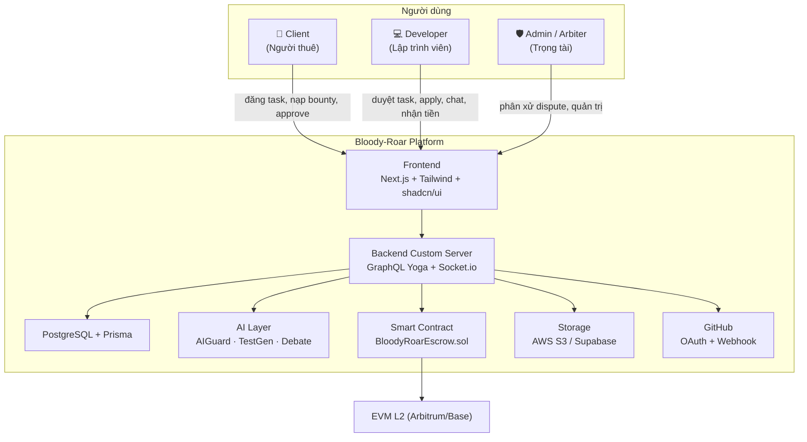
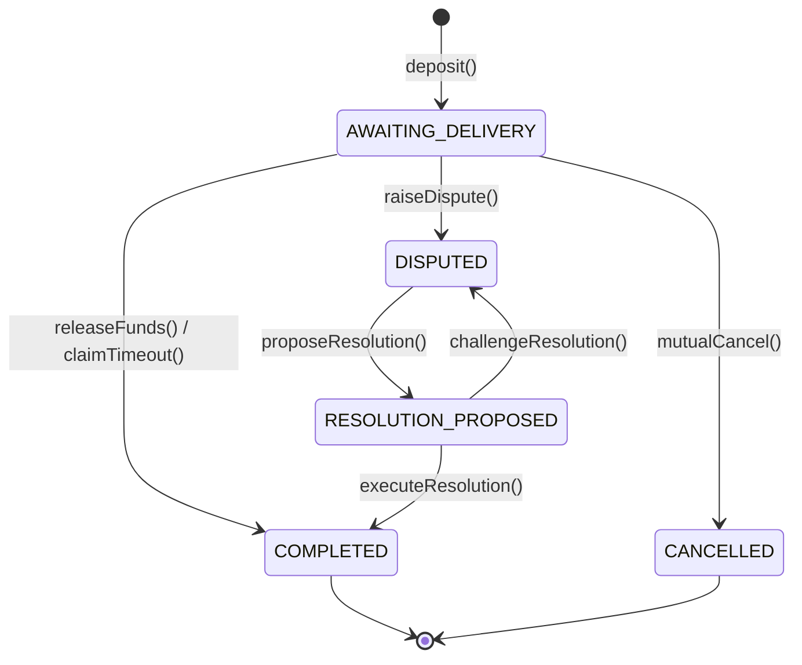
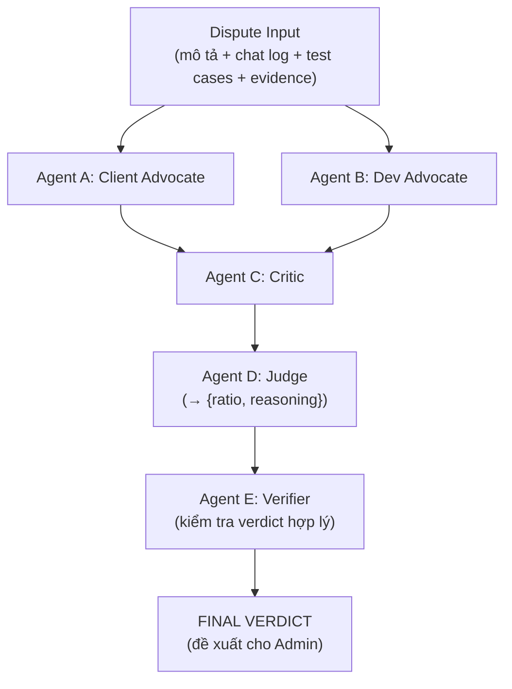
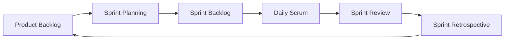

# 🩸 Bloody-Roar — Nền Tảng Thuê Lập Trình Viên Phi Tập Trung

> **Capstone Project 1 — CMU-SE 450 — Proposal Document**
>
> **Version:** 1.0
> **Date:** `[TODO: ngày phát hành]`

---

## TRANG BÌA

```
International School
Capstone Project 1
CMU-SE 450 – C1SE42

Proposal Document
Version 1.0
Date: [TODO]

Bloody-Roar
Decentralized Bounty Marketplace
(Tin tưởng được thay thế bằng Toán học và Trí tuệ nhân tạo)

Created by <C1SE.42>
[TODO: Tên đầy đủ 1] — Kiên
[TODO: Tên đầy đủ 2] — Khôi
[TODO: Tên đầy đủ 3] — Hiếu
[TODO: Tên đầy đủ 4] — Hân
[TODO: Tên đầy đủ 5] — Trâm

Approved by
[TODO: Tên Mentor], Le Kim Hoang — Mentor

Proposal Review Panel Representative:
Name            Signature       Date

Capstone Project 1 — Mentor:
Name            Signature       Date
```

---

## PROJECT INFORMATION

| Mục                        | Nội dung                                                                          |
| -------------------------- | --------------------------------------------------------------------------------- |
| **Project acronym**        | Bloody-Roar                                                                       |
| **Project Title**          | Decentralized Bounty Marketplace (Nền tảng thuê lập trình viên phi tập trung)     |
| **Start Date**             | `[TODO]`                                                                          |
| **End Date**               | `[TODO]` (10 tuần phát triển)                                                     |
| **Lead Institution**       | International School, Duy Tan University                                          |
| **Project Mentor**         | `[TODO: Tên Mentor]`                                                              |
| **Scrum master / Leader**  | `[TODO: Tên]` — Email: `[TODO]` — Tel: `[TODO]` — ID: `[TODO]`                    |
| **Partner Organization**   | Duy Tan University                                                                |
| **Project Web URL**        | `[TODO]`                                                                          |

**Team members**

| Name                  | Email        | Tel       | MSSV        |
| --------------------- | ------------ | --------- | ----------- |
| Kiên (Smart Contract) | `[TODO]`     | `[TODO]`  | `[TODO]`    |
| Khôi (Backend Lead)   | `[TODO]`     | `[TODO]`  | `[TODO]`    |
| Hiếu (Backend)        | `[TODO]`     | `[TODO]`  | `[TODO]`    |
| Hân (UI/UX + QA)      | `[TODO]`     | `[TODO]`  | `[TODO]`    |
| Trâm (UI/UX + Test)   | `[TODO]`     | `[TODO]`  | `[TODO]`    |

---

## DOCUMENT HISTORY

| Version | Date       | Comments        |
| ------- | ---------- | --------------- |
| 1.0     | `[TODO]`   | Initial Release |

---

## DOCUMENT APPROVALS

| Vai trò             | Tên           | MSSV        | Chữ ký | Ngày |
| ------------------- | ------------- | ----------- | ------ | ---- |
| Mentor              | `[TODO]`      | —           |        |      |
| Scrum Master        | `[TODO]`      | `[TODO]`    |        |      |
| Team Member (Kiên)  | `[TODO]`      | `[TODO]`    |        |      |
| Team Member (Khôi)  | `[TODO]`      | `[TODO]`    |        |      |
| Team Member (Hiếu)  | `[TODO]`      | `[TODO]`    |        |      |
| Team Member (Hân)   | `[TODO]`      | `[TODO]`    |        |      |
| Team Member (Trâm)  | `[TODO]`      | `[TODO]`    |        |      |

---

## MỤC LỤC

1. [Tiêu đề dự án](#1-tiêu-đề-dự-án)
2. [Tổng quan dự án](#2-tổng-quan-dự-án)
   - 2.1 [Mục đích của tài liệu](#21-mục-đích-của-tài-liệu)
   - 2.2 [Mục tiêu dự án](#22-mục-tiêu-dự-án)
3. [Bối cảnh và động lực](#3-bối-cảnh-và-động-lực)
4. [Giải pháp đề xuất](#4-giải-pháp-đề-xuất)
   - 4.1 [Giải pháp](#41-giải-pháp)
   - 4.2 [Sơ đồ ngữ cảnh hệ thống](#42-sơ-đồ-ngữ-cảnh-hệ-thống)
   - 4.3 [Mô tả ngữ cảnh hệ thống](#43-mô-tả-ngữ-cảnh-hệ-thống)
5. [Các sản phẩm / dự án liên quan trên thị trường](#5-các-sản-phẩm--dự-án-liên-quan-trên-thị-trường)
6. [Mục tiêu và sản phẩm bàn giao](#6-mục-tiêu-và-sản-phẩm-bàn-giao)
   - 6.1 [Mục tiêu](#61-mục-tiêu)
   - 6.2 [Bảng tổng quan nhiệm vụ](#62-bảng-tổng-quan-nhiệm-vụ)
7. [Phương pháp và công cụ](#7-phương-pháp-và-công-cụ)
   - 7.1 [Ràng buộc kỹ thuật](#71-ràng-buộc-kỹ-thuật)
   - 7.2 [Quy trình Scrum](#72-quy-trình-scrum)
8. [Tiến độ (Timeline)](#8-tiến-độ-timeline)
9. [Nhóm dự án](#9-nhóm-dự-án)
10. [Quản lý rủi ro](#10-quản-lý-rủi-ro)
11. [Ngân sách và nguồn lực](#11-ngân-sách-và-nguồn-lực)
12. [Ràng buộc dự án](#12-ràng-buộc-dự-án)
13. [Kết luận](#13-kết-luận)
14. [Tài liệu tham khảo](#14-tài-liệu-tham-khảo)
15. [Phụ lục: MÔ TẢ YÊU CẦU SẢN PHẨM](#15-phụ-lục-mô-tả-yêu-cầu-sản-phẩm)
    - 15.1 [Mô tả ngắn ý tưởng sản phẩm](#151-mô-tả-ngắn-ý-tưởng-sản-phẩm)
    - 15.2 [Yêu cầu](#152-yêu-cầu)

---

## DANH SÁCH BẢNG

- Bảng 1. So sánh các nền tảng hiện có
- Bảng 2. Tổng quan nhiệm vụ
- Bảng 3. Tiến độ dự án (5 Sprint × 2 tuần)
- Bảng 4. Vai trò và trách nhiệm nhóm
- Bảng 5. Kế hoạch quản lý rủi ro
- Bảng 6. Ngân sách và nguồn lực
- Bảng 7. Ràng buộc dự án
- Bảng 8. Tài liệu tham khảo
- Bảng 9. Backlog chi tiết Sprint 0 – 4

---

## DANH SÁCH HÌNH

- Hình 1. Sơ đồ ngữ cảnh hệ thống
- Hình 2. Máy trạng thái Smart Contract Escrow
- Hình 3. Kiến trúc AI Multi-Agent Debate
- Hình 4. Quy trình Scrum

---

# 1. TIÊU ĐỀ DỰ ÁN

**Bloody-Roar — Nền tảng thuê lập trình viên phi tập trung (Decentralized Bounty Marketplace)**

> Một giải pháp thông minh cho thị trường việc làm freelance, nơi **niềm tin vào con người/tổ chức được thay thế bằng niềm tin vào công nghệ** (blockchain escrow + AI).

---

# 2. TỔNG QUAN DỰ ÁN

## 2.1 Mục đích của tài liệu

- Cung cấp cái nhìn tổng quan về dự án, bao gồm mục đích và phạm vi.
- Xác định nhu cầu nghiệp vụ, các vấn đề liên quan đến việc khởi tạo và xây dựng sản phẩm.
- Đưa ra giải pháp cho nhu cầu nghiệp vụ và tổng quan kiến trúc hệ thống.
- Cung cấp tổng quan về nguồn lực, tiến độ, giải pháp kỹ thuật và ngân sách của dự án.

## 2.2 Mục tiêu dự án

**Bloody-Roar** là một **bounty marketplace** (chợ việc làm kèm tiền thưởng) phi tập trung, nơi:

- **Client** (người thuê) đăng bài toán kèm tiền thưởng (bounty).
- **Developer** (lập trình viên) ứng tuyển và giải quyết bài toán.
- Việc **thanh toán được đảm bảo trustless** bằng smart contract escrow trên EVM L2.
- **AI** đóng vai trò: bảo vệ thông tin nhạy cảm trong chat, sinh test cases để định nghĩa "done", và phân xử tranh chấp công bằng.

Điểm khác biệt cốt lõi: **không cần tin tưởng lẫn nhau** — mọi giao dịch được đảm bảo bởi blockchain (giữ tiền minh bạch) và trí tuệ nhân tạo (kiểm tra, phân xử).

---

# 3. BỐI CẢNH VÀ ĐỘNG LỰC

## 3.1 Bài toán "Bất đối xứng niềm tin" (Asymmetric Trust)

Trong thị trường freelance truyền thống, bài toán muôn thuở là **"Ai trả tiền trước?"**:

| Nếu Client trả trước                                        | Nếu Client giữ tiền đến cuối                                                     |
| ----------------------------------------------------------- | --------------------------------------------------------------------------------- |
| Developer có thể biến mất, code dở tệ, không bàn giao → mất tiền oan. | Developer sợ bị "bùng": code xong rồi bị hủy job, không nhận được đồng nào. |

Cả hai bên đều có lý do chính đáng để **không tin tưởng đối phương**.

## 3.2 Các sàn hiện tại giải quyết ra sao?

Các sàn như Upwork, Fiverr, Freelancer đóng vai trò **"người trung gian giữ tiền"**. Cách này giải quyết được phần nào, nhưng sinh ra vấn đề mới:

- **Phí cao:** 10–20% giá trị hợp đồng.
- **Tập trung quyền lực:** Sàn là người duy nhất quyết định ai đúng ai sai khi tranh chấp; có thể thiên vị, chậm trễ, thậm chí phá sản và ôm tiền.
- **Thiếu minh bạch:** Người dùng không biết tiền của mình được xử lý như thế nào.

## 3.3 Giải pháp của Bloody-Roar

Bloody-Roar thay thế **"niềm tin vào con người/tổ chức"** bằng **"niềm tin vào công nghệ"** qua 4 trụ cột:

| Trụ cột                          | Chức năng                                                                        |
| -------------------------------- | -------------------------------------------------------------------------------- |
| **Ký quỹ Blockchain (Escrow)**   | Giữ tiền trong smart contract, tự động trả khi đủ điều kiện (không cần trung gian). |
| **Định danh số (eKYC/GitHub)**   | Xác minh danh tính developer, gắn với chứng chỉ không thể chuyển nhượng.          |
| **AI Guard**                     | Tự động phát hiện và che thông tin nhạy cảm, chấm điểm code, phân xử tranh chấp.  |
| **AI Test Case Generator**       | Sinh test cases khi đăng bounty để định nghĩa "done" rõ ràng, chống tranh chấp scope. |

---

# 4. GIẢI PHÁP ĐỀ XUẤT

## 4.1 Giải pháp

Bloody-Roar cung cấp nền tảng all-in-one giải quyết bài toán freelance với các tính năng chính:

### 4.1.1 Marketplace (Chợ việc làm)

- **Đăng task:** Client điền tiêu đề, mô tả, category, bounty (USDT).
- **Duyệt & lọc:** Developer duyệt danh sách task, lọc theo category, bounty range, status; tìm kiếm từ khóa.
- **Ứng tuyển & chọn:** Developer apply (không cần đặt cọc), Client xem danh sách ứng viên và chọn developer.

### 4.1.2 Smart Contract Escrow (Ký quỹ thông minh)

- **Lazy-Deposit:** Client ký EIP-712 off-chain khi đăng task (không tốn gas); chỉ nạp 100% bounty on-chain khi chính thức chọn developer.
- **Zero-Stake:** Developer không cần đặt cọc 10–20% như các nền tảng blockchain khác — dùng danh tính đã xác minh làm tài sản thế chấp.
- **Tự động thanh toán:** Client approve → tiền chuyển cho developer; Client "biến mất" 30 ngày → developer claim tiền tự động; cả hai đồng ý hủy → hoàn 100% cho client.

### 4.1.3 AI (5 module)

| # | Module                          | Chức năng                                                                 | Trigger        | Model gợi ý                    |
| - | ------------------------------- | ------------------------------------------------------------------------- | -------------- | ------------------------------ |
| 1 | **AI Chat Guard**               | Phát hiện + che API keys, private keys, PII trong chat (2 tầng: Regex + LLM) | Mỗi message    | Groq llama-3.1-8b-instant      |
| 2 | **AI Test Case Generator**      | Sinh test cases / acceptance criteria khi đăng bounty                      | Đăng bounty    | Groq llama-3.3-70b / Gemini    |
| 3 | **AI Dispute Assistant**        | Gom dữ liệu tranh chấp → phân tích → đề xuất tỷ lệ payout                | Raise dispute  | Multi-agent debate             |
| 4 | **AI Multi-Agent Debate**       | 5 agent (2 Advocate + Critic + Judge + Verifier) tranh luận trước khi chốt verdict | Dispute        | Mix (xem 7.1)                  |
| 5 | **Model Router**                | Điều phối model free theo task + fallback                                  | Mọi AI call    | Groq/Gemini free → OpenAI      |

### 4.1.4 Real-time Chat & Notifications

- Chat real-time giữa Client–Developer qua Socket.io (room per task, lưu lịch sử, gửi file qua S3 presigned URL).
- Thông báo real-time: có ứng viên, được assign, dispute, thanh toán.

### 4.1.5 GitHub Auth (KYC) & Integration

- Xác thực user qua GitHub OAuth → verified badge (định danh cơ bản cho MVP).
- Liên kết repo, webhook `pull_request.merged` → tự động kích hoạt thanh toán.

### 4.1.6 Admin & Analytics

- Admin dashboard: tổng quan tasks/users/revenue, quản lý user (ban, KYC status), dispute dashboard với AI report.
- User analytics: thống kê cá nhân (tasks hoàn thành, earnings).

## 4.2 Sơ đồ ngữ cảnh hệ thống



**Hình 1. Sơ đồ ngữ cảnh hệ thống**

## 4.3 Mô tả ngữ cảnh hệ thống

**Client (Người thuê):**
- Đăng task với tiêu đề, mô tả, category, bounty; AI sinh test cases khi đăng.
- Ký cam kết EIP-712 off-chain; nạp bounty on-chain khi chọn developer.
- Xem danh sách ứng viên, chọn developer, approve/release tiền, raise dispute.
- Không xem được code gốc của developer cho đến khi thanh toán (Asymmetric Visibility — v2).

**Developer (Lập trình viên):**
- Kết nối ví (MetaMask/WalletConnect) để đăng nhập; kết nối GitHub để verified (KYC).
- Duyệt marketplace, lọc/tìm kiếm, xem chi tiết task, ứng tuyển (zero-stake).
- Chat real-time, nhận tiền tự động khi client approve hoặc claim sau 30 ngày.

**Admin / Arbiter (Trọng tài):**
- Xem dashboard tổng quan, quản lý user (ban, KYC status).
- Khi có dispute: xem AI report phân tích, đề xuất tỷ lệ payout (partial release), chịu 24h challenge period.
- Mọi quyết định được ghi lại công khai trên blockchain; không thể tự ý rút/chuyển tiền.

---

# 5. CÁC SẢN PHẨM / DỰ ÁN LIÊN QUAN TRÊN THỊ TRƯỜNG

**Bảng 1. So sánh các nền tảng hiện có**

| Đặc điểm                        | Bloody-Roar | Upwork | Fiverr | Gitcoin | TalentLayer |
| ------------------------------- | ----------- | ------ | ------ | ------- | ----------- |
| Escrow qua Smart Contract       | ✅          | ❌ (tập trung) | ❌ | ✅ (quadratic) | ✅ |
| Lazy-Deposit (không nạp trước)  | ✅          | ❌     | ❌     | ⚠️      | ⚠️          |
| Zero-Stake cho developer        | ✅          | ❌     | ❌     | ⚠️      | ⚠️          |
| AI Guard bảo vệ secrets         | ✅          | ❌     | ❌     | ❌      | ❌          |
| AI Test Case Generator          | ✅          | ❌     | ❌     | ❌      | ❌          |
| AI Dispute (Multi-Agent Debate) | ✅          | ❌     | ❌     | ❌      | ❌          |
| Phí giao dịch                   | Thấp (L2 gas) | 10–20% | 20% | 5% | —        |

**Ưu thế cạnh tranh của Bloody-Roar:**
- **Trustless:** Không cần tin vào nền tảng trung gian — tiền do smart contract quản lý.
- **Rào cản thấp:** Client không cần nạp tiền trước, developer không cần đặt cọc.
- **AI-first:** AI Guard, AI Test Gen, AI Dispute là những tính năng mà các đối thủ chưa có.
- **Chi phí thấp:** Chạy trên EVM L2 (gas < $0.01), dùng model AI free (Groq/Gemini).

---

# 6. MỤC TIÊU VÀ SẢN PHẨM BÀN GIAO

## 6.1 Mục tiêu

- **Mục tiêu 1:** Xây dựng marketplace cho phép Client đăng task và Developer duyệt, ứng tuyển, được chọn.
  - **Deliverable:** Module Marketplace hoàn chỉnh (Issue CRUD, search/filter, apply/assign) qua GraphQL + UI.
- **Mục tiêu 2:** Triển khai escrow trustless trên EVM L2.
  - **Deliverable:** `BloodyRoarEscrow.sol` (deposit, release, mutual cancel, claim timeout, dispute, partial resolution, pause) với 14+ unit tests.
- **Mục tiêu 3:** Tích hợp 5 module AI (Guard, Test Gen, Dispute Assistant, Multi-Agent Debate, Model Router).
  - **Deliverable:** AIGuardService (accuracy >95%), TestGenerator, DebateOrchestrator + DisputeAnalyzer, ModelRouter (Groq/Gemini free).
- **Mục tiêu 4:** Xác thực danh tính và tích hợp GitHub.
  - **Deliverable:** Thirdweb Auth (SIWE) + GitHub OAuth (verified badge) + GitHub App webhook (auto-payment trigger).
- **Mục tiêu 5:** Real-time chat + notifications + admin/analytics.
  - **Deliverable:** Socket.io chat, hệ thống notification, Admin dashboard + user analytics.
- **Mục tiêu 6:** Testing, CI/CD, deployment production.
  - **Deliverable:** Vitest + Playwright E2E, GitHub Actions CI, deploy Railway/Fly.io + Neon/Supabase, Sentry.

## 6.2 Bảng tổng quan nhiệm vụ

**Bảng 2. Tổng quan nhiệm vụ**

| No. | Task name                     | Mô tả                                                                                     |
| --- | ----------------------------- | ----------------------------------------------------------------------------------------- |
| 1.  | **Khởi tạo**                  |                                                                                           |
| 1.1 | Thu thập yêu cầu              | Ghi nhận yêu cầu chức năng/phi chức năng (xem mục 15).                                    |
| 1.2 | Xác định tính năng chính      | Ưu tiên tính năng cho MVP: marketplace → escrow → chat → dispute.                          |
| 2.  | **Khởi động**                 |                                                                                           |
| 2.1 | Kick-off                      | Thống nhất mục tiêu, phạm vi, timeline.                                                   |
| 2.2 | Tạo tài liệu dự án            | Thiết kế kỹ thuật, kiến trúc, backlog ban đầu.                                            |
| 3.  | **Phát triển**                |                                                                                           |
| 3.1 | Sprint 0 (Foundation)         | Monorepo, Prisma schema, Next.js custom server, Hardhat, design system.                   |
| 3.2 | Sprint 1 (Auth + Marketplace) | Web3 login, profile, issue CRUD, apply/assign, escrow contract.                           |
| 3.3 | Sprint 2 (Escrow + Chat + AI) | Escrow E2E, chat real-time, AI Guard, AI Test Gen, Model Router.                          |
| 3.4 | Sprint 3 (Dispute + GitHub)   | AI Multi-Agent Debate, GitHub Auth, notifications, analytics.                             |
| 3.5 | Sprint 4 (Polish + Deploy)    | CI/CD, EAS reputation, responsive polish, deploy production, documentation.               |
| 4.  | **Retrospective**             | Đánh giá quá trình, rút kinh nghiệm.                                                      |
| 5.  | **Final Release**             | Deploy production, đảm bảo chức năng, hỗ trợ sau launch.                                  |

---

# 7. PHƯƠNG PHÁP VÀ CÔNG CỤ

## 7.1 Ràng buộc kỹ thuật

### Công nghệ phát triển

| Lớp                 | Công nghệ                                                                          |
| ------------------- | ---------------------------------------------------------------------------------- |
| Package Manager     | **Bun** (monorepo workspaces)                                                      |
| Runtime             | **Next.js Custom Server** (TypeScript) — gắn thêm Socket.io/GraphQL              |
| Frontend            | Next.js 14+ App Router + **Tailwind CSS v4 + shadcn/ui** (mobile-first)            |
| API                 | **GraphQL Yoga + Pothos** (code-first schema)                                      |
| Auth                | **Thirdweb Auth** (SIWE, JWT)                                                      |
| Database            | **PostgreSQL** + **Prisma** (ORM, type-safe)                                       |
| Web3 Client         | **Thirdweb SDK**                                                                   |
| Real-time           | **Socket.io** (room management, chat)                                              |
| AI SDK              | **Vercel AI SDK** (multi-provider: Groq + Gemini + OpenAI)                         |
| AI Models           | **Groq llama-3.1-8b-instant / llama-3.3-70b (free)** + **Gemini Flash (free)** + OpenAI GPT-4o (fallback) |
| Storage             | **AWS S3** (pre-signed URL) / Supabase Storage                                     |
| KYC                 | **GitHub OAuth** (verified badge)                                                  |
| Reputation          | DB (v1) → **EAS Attestation on-chain** (v1.5)                                      |
| Anti-Sybil          | **Gitcoin Passport** (v2)                                                          |
| State / Forms       | **Zustand + TanStack Query** · **React Hook Form + Zod**                          |
| Testing             | **Vitest** (unit/integration) + **Playwright** (E2E) + **Hardhat/Chai** (contract) |
| Logging / Monitor   | **Pino** + **Sentry**                                                              |
| Deploy / CI/CD      | **Railway/Fly.io** + **Neon/Supabase** · **GitHub Actions**                       |
| Smart Contracts     | **Solidity 0.8.24 + Hardhat** (EVM L2: Arbitrum/Base) + **EAS**                    |

### Máy trạng thái Smart Contract Escrow

`BloodyRoarEscrow.sol` quản lý giao dịch qua 5 trạng thái:

| State                 | Định nghĩa                                        | Điều kiện chuyển trạng thái                                        |
| --------------------- | ------------------------------------------------- | ------------------------------------------------------------------ |
| `AWAITING_DELIVERY`   | Task đang hoạt động, in-progress                  | Client gọi `deposit()` khóa 100% bounty (yêu cầu worker đã verify) |
| `COMPLETED`           | Tiền đã được phân phối                            | Client approve HOẶC timeout 30 ngày (auto-release)                 |
| `CANCELLED`           | Escrow hủy hòa bình                               | Cả Client và Developer đồng ý hủy (mutual cancel)                  |
| `DISPUTED`            | Tiền bị đóng băng do tranh chấp                   | Client hoặc Developer raise dispute                                |
| `RESOLUTION_PROPOSED` | Arbiter đề xuất tỷ lệ chia                        | Arbiter `proposeResolution()`; bắt đầu 24h timelock                |



**Hình 2. Máy trạng thái Smart Contract Escrow**

### Kiến trúc AI Multi-Agent Debate



**Hình 3. Kiến trúc AI Multi-Agent Debate** (kết quả chỉ là *đề xuất*; Admin con người approve cuối cùng)

### Môi trường phát triển & testing

- **IDE:** Visual Studio Code; **Repo:** GitHub (Git Flow: main ← develop ← feat/*).
- **Testing env:** Localhost (Next.js custom server + Hardhat node), Postman/GraphiQL cho API testing.
- **Ràng buộc khác:**
  - **Nguồn lực:** Team 5 người (xem mục 9).
  - **Thời gian:** 10 tuần (5 Sprint × 2 tuần) theo Scrum.
  - **Ngân sách:** Hạn chế, ưu tiên free-tier (Groq/Gemini free, Neon/Supabase, Cloudflare, Alchemy).
  - **Khả mở rộng:** Thiết kế để mở rộng từ task nhỏ đến nhiều user.

## 7.2 Quy trình Scrum

Scrum là phương pháp phát triển phần mềm Agile, quản lý dự án qua các vòng lặp (iteration) và increment. Phù hợp với dự án có yêu cầu thay đổi nhanh, phức tạp.



**Hình 4. Quy trình Scrum**

- **Sprint:** 2 tuần × 5 sprint = 10 tuần.
- **Roles:** Product Owner, Scrum Master, Development Team (5 thành viên đa năng).
- **Lợi ích:** Dễ thích ứng với thay đổi; phát hiện vấn đề sớm; giao phần việc giá trị cao trước; đáp ứng tốt nhu cầu khách hàng; cải thiện năng suất; duy trì lịch trình dự đoán được.

---

# 8. TIẾN ĐỘ (TIMELINE)

**Bảng 3. Tiến độ dự án (5 Sprint × 2 tuần = 10 tuần)**

| Phase            | Tuần   | Ngày bắt đầu | Ngày kết thúc | Mô tả                                                                 |
| ---------------- | ------ | ------------ | ------------- | --------------------------------------------------------------------- |
| **Sprint 0: Foundation** | 1      | `[TODO]` | `[TODO]` | Monorepo, Prisma schema, Next.js custom server, Hardhat, design system, AI research |
| **Sprint 1: Auth + Marketplace** | 2–3 | `[TODO]` | `[TODO]` | Web3 login, profile, issue CRUD, apply/assign, escrow contract (14+ tests) |
| **Sprint 2: Escrow + Chat + AI Guard** | 4–5 | `[TODO]` | `[TODO]` | Escrow E2E, chat real-time, AI Guard, AI Test Gen, Model Router |
| **Sprint 3: Dispute + GitHub Auth + Analytics** | 6–7 | `[TODO]` | `[TODO]` | AI Multi-Agent Debate, GitHub OAuth, notifications, analytics |
| **Sprint 4: Polish + Deploy** | 8–10 | `[TODO]` | `[TODO]` | CI/CD, EAS reputation, polish, deploy production, documentation |

### Backlog chi tiết theo Sprint

**Bảng 9. Backlog chi tiết Sprint 0 – 4** (Task ID · Task · Owner · Estimate · Dependencies · Acceptance Criteria)

#### Sprint 0 — Foundation (Tuần 1)

| Task ID | Task | Owner | Est | Deps | AC |
| ------- | ---- | ----- | --- | ---- | -- |
| S0-FND-01 | Khởi tạo monorepo với Bun workspaces | Khôi | 2h | — | `bun install` thành công, `apps/*` + `packages/*` hoạt động |
| S0-FND-02 | Khởi tạo `packages/shared` | Khôi | 1h | FND-01 | Package export được types |
| S0-FND-03 | Thiết kế Prisma schema (10+ models) | Khôi | 6h | FND-02 | `prisma migrate dev` thành công |
| S0-FND-04 | Seed database | Khôi | 2h | FND-03 | `bun run seed` tạo admin + sample data |
| S0-FND-05 | Docker Compose PostgreSQL | Khôi | 1h | — | PostgreSQL chạy port 5432 |
| S0-FND-06 | Next.js app + custom server | Khôi | 4h | FND-01 | `bun run dev` chạy port 3000 |
| S0-FND-07 | Attach GraphQL Yoga vào custom server | Khôi | 3h | FND-06 | `POST /api/graphql` trả Hello World |
| S0-FND-08 | Attach Socket.io vào custom server | Khôi | 2h | FND-06 | Client connect được socket |
| S0-FND-09 | Tailwind CSS v4 + shadcn/ui | Khôi | 1h | FND-06 | Button render được |
| S0-FND-10 | TypeScript strict + ESLint + Prettier | Khôi | 1h | FND-06 | `lint` + `typecheck` chạy qua |
| S0-FND-11 | Cấu hình Pino logger | Khôi | 1h | FND-06 | Request log JSON |
| S0-FND-12 | `.env.example` với mọi biến | Khôi | 1h | FND-06 | Template có comment |
| S0-FND-13 | Review Prisma schema | Hiếu | 1h | FND-03 | Feedback cho Khôi |
| S0-FND-14 | Hỗ trợ setup Next.js server | Hiếu | 2h | FND-06 | Server hoạt động |
| S0-FND-15 | Research GraphQL Yoga + Pothos | Hiếu | 2h | — | Knowledge base sẵn sàng |
| S0-SC-01 | Khởi tạo Hardhat project | Kiên | 1h | — | `npx hardhat compile` thành công |
| S0-SC-02 | Multi-network (localhost, sepolia, mainnet) | Kiên | 1h | SC-01 | Deploy script hoạt động localhost |
| S0-SC-03 | Cài OpenZeppelin Contracts v5 | Kiên | 0.5h | SC-01 | Import thành công |
| S0-AI-01 | Đăng ký OpenAI API key + billing | Khôi | 1h | — | Gọi được GPT-4o-mini |
| S0-AI-02 | Research Vercel AI SDK + sample | Khôi | 3h | AI-01 | Sample streaming hoạt động |
| S0-AI-03 | Tổng hợp PII/Secret patterns (20+ regex) | Khôi | 3h | — | Patterns document |
| S0-AI-04 | Tạo `prompts/` trong repo | Khôi | 0.5h | — | Cấu trúc + template |
| S0-DSN-01 | Design Tokens (colors, typography, spacing) | Hân | 4h | — | Figma tokens documented |
| S0-DSN-02 | Layout System (navbar, sidebar, mobile) | Hân | 3h | DSN-01 | Figma desktop + mobile |
| S0-DSN-03 | Component variants (button, input, card...) | Hân | 4h | DSN-01 | Figma components |
| S0-DSN-04 | Customize shadcn/ui theme | Trâm | 3h | DSN-01, FND-09 | CSS variables override |
| S0-DSN-05 | Cài toàn bộ shadcn/ui components | Trâm | 2h | FND-09 | 12+ components sẵn sàng |
| S0-DSN-06 | Form components (React Hook Form + Zod) | Trâm | 3h | DSN-05 | FormField/Input/Select/Textarea |
| S0-DSN-07 | Accessibility tools (axe-core, eslint a11y) | Trâm | 1h | FND-09 | Lint báo lỗi a11y |
| S0-DSN-08 | Loading + Error + Empty states | Hân | 2h | DSN-01 | Patterns cho mọi state |

#### Sprint 1 — Auth + Marketplace (Tuần 2–3)

| Task ID | Task | Owner | Est | Deps | AC |
| ------- | ---- | ----- | --- | ---- | -- |
| S1-AUTH-01 | Cấu hình Thirdweb Auth provider | Hiếu | 2h | FND-06 | `useConnect` chạy |
| S1-AUTH-02 | Auth middleware GraphQL | Hiếu | 2h | AUTH-01 | Query không JWT → Unauthorized |
| S1-AUTH-03 | GraphQL Context factory (DB + user) | Hiếu | 1h | AUTH-02 | Context có `user` + `db` |
| S1-AUTH-04 | User module — Pothos types | Hiếu | 1h | FND-07 | Type `User` |
| S1-AUTH-05 | Query `me` và `user(id)` | Hiếu | 1h | AUTH-04 | Trả user đúng |
| S1-AUTH-06 | Mutation `updateProfile` | Hiếu | 2h | AUTH-05 | Update name/email/bio/avatar |
| S1-AUTH-07 | Auth pages UI design | Hân | 2h | DSN-03 | Figma login + connect wallet |
| S1-AUTH-08 | Auth pages code | Trâm | 3h | AUTH-07, AUTH-01 | ConnectWallet + redirect |
| S1-AUTH-09 | Review Thirdweb Auth middleware | Kiên | 1h | AUTH-02 | Code review |
| S1-MKP-01 | Issue module — Pothos types | Hiếu | 1h | AUTH-04 | Issue, IssueStatus, Filter, Pagination |
| S1-MKP-02 | Query `issues` (filter/sort/paginate) | Hiếu | 3h | MKP-01 | Cursor pagination |
| S1-MKP-03 | Query `issue(id)` | Hiếu | 1h | MKP-01 | Issue + client + applicants |
| S1-MKP-04 | Mutation `createIssue` | Hiếu | 2h | MKP-01 | Zod validate + insert DB |
| S1-MKP-05 | Mutation `updateIssue` | Hiếu | 1h | MKP-04 | Client-only update |
| S1-MKP-06 | Mutation `cancelIssue` | Hiếu | 1h | MKP-04 | CANCELLED nếu chưa assign |
| S1-MKP-07 | Application module (`applyIssue`, `getApplicants`) | Hiếu | 2h | MKP-03 | Apply + list applicants |
| S1-MKP-08 | Mutation `assignDeveloper` | Hiếu | 2h | MKP-07 | Status → IN_PROGRESS |
| S1-MKP-09 | Search & Filter logic | Hiếu | 2h | MKP-02 | Prisma `where` + `orderBy` |
| S1-MKP-10..15 | Thiết kế Marketplace/Detail/Create/Dashboard/Profile/GitHub badge | Hân | ~12h | DSN-02 | Figma designs |
| S1-MKP-16 | Main Layout (navbar + sidebar) | Trâm | 3h | DSN-05 | Responsive + mobile menu |
| S1-MKP-17 | Profile page | Trâm | 2h | MKP-14, AUTH-05 | Edit form + avatar upload |
| S1-MKP-18 | Marketplace page | Trâm | 4h | MKP-10, MKP-02 | Filter, search, pagination |
| S1-MKP-19 | Issue Detail page | Trâm | 3h | MKP-11, MKP-03 | Description, bounty, applicants |
| S1-MKP-20 | Create Issue form | Trâm | 4h | MKP-12, MKP-04 | Multi-step, validate, submit |
| S1-MKP-21 | Dashboard page | Trâm | 3h | MKP-13 | Posted/working tabs, stats |
| S1-MKP-22 | GitHub Auth badge | Trâm | 1h | MKP-15 | Connect → verified badge |
| S1-MKP-23 | Hỗ trợ FE Web3 integration | Khôi | 2h | AUTH-01 | Thirdweb hooks review |
| S1-MKP-24 | Hỗ trợ BE marketplace | Kiên | 1h | MKP-04 | Code review |
| S1-SC-01 | State machine diagram | Kiên | 1h | — | 5 states documented |
| S1-SC-02 | `BloodyRoarEscrow.sol` base | Kiên | 2h | SC-03 | Skeleton compile |
| S1-SC-03 | `deposit(issueId, worker)` | Kiên | 3h | SC-02 | Lock funds + emit |
| S1-SC-04 | `releaseFunds(issueId)` | Kiên | 1h | SC-03 | Client-only transfer |
| S1-SC-05 | `mutualCancel(issueId)` | Kiên | 2h | SC-03 | Both sign → refund |
| S1-SC-06 | `claimTimeout(issueId)` | Kiên | 1h | SC-03 | Claim sau 30 ngày |
| S1-SC-07 | `raiseDispute(issueId)` | Kiên | 1h | SC-03 | State = DISPUTED |
| S1-SC-08 | `proposeResolution(issueId, ratio)` | Kiên | 2h | SC-07 | Arbiter-only, 24h timelock |
| S1-SC-09 | `challengeResolution(issueId)` | Kiên | 1h | SC-08 | Trong 24h window |
| S1-SC-10 | `executeResolution(issueId)` | Kiên | 1h | SC-09 | Split funds |
| S1-SC-11 | `pause()` / `unpause()` | Kiên | 1h | SC-02 | Owner-only circuit breaker |
| S1-SC-12 | Full unit tests (14+ cases) | Kiên | 4h | SC-10 | All pass + gas report |
| S1-CHAT-01 | Socket.io auth middleware (JWT) | Khôi | 1h | FND-08, AUTH-01 | Disconnect nếu invalid |
| S1-CHAT-02 | Room Management (`join:task`, `leave:task`) | Khôi | 2h | CHAT-01 | Rooms hoạt động |
| S1-CHAT-03 | Message handler (save DB + broadcast) | Khôi | 2h | CHAT-02 | Lưu Prisma + emit |
| S1-CHAT-04 | File upload endpoint (S3 presigned) | Khôi | 3h | FND-06 | `POST /api/upload` → S3 URL |
| S1-TST-01 | Cài Vitest + Testing Library | Trâm | 1h | — | `vitest run` thành công |
| S1-TST-02 | Cài Playwright | Hân | 1h | — | `npx playwright test` chạy được |

#### Sprint 2 — Escrow + Chat + AI Guard (Tuần 4–5)

| Task ID | Task | Owner | Est | Deps | AC |
| ------- | ---- | ----- | --- | ---- | -- |
| S2-ESC-01 | Thirdweb SDK backend (connect contract) | Khôi | 1h | SC-12 | Gọi contract từ server |
| S2-ESC-02 | EIP-712 typed data schema | Kiên | 2h | — | Domain/types/values spec |
| S2-ESC-03 | `signCommitment()` frontend | Kiên | 2h | ESC-02 | Ký → signature |
| S2-ESC-04 | `verifyCommitment()` on-chain | Kiên | 2h | ESC-02 | Verify function |
| S2-ESC-05 | Escrow Prisma model + migration | Khôi | 1h | FND-03 | DB schema |
| S2-ESC-06 | Transaction logger | Khôi | 1h | ESC-05 | Lưu txHash |
| S2-ESC-07 | Escrow GraphQL types | Hiếu | 1h | MKP-01 | Escrow, EscrowStatus |
| S2-ESC-08 | `depositToEscrow(issueId, developerId)` | Hiếu | 3h | ESC-01, ESC-03 | Gọi contract.deposit() |
| S2-ESC-09 | `releaseFunds(issueId)` | Hiếu | 1h | ESC-08 | Gọi contract.releaseFunds() |
| S2-ESC-10 | `cancelEscrow(issueId)` | Hiếu | 1h | ESC-08 | Gọi mutualCancel() |
| S2-ESC-11 | `raiseDispute(issueId, reason)` | Hiếu | 1h | ESC-08 | Gọi raiseDispute() |
| S2-ESC-12 | EIP-712 signing flow FE | Khôi | 2h | ESC-03 | Thirdweb → ký → gửi BE |
| S2-ESC-13 | Oracle/Relayer script | Kiên | 3h | ESC-08 | Nhận event → ký → release |
| S2-ESC-14 | Deploy Escrow testnet + verify | Kiên | 2h | SC-12 | Address + verified |
| S2-ESC-15 | Review Escrow resolvers | Kiên | 1h | ESC-08 | Code review |
| S2-CHAT-01 | File attachment trong chat | Khôi | 2h | CHAT-04, CHAT-03 | Upload → S3 → gửi |
| S2-CHAT-02 | Chat GraphQL module | Hiếu | 2h | CHAT-03 | `messages(issueId)` |
| S2-CHAT-03 | Chat UI design | Hân | 3h | MKP-11 | Figma sidebar/bubbles/preview |
| S2-CHAT-04 | Chat UI implementation | Trâm | 4h | CHAT-03, CHAT-02 | Auto-scroll, upload, Monaco |
| S2-CHAT-05 | Escrow UI design | Hân | 2h | MKP-11 | Deposit modal, timeline |
| S2-CHAT-06 | Escrow UI implementation | Trâm | 3h | CHAT-05, ESC-08 | Deposit → wallet tx → status |
| S2-AI-01 | Regex pattern library (20+) | Khôi | 3h | AI-03 | `patterns.ts` |
| S2-AI-02 | `RegexScanner` class | Khôi | 2h | AI-01 | Detect → mask |
| S2-AI-03 | LLM system prompt (PII) | Khôi | 2h | AI-04 | Masked JSON output |
| S2-AI-04 | `AIGuardService` orchestration | Khôi | 3h | AI-02, AI-03 | Regex → LLM → response |
| S2-AI-05 | Tích hợp AIGuard vào Socket middleware | Khôi | 2h | AI-04, CHAT-03 | Auto-mask trước broadcast |
| S2-AI-06 | 50+ AI Guard test cases | Khôi | 3h | AI-05 | API keys/PII → masked |
| S2-AI-07 | Đánh giá accuracy (FP/FN) | Khôi | 2h | AI-06 | Accuracy >95% |
| S2-MDL-01 | Đăng ký Groq API key (free) | Khôi | 1h | — | Credentials hoạt động |
| S2-MDL-02 | Đăng ký Google AI Studio (Gemini) | Khôi | 1h | — | Credentials hoạt động |
| S2-MDL-03 | `ModelRouter` class | Khôi | 3h | MDL-01,02 | Guard→llama-8b, TestGen→70b, Judge→gpt-oss-120b |
| S2-MDL-04 | Vercel AI SDK multi-provider | Khôi | 2h | MDL-03 | Groq+Gemini+OpenAI cùng SDK |
| S2-MDL-05 | Fallback logic | Khôi | 1h | MDL-04 | Model lỗi → dự phòng |
| S2-TSTGEN-01 | Prompt cho Test Gen | Khôi | 2h | AI-04 | Desc → test cases |
| S2-TSTGEN-02 | `TestGenerator` class | Khôi | 3h | TSTGEN-01, MDL-03 | `{testCases, acceptanceCriteria, edgeCases}` |
| S2-TSTGEN-03 | Structured output | Khôi | 2h | TSTGEN-02 | JSON schema (given/when/then) |
| S2-TSTGEN-04 | Prisma model Test Cases | Khôi | 1h | FND-03 | DB schema |
| S2-TSTGEN-05 | Mutation `generateTestCases(issueId)` | Hiếu | 2h | TSTGEN-02 | AI resolver |
| S2-TSTGEN-06 | UI review test cases | Trâm | 3h | TSTGEN-05 | Client approve/sửa trước publish |
| S2-DSP-01 | Dispute GraphQL types | Hiếu | 1h | MKP-01 | Dispute, Resolution |
| S2-DSP-02 | Dispute queries + mutations | Hiếu | 2h | DSP-01 | `getDispute`, `raiseDispute` |
| S2-DSP-03 | `proposeResolution(issueId, ratio)` | Hiếu | 1h | ESC-11 | Admin-only |
| S2-DSP-04 | `challengeResolution(issueId)` | Hiếu | 1h | DSP-03 | Gọi contract |
| S2-DSP-05 | Admin Dispute Dashboard design | Hân | 3h | — | Figma: case list, AI report |
| S2-DSP-06 | Admin Dispute Dashboard implementation | Trâm | 3h | DSP-05, DSP-02 | Table + AI report |
| S2-TST-01 | E2E Auth flow | Hân | 2h | AUTH-01 | Login → session |
| S2-TST-02 | E2E Marketplace | Hân | 2h | MKP-04 | Create → browse |
| S2-TST-03 | UI component tests | Trâm | 2h | DSN-05 | Render + events |
| S2-TST-04 | Auth hooks tests | Trâm | 2h | AUTH-02 | `useAuth`, `useUser` |
| S2-TST-05 | Hỗ trợ FE Chat + Escrow | Khôi | 2h | CHAT-04, CHAT-06 | Web3 integration review |
| S2-TST-06 | Hỗ trợ BE Escrow | Kiên | 1h | ESC-08 | Code review |

#### Sprint 3 — Dispute + GitHub Auth + Analytics (Tuần 6–7)

| Task ID | Task | Owner | Est | Deps | AC |
| ------- | ---- | ----- | --- | ---- | -- |
| S3-AI-01 | Dispute prompt chain | Khôi | 2h | AI-04 | summarize → debate → verdict |
| S3-AI-02 | `DisputeDataCollector` class | Khôi | 3h | CHAT-02, TSTGEN-04 | Gom desc + chat + test + evidence |
| S3-AI-03 | Multi-Agent Debate design | Khôi | 3h | AI-02 | 5 agent: 2 Advocate, Critic, Judge, Verifier |
| S3-AI-04 | Prompt cho 5 agent | Khôi | 4h | AI-03 | 5 persona prompts |
| S3-AI-05 | `DebateOrchestrator` class | Khôi | 4h | AI-03, MDL-03 | Điều phối vòng tranh luận |
| S3-AI-06 | `DisputeAnalyzer` class | Khôi | 3h | AI-05 | `{suggestedClientRatio, reasoning}` |
| S3-AI-07 | `analyzeDispute(issueId)` resolver | Hiếu | 2h | AI-06, DSP-02 | AI debate resolver |
| S3-AI-08 | 10+ Dispute test scenarios | Khôi | 2h | AI-06 | Scope creep, ghosting... |
| S3-AI-09 | Verdict → on-chain | Khôi+Kiên | 2h | AI-06, ESC-11 | ratio → proposeResolution() |
| S3-AI-10 | Đánh giá debate vs 1 model | Khôi | 2h | AI-08 | Accuracy, fairness report |
| S3-AI-11 | Hỗ trợ dispute contract flow | Kiên | 1h | AI-06 | Flow review |
| S3-GH-01 | Đăng ký GitHub OAuth App | Hiếu | 2h | — | Client ID + secret |
| S3-GH-02 | GitHub OAuth flow | Hiếu | 2h | GH-01 | Login → verify → link |
| S3-GH-03 | `linkGithub` mutation | Hiếu | 1h | GH-02 | Lưu username, verified=true |
| S3-GH-04 | Đăng ký GitHub App (webhook) | Hiếu | 2h | — | App ID + private key |
| S3-GH-05 | Cài Octokit | Hiếu | 1h | GH-04 | Gọi GitHub API |
| S3-GH-06 | Webhook handler (`pull_request.merged`) | Hiếu | 2h | GH-05 | Verify → lưu DB |
| S3-GH-07 | Auto-payment trigger | Hiếu | 2h | GH-06, ESC-09 | PR merged → releaseFunds |
| S3-GH-08 | `linkGithubRepo` mutation | Hiếu | 1h | GH-05 | Lưu repo + installation ID |
| S3-GH-09 | GitHub Auth UI (badge) | Trâm | 2h | MKP-22, GH-02 | Connect → verified |
| S3-GH-10 | GitHub Repo linking UI | Trâm | 2h | GH-08 | Select repo |
| S3-ANL-01 | Analytics SQL queries | Hiếu | 3h | MKP-02 | Task/revenue/dispute/user |
| S3-ANL-02 | Analytics GraphQL queries | Hiếu | 1h | ANL-01 | `adminStats`, `userStats` |
| S3-ANL-03 | Notification model + migration | Hiếu | 0.5h | FND-03 | Model |
| S3-ANL-04 | `createNotification()` service | Hiếu | 1h | ANL-03 | Lưu DB + emit socket |
| S3-ANL-05 | Notification triggers | Hiếu | 2h | ANL-04 | Applicant/assigned/dispute/paid |
| S3-ANL-06 | Notification queries | Hiếu | 1h | ANL-03 | `notifications`, `unreadCount`, `markAsRead` |
| S3-ANL-07 | Admin resolvers | Hiếu | 1h | ANL-02 | Admin-only queries |
| S3-ANL-08 | Admin Dashboard design | Hân | 3h | — | Stat cards, charts |
| S3-ANL-09 | Analytics page design | Hân | 2h | — | Personal + platform stats |
| S3-ANL-10 | User Management design | Hân | 1h | — | Table, ban, verified filter |
| S3-ANL-11 | Admin Dashboard implementation | Trâm | 3h | ANL-08, ANL-02 | Charts (Tremor/Recharts) |
| S3-ANL-12 | Analytics page implementation | Trâm | 2h | ANL-09, ANL-02 | Stats + charts |
| S3-ANL-13 | User Management implementation | Trâm | 2h | ANL-10, ANL-07 | Table, ban, filter |
| S3-ANL-14 | Notification UI | Trâm | 2h | ANL-06 | Bell + badge, mark read |
| S3-TST-01..12 | Unit/integration/E2E/A11y tests | Trâm + Hân | ~24h | — | Coverage đầy đủ + CI |

#### Sprint 4 — Polish + Deploy (Tuần 8–10)

| Task ID | Task | Owner | Est | Deps | AC |
| ------- | ---- | ----- | --- | ---- | -- |
| S4-CICD-01 | GitHub Actions CI | Khôi | 2h | — | lint → type-check → test → build |
| S4-CICD-02 | Sentry error tracking | Khôi | 1h | — | Error trên dashboard |
| S4-CICD-03 | Production PostgreSQL (Neon/Supabase) | Khôi | 1h | — | Connection string |
| S4-CICD-04 | Dockerfile custom server | Khôi | 1h | — | `docker build` thành công |
| S4-CICD-05 | Deploy Railway/Fly.io | Khôi | 2h | CICD-04 | Production URL |
| S4-CICD-06 | Domain + SSL (Cloudflare) | Khôi | 1h | CICD-05 | HTTPS hoạt động |
| S4-CICD-07 | Health check endpoint | Khôi | 0.5h | CICD-05 | `GET /api/health` |
| S4-CICD-08 | Deploy contracts mainnet L2 | Kiên | 2h | SC-12 | Deployed + verified |
| S4-CICD-09 | Smoke test production | Cả team | 2h | CICD-05 | Flow chính hoạt động |
| S4-POL-01 | Tối ưu gas contract | Kiên | 2h | SC-12 | Gas report giảm |
| S4-POL-02 | Security audit checklist | Kiên | 2h | POL-01 | Reentrancy, overflow, access |
| S4-POL-03 | Tinh chỉnh AI Guard accuracy | Khôi | 2h | AI-07 | FP<3%, FN<1% |
| S4-POL-04 | Tinh chỉnh Dispute prompt | Khôi | 2h | AI-07 | Consistency >90% |
| S4-POL-05 | Tài liệu AI integration | Khôi | 2h | POL-04 | Prompt engineering guide |
| S4-POL-06 | Responsive polish | Trâm | 4h | TST-05 | Mọi page responsive |
| S4-POL-07 | Loading skeletons + empty states | Trâm | 3h | — | Không flash trắng |
| S4-POL-08 | Error boundaries | Trâm | 2h | — | Toast/fallback |
| S4-POL-09 | Animation (Framer Motion) | Trâm | 2h | POL-06 | Page transitions |
| S4-POL-10 | E2E responsive (3 viewport) | Hân | 2h | MKP-18 | Breakpoints đúng |
| S4-POL-11 | CI Vitest coverage | Trâm | 1h | TST-05 | Coverage >80% |
| S4-POL-12 | CI Playwright | Hân | 1h | TST-10 | GitHub Actions chạy Playwright |
| S4-DOC-01 | Smart Contract API docs | Kiên | 2h | POL-02 | Signatures, events, errors |
| S4-DOC-02 | GraphQL API docs | Hiếu | 2h | — | Schema reference |
| S4-DOC-03 | README + Setup guide | Hiếu | 2h | CICD-05 | `bun install && bun run dev` |
| S4-DOC-04 | AI architecture docs | Khôi | 2h | POL-05 | Pipeline, prompt guide |
| S4-FE-01 | Hỗ trợ responsive + polish | Khôi | 3h | POL-06 | Code review |
| S4-FE-02 | Hỗ trợ E2E testing | Hiếu | 2h | POL-10 | Code review, mocks |
| S4-REP-01 | Research EAS SDK | Kiên | 2h | — | EAS hoạt động |
| S4-REP-02 | Reputation Schema design | Kiên | 2h | REP-01 | `{completedTask, rating, skills}` |
| S4-REP-03 | `attestCompletion()` helper | Kiên | 3h | REP-02 | EAS.attest() |
| S4-REP-04 | `revokeAttestation()` | Kiên | 2h | REP-02 | Revoke khi gian lận |
| S4-REP-05 | Verify helper (off-chain read) | Kiên | 2h | REP-03 | Query attestations |
| S4-REP-06 | BE trigger attestation | Khôi+Kiên | 2h | REP-03, ESC-09 | Complete → attest (gasless) |
| S4-REP-07 | UI reputation on-chain | Trâm | 2h | REP-05 | Profile show attestations |

---

# 9. NHÓM DỰ ÁN

**Bảng 4. Vai trò và trách nhiệm nhóm**

| Thành viên | Vai trò | Trách nhiệm chính |
| ---------- | ------- | ----------------- |
| **Kiên** | Smart Contract Engineer + Backend Support | Solidity, Hardhat, EIP-712, Oracle/Relayer, EAS Attestation, contract testing/deployment, hỗ trợ BE |
| **Khôi** | Backend Lead & AI Engineer | Prisma schema, Socket.io, AI Guard, AI Dispute (Multi-Agent Debate), AI Test Gen, Model Router, SC integration, hỗ trợ FE |
| **Hiếu** | Backend Engineer & Frontend Support | GraphQL server, auth middleware, marketplace, escrow, dispute, notifications, analytics, GitHub, hỗ trợ FE |
| **Hân** | UI/UX Designer & QA Engineer | Frontend pages, shadcn/ui, responsive, design system, Playwright E2E testing |
| **Trâm** | UI/UX Designer & Test Engineer | Frontend pages, component library, design tokens, Vitest unit/integration testing, accessibility |

*(Chưa xác định Scrum Master/Product Owner cụ thể — điền `[TODO]` ở phần Project Information.)*

---

# 10. QUẢN LÝ RỦI RO

**Bảng 5. Kế hoạch quản lý rủi ro**

| Rủi ro | Chiến lược giảm thiểu |
| ------ | ---------------------- |
| **Technical: Smart contract có lỗ hổng bảo mật** (reentrancy, overflow, access control) | Dùng OpenZeppelin v5, unit tests 14+ cases, security audit checklist, `pause()` circuit breaker. |
| **Technical: AI integration chậm / accuracy thấp** | Phát triển theo pha có buffer, đánh giá FP/FN liên tục, ModelRouter fallback, AI chỉ đề xuất (không tự chốt). |
| **Technical: Độ trễ / mất kết nối Socket.io** | Auth middleware + auto-reconnect, lưu lịch sử chat vào DB, testing E2E. |
| **Financial: Vượt ngân sách (gas, AI paid)** | Ưu tiên L2 gas rẻ (<$0.01), model free (Groq/Gemini), fallback OpenAI chỉ khi cần, quỹ dự phòng. |
| **Time: Trễ tiến độ 10 tuần** | Scrum sprint 2 tuần, ưu tiên P0, defer P1/P2, review hàng tuần. |
| **Resource: Team availability** | Cross-train giữa BE/FE, hỗ trợ chéo (Khôi/Hiếu hỗ trợ FE, Kiên hỗ trợ BE). |
| **Integration: Third-party thay đổi** (GitHub, Groq, Alchemy) | Fallback options, ModelRouter đa provider, monitor integration. |
| **Security: Lộ secrets/private keys/PII** | AI Guard 2 tầng (Regex + LLM), không hardcode secrets, env vars, `.env` không commit. |
| **Market: Người dùng không chấp nhận** | Tập trung MVP core flow, thu thập phản hồi, tài liệu + demo rõ ràng. |

---

# 11. NGÂN SÁCH VÀ NGUỒN LỰC

**Bảng 6. Ngân sách và nguồn lực** *(dự kiến, ưu tiên free-tier)*

| Hạng mục | Chi phí ước tính | Mô tả |
| -------- | ---------------- | ----- |
| Cloud Hosting (Railway/Fly.io) | $0–$20/tháng | Free tier cho dev, trả phí nhỏ khi production |
| Database (Neon/Supabase) | $0 | Free tier PostgreSQL |
| AI Service (Groq/Gemini) | $0 | Groq free 14,400 req/ngày (llama-3.1-8b), Gemini Flash free |
| AI Fallback (OpenAI) | ~$10/tháng | GPT-4o-mini chỉ khi cần chất lượng cao |
| Blockchain (L2 gas + Alchemy RPC) | <$5/tháng | Gas L2 < $0.01/tx, Alchemy free tier |
| Storage (AWS S3 / Supabase) | $0 | AWS S3 free tier 5GB / Supabase 1GB |
| Domain + SSL (Cloudflare) | ~$10/năm | Domain + HTTPS |
| Monitoring (Sentry) | $0 | Free tier |
| Software Licenses | $0–$100 | IDE, tools (đa phần free/open-source) |
| **Tổng cộng** | **~$30–$135 (khởi điểm)** | Chi phí tối thiểu nhờ free-tier + model free |

**Nguồn lực:**
- **Nhân sự:** 5 người (1 Smart Contract + 1 Backend Lead/AI + 1 Backend + 2 UI/UX & Testing).
- **Phần cứng:** 5 laptop cá nhân; cloud instance cho hosting.
- **Phần mềm:** VSCode, Git/GitHub, Jira/Trello (hoặc GitHub Projects), Figma, Hardhat.

---

# 12. RÀNG BUỘC DỰ ÁN

**Bảng 7. Ràng buộc dự án**

| Loại ràng buộc | Mô tả | Hướng dẫn nghiệm thu |
| -------------- | ----- | -------------------- |
| **Kinh tế** | Ngân sách hạn chế cho phần mềm, phần cứng, hosting. | Cân nhắc chi phí thiết kế, sản xuất, bảo trì, vận hành. |
| **Môi trường** | Tác động môi trường của việc duy trì data center. | Ưu tiên giải pháp tiết kiệm năng lượng, dùng dịch vụ cloud dùng chung. |
| **Đạo đức** | Đảm bảo quyền riêng tư, chống lạm dụng dữ liệu, tuân thủ GDPR. | Bảo vệ dữ liệu user, AI Guard che PII, không log secrets. |
| **An toàn cộng đồng** | Hệ thống an toàn khi xử lý thanh toán. | Smart contract được audit, timelock 24h chống key bị xâm phạm. |
| **Xã hội & toàn cầu** | Khả năng truy cập toàn cầu, tuân thủ quy định quốc tế. | Hỗ trợ Web3 wallet chuẩn (SIWE), L2 gas rẻ cho user toàn cầu. |
| **Văn hóa** | Thiết kế không xung đột giá trị văn hóa. | Giao diện đơn giản, ngôn ngữ linh hoạt. |
| **Bền vững** | Thiết kế để bảo trì lâu dài. | Monorepo, type-safe, documentation đầy đủ, code chuẩn sạch. |

---

# 13. KẾT LUẬN

Bloody-Roar không chỉ là một nền tảng thuê lập trình viên — nó là **hệ thống tự vận hành bằng niềm tin vào công nghệ**:

- **Developer** không cần tin Client — họ tin vào két sắt blockchain (escrow).
- **Client** không cần tin Developer — họ tin vào AI kiểm tra và test cases.
- **Cả hai** không cần tin nền tảng — họ tin vào bằng chứng và code.

Bằng cách kết hợp **blockchain escrow (EVM L2)**, **định danh số (GitHub OAuth + EAS)**, và **5 module AI** (Guard, Test Gen, Dispute Assistant, Multi-Agent Debate, Model Router), Bloody-Roar giải quyết triệt để bài toán "bất đối xứng niềm tin" trong freelance với chi phí thấp và kiến trúc sẵn sàng mở rộng.

> *"Bloody-Roar: Thay thế niềm tin bằng toán học và trí tuệ nhân tạo."*

---

# 14. TÀI LIỆU THAM KHẢO

**Bảng 8. Tài liệu tham khảo**

| No. | Loại | Link |
| --- | ---- | ---- |
| 1 | Scrum | https://www.scrum.org/resources/scrum-guide · https://www.atlassian.com/agile/scrum |
| 2 | Vercel AI SDK | https://sdk.vercel.ai/docs |
| 3 | EAS (Ethereum Attestation Service) | https://docs.attest.org |
| 4 | Groq (model + rate limits) | https://console.groq.com/docs/rate-limits |
| 5 | Google Gemini | https://ai.google.dev |
| 6 | Multi-agent debate (MIT) | "Improving Factuality and Reasoning in Language Models through Multiagent Debate" |
| 7 | Thirdweb Auth | https://portal.thirdweb.com |
| 8 | Gitcoin/Human Passport | https://docs.passport.xyz |
| 9 | ISO/IEC/IEEE 12207:2017 | https://standards.ieee.org/standard/12208-2017.html |

---

# 15. PHỤ LỤC: MÔ TẢ YÊU CẦU SẢN PHẨM

## 15.1 Mô tả ngắn ý tưởng sản phẩm

1. Bloody-Roar là chợ việc làm freelance phi tập trung nơi Client đăng bounty và Developer giải quyết để nhận tiền.
2. Thanh toán trustless qua smart contract escrow trên EVM L2 (lazy-deposit, zero-stake).
3. AI Guard tự động che thông tin nhạy cảm (API keys, private keys, PII) trong chat.
4. AI Test Case Generator sinh test cases khi đăng bounty để định nghĩa "done".
5. AI Multi-Agent Debate phân xử tranh chấp, đề xuất tỷ lệ payout công bằng cho Admin.
6. Chat real-time và notifications giúp Client–Developer phối hợp.
7. GitHub OAuth (KYC) xác minh danh tính, webhook PR merged kích hoạt auto-payment.

## 15.2 Yêu cầu

### Yêu cầu chức năng (High-level functional requirements)

1. **Authentication & User** — đăng nhập ví Web3 (SIWE), quản lý profile, reputation score.
2. **Marketplace** — đăng/duyệt/lọc/tìm kiếm task, apply, assign developer, hủy task.
3. **Smart Contract Escrow** — EIP-712 signing, deposit, release, mutual cancel, claim timeout, dispute, partial resolution, pause.
4. **Real-time Chat** — chat 2 chiều, gửi file, lưu lịch sử.
5. **AI Guard** — phát hiện secrets/PII trong chat.
6. **AI Test Case Generator** — sinh test cases khi đăng bounty.
7. **Dispute Resolution** — raise dispute, AI report, propose/challenge resolution.
8. **GitHub Auth & Integration** — OAuth verified badge, link repo, webhook auto-pay.
9. **Notifications** — thông báo real-time (applicant, assigned, dispute, paid).
10. **Admin & Analytics** — dashboard, user management, dispute dashboard, stats.

### Yêu cầu chất lượng (Quality property requirements)

1. Dễ sử dụng (Easy to Use).
2. Dễ học (Easy to Learn).
3. Dễ tương tác (Easy to Interact).
4. Dễ hiểu (Easy to Understand).
5. Dễ truy cập dữ liệu và báo cáo (Easy to Access Data and Reports).
6. Responsive trên mobile/tablet/desktop (mobile-first).

### Yêu cầu vận hành (Operational requirements)

1. Đảm bảo tính ổn định của ứng dụng.
2. Đảm bảo an toàn, bảo mật thông tin user và hệ thống.
3. Cân bằng tải và khả năng mở rộng phục vụ nhiều user.

### Yêu cầu môi trường & vận hành

- Chạy trên trình duyệt web (iOS Safari, Android Chrome) không cần app native.
- Tương tác với hệ thống hiện có: blockchain (Arbitrum/Base), GitHub API, AI providers.

### Yêu cầu bảo trì & hỗ trợ

1. Mã nguồn dễ bảo trì (monorepo, type-safe, clean code).
2. Mã nguồn dễ mở rộng (modular: auth, chat, issues, escrow, github...).
3. Tài liệu chi tiết (README, API docs, setup guide, AI docs).

### Yêu cầu bảo mật / an toàn

1. Bảo mật thông tin user (JWT, env vars, không hardcode secrets).
2. Phòng chống xâm nhập (AI Guard, smart contract `pause()`, timelock 24h).

### Yêu cầu văn hóa

1. N/A (không ràng buộc đặc thù cho MVP).

### Đánh giá độ phức tạp kỹ thuật

1. Multi-component Integration (blockchain + AI + realtime + web3 auth).
2. Multi-disciplinary Approach (Web3, AI, Fullstack, UI/UX).
3. Broad Technical Challenges (escrow trustless, AI debate accuracy).

### Yêu cầu chuẩn (Standard requirements)

1. Code Standard (ESLint + Prettier, commit convention).
2. Design Standards (Object-Oriented Design, Design System).
3. ISO/IEC/IEEE 12207:2017 (TCVN 10539:2014); ISO/IEC 25051:2006 (TCVN 10540:2014).
