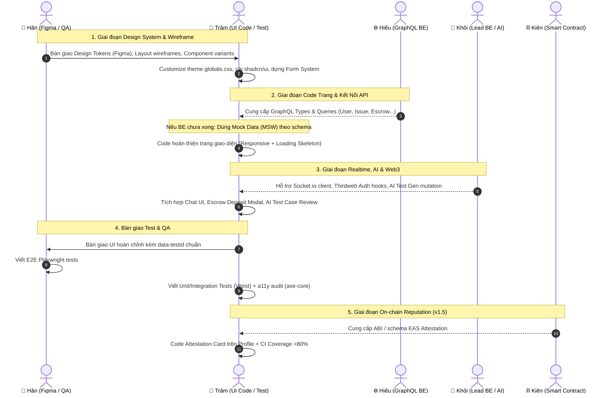
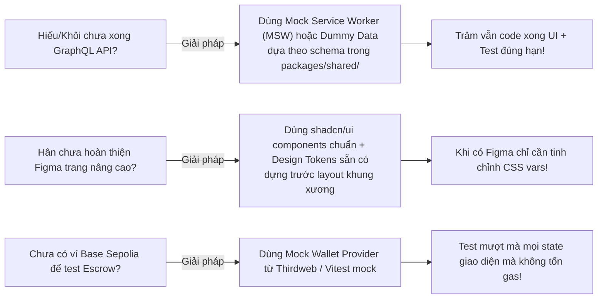

# 🌸 Bloody-Roar — Kế Hoạch Công Việc TRÂM (UI/UX Designer & Test Engineer)

> **Vai trò:** UI/UX Designer & Test Engineer  
> **Team size:** 5 thành viên (Kiên, Khôi, Hiếu, Hân, Trâm)  
> **Tổng thời gian:** 10 tuần (5 Sprint × 2 tuần)  
> **Tech Stack chính:** Next.js 14+ (App Router) · Tailwind CSS v4 + shadcn/ui · React Hook Form + Zod · Vitest + @testing-library/react · axe-core · Lucide React · Recharts/Tremor · Framer Motion  
> **Tài liệu liên quan:** [`TEAM_PLAN.md`](./TEAM_PLAN.md) · [`PRODUCT_BACKLOG.md`](./PRODUCT_BACKLOG.md) · [`KHOI_TASKS.md`](./KHOI_TASKS.md) · [`RESEARCH.md`](./RESEARCH.md)

---

## MỤC LỤC

1. [Cây Công Việc Tổng Thể (Work Breakdown Structure — WBS)](#1-cây-công-việc-tổng-thể-work-breakdown-structure--wbs)
2. [Sơ Đồ Luồng Công Việc & Điểm Giao Tiếp (Workflow & Hand-off)](#2-sơ-đồ-luồng-công-việc--điểm-giao-tiếp-workflow--hand-off)
3. [Kế Hoạch Chi Tiết Theo Từng Sprint (Todo List & AC)](#3-kế-hoạch-chi-tiết-theo-từng-sprint-todo-list--ac)
   - [Sprint 0: Foundation & Component System (Tuần 1)](#sprint-0-foundation--component-system-tuần-1)
   - [Sprint 1: Auth & Marketplace Core (Tuần 2–3)](#sprint-1-auth--marketplace-core-tuần-23)
   - [Sprint 2: Escrow, Chat Realtime & AI Test Gen UI (Tuần 4–5)](#sprint-2-escrow-chat-realtime--ai-test-gen-ui-tuần-45)
   - [Sprint 3: Dispute, Analytics & Full Testing (Tuần 6–7)](#sprint-3-dispute-analytics--full-testing-tuần-67)
   - [Sprint 4: UX Polish, On-chain Reputation & Production (Tuần 8–10)](#sprint-4-ux-polish-on-chain-reputation--production-tuần-810)
4. [Definition of Done (DoD) Của Trâm](#4-definition-of-done-dod-của-trâm)
5. [Ma Trận Phụ Thuộc & Chiến Lược Không Nghẽn (No-Blocker Strategy)](#5-ma-trận-phụ-thuộc--chiến-lược-không-nghẽn-no-blocker-strategy)
6. [Bảng Theo Dõi Tiến Độ Tự Động (Checklist Tổng)](#6-bảng-theo-dõi-tiến-độ-tự-động-checklist-tổng)

---

## 1. CÂY CÔNG VIỆC TỔNG THỂ (WORK BREAKDOWN STRUCTURE — WBS)

Dưới đây là cây phân rã công việc trực quan 4 nhánh chính mà Trâm làm chủ trong suốt dự án:

```mermaid
graph TD
    Root["🌸 TRÂM: UI/UX DESIGNER & TEST ENGINEER"]

    %% Branch 1
    Root --> B1["📦 1. DESIGN SYSTEM & COMPONENT LIBRARY"]
    B1 --> B1_1["1.1 shadcn/ui Theme & Base Setup<br/>(Tailwind v4 tokens, CSS vars, base components)"]
    B1 --> B1_2["1.2 Reusable Form System<br/>(FormField, FormInput, FormSelect, FormTextarea + Zod)"]
    B1 --> B1_3["1.3 Layout & Data Display<br/>(Navbar, Sidebar, DataTable, StatCard, Timeline)"]
    B1 --> B1_4["1.4 Accessibility Tooling<br/>(axe-core, eslint-plugin-jsx-a11y)"]

    %% Branch 2
    Root --> B2["🖥️ 2. FRONTEND IMPLEMENTATION (13+ PAGES)"]
    B2 --> B2_1["2.1 Auth & Core Marketplace<br/>(Login ConnectWallet, Layout, Profile, Marketplace Grid, Issue Detail, Create Issue, Dashboard)"]
    B2 --> B2_2["2.2 Escrow & Communication<br/>(Deposit modal, Status timeline, Chat sidebar, File upload, Code preview)"]
    B2 --> B2_3["2.3 AI Features UI<br/>(AI Test Case review flow, AI Guard indicator)"]
    B2 --> B2_4["2.4 Dispute, Admin & KYC<br/>(Admin Dispute Dashboard, User Mgmt, Analytics Charts, GitHub Verified Badge, Repo Linking)"]
    B2 --> B2_5["2.5 Web3 & Reputation<br/>(EAS On-chain Attestation Card & Explorer link)"]

    %% Branch 3
    Root --> B3["🧪 3. TESTING & QUALITY ASSURANCE"]
    B3 --> B3_1["3.1 Test Infrastructure<br/>(Vitest config, testing-library setup, mocks)"]
    B3 --> B3_2["3.2 Unit Testing<br/>(UI Components, Auth hooks, Marketplace queries, Chat hooks)"]
    B3 --> B3_3["3.3 Validation Testing<br/>(Zod validation schemas: Create, Apply, UpdateProfile)"]
    B3 --> B3_4["3.4 Integration Testing<br/>(End-to-end mock flow: Create Issue → Apply → Assign)"]
    B3 --> B3_5["3.5 Accessibility Audits<br/>(axe-core automated test per page)"]
    B3 --> B3_6["3.6 CI/CD Testing<br/>(GitHub Actions Vitest coverage threshold >80%)"]

    %% Branch 4
    Root --> B4["✨ 4. UX POLISH & FINAL DELIVERY"]
    B4 --> B4_1["4.1 Mobile-First Responsive<br/>(Mobile 375px, Tablet 768px, Desktop 1280px)"]
    B4 --> B4_2["4.2 Skeleton Screens & Empty States<br/>(Zero layout shift, no white flash)"]
    B4 --> B4_3["4.3 Error Boundaries & Global Handling<br/>(Graceful fallback, Toast alerts)"]
    B4 --> B4_4["4.4 Micro-Interactions<br/>(Framer Motion transitions, loading spinners)"]
    B4 --> B4_5["4.5 Team Smoke Test<br/>(Production walk-through with team)"]
```



---

## 2. SƠ ĐỒ LUỒNG CÔNG VIỆC & ĐIỂM GIAO TIẾP (WORKFLOW & HAND-OFF)



---

## 3. KẾ HOẠCH CHI TIẾT THEO TỪNG SPRINT (TODO LIST & AC)

---

### SPRINT 0: Foundation & Component System (Tuần 1)
> **Mục tiêu chính:** Xây dựng hệ thống UI Components nền tảng chuẩn mực, thiết lập form validation system và cấu hình công cụ Accessibility (a11y).

```
Sprint 0 (13h)
├── S0-DSN-04: Customize shadcn/ui theme (3h) [P0]
├── S0-DSN-05: Cài đặt bộ shadcn/ui components (2h) [P0]
├── S0-DSN-06: Xây dựng Form components (React Hook Form + Zod) (3h) [P0]
├── T-1.4: Xây dựng Layout components cơ bản (2h) [P0]
├── T-1.5: Xây dựng Data Display components (2h) [P1]
└── S0-DSN-07: Cấu hình công cụ kiểm tra a11y (1h) [P1]
```

#### Chi tiết công việc:

- [ ] **S0-DSN-04: Customize shadcn/ui theme theo Design Tokens**
  - **Estimate:** 3h | **Priority:** `P0` | **Deps:** Hân (`S0-DSN-01`), Khôi (`S0-FND-09`)
  - **Mô tả:** Đưa toàn bộ palette màu Dark mode (Vercel-inspired), font size, border radii, shadows từ bản thiết kế Figma của Hân vào `globals.css` và cấu hình Tailwind CSS v4.
  - **Acceptance Criteria (AC):** Mọi CSS variables (`--background`, `--foreground`, `--primary`, `--card`...) khớp 100% với Figma token; chuyển đổi dark theme chuẩn xác.

- [ ] **S0-DSN-05: Cài đặt và cấu hình thư viện shadcn/ui base**
  - **Estimate:** 2h | **Priority:** `P0` | **Deps:** Khôi (`S0-FND-09`)
  - **Mô tả:** Cài đặt các thành phần cốt lõi của shadcn/ui vào thư mục `components/ui/`.
  - **AC:** Cài đầy đủ: *Button, Input, Select, Dialog, Card, Table, Badge, Tabs, Toast, DropdownMenu, Avatar, Skeleton*. Tất cả render không lỗi SSR trong Next.js App Router.

- [ ] **S0-DSN-06: Xây dựng bộ Reusable Form Components**
  - **Estimate:** 3h | **Priority:** `P0` | **Deps:** `S0-DSN-05`
  - **Mô tả:** Tạo bộ khung Form chuẩn hóa kết hợp `react-hook-form` + `@hookform/resolvers/zod`.
  - **AC:** Tạo xong `FormField`, `FormInput`, `FormSelect`, `FormTextarea`, `FormErrorMessage`. Hỗ trợ hiển thị lỗi tự động, focus khi submit lỗi, disabled state khi đang loading.

- [ ] **T-1.4: Xây dựng bộ khung Layout Components**
  - **Estimate:** 2h | **Priority:** `P0` | **Deps:** `S0-DSN-05`
  - **Mô tả:** Dựng các layout shell tái sử dụng: `Navbar`, `Sidebar`, `PageLayout`, `Container`, `Grid`.
  - **AC:** Layout responsive tự co giãn mượt mà theo breakpoints: Mobile (<640px), Tablet (<1024px), Desktop (>=1024px).

- [ ] **T-1.5: Xây dựng Data Display Components**
  - **Estimate:** 2h | **Priority:** `P1` | **Deps:** `S0-DSN-05`
  - **Mô tả:** Tạo component chuyên biệt phục vụ dashboard và danh sách: `DataTable` (kèm pagination UI), `StatCard`, `Timeline`, `StatusBadge`.
  - **AC:** `StatusBadge` map đúng màu trạng thái task (`OPEN`, `ASSIGNED`, `IN_PROGRESS`, `COMPLETED`, `DISPUTED`).

- [ ] **S0-DSN-07: Cấu hình công cụ kiểm tra Accessibility (a11y)**
  - **Estimate:** 1h | **Priority:** `P1` | **Deps:** Khôi (`S0-FND-09`)
  - **Mô tả:** Tích hợp `axe-core` và plugin linter `eslint-plugin-jsx-a11y`.
  - **AC:** IDE và script lint cảnh báo ngay lập tức nếu thiếu `alt`, `aria-label`, hoặc độ tương phản màu (contrast ratio) không đạt chuẩn WCAG AA.

---

### SPRINT 1: Auth & Marketplace Core (Tuần 2–3)
> **Mục tiêu chính:** Hoàn thiện hạ tầng Vitest, dựng toàn bộ giao diện luồng cốt lõi: Đăng nhập ví -> Quản lý Profile -> Duyệt Marketplace -> Xem bài -> Đăng bài -> Quản lý công việc Dashboard.

```
Sprint 1 (24h)
├── TUẦN 2 (13h):
│   ├── S1-TST-01: Setup Vitest + Testing Library (1h) [P0]
│   ├── S1-MKP-16: Main Layout & Responsive Navigation (3h) [P0]
│   ├── S1-AUTH-08: Auth Pages & ConnectWallet (3h) [P0]
│   ├── S1-MKP-17: User Profile Page (2h) [P0]
│   └── S1-MKP-18: Marketplace Listing Page (4h) [P0]
└── TUẦN 3 (11h):
    ├── S1-MKP-19: Issue Detail Page (3h) [P0]
    ├── S1-MKP-20: Create Issue Multi-step Form (4h) [P0]
    ├── S1-MKP-21: Dashboard Page (My Tasks/Earnings) (3h) [P0]
    └── S1-MKP-22: GitHub Auth KYC Badge UI (1h) [P0]
```

#### Chi tiết công việc Tuần 2:

- [ ] **S1-TST-01: Setup Vitest + React Testing Library**
  - **Estimate:** 1h | **Priority:** `P0` | **Deps:** —
  - **Mô tả:** Cấu hình môi trường Unit/Integration Test cho frontend với Vitest và `jsdom`.
  - **AC:** File `vitest.config.ts` hoàn chỉnh, hỗ trợ path alias `@/*`, chạy `bun run test` xuất kết quả xanh.

- [ ] **S1-MKP-16: Implement Main Layout & Navigation**
  - **Estimate:** 3h | **Priority:** `P0` | **Deps:** `S0-DSN-05`
  - **Mô tả:** Code giao diện khung App Shell bao gồm Header (Logo, Search, Notification Bell, User Avatar) và Sidebar điều hướng; Mobile Drawer với Hamburger menu.
  - **AC:** Chuyển đổi linh hoạt giữa Desktop và Mobile, link active hiển thị rõ ràng, không bị lệch layout khi đổi route.

- [ ] **S1-AUTH-08: Implement Auth Pages & Connect Wallet**
  - **Estimate:** 3h | **Priority:** `P0` | **Deps:** Hân (`S1-AUTH-07`), Hiếu (`S1-AUTH-01`)
  - **Mô tả:** Trang Login tích hợp nút `ConnectWallet` từ Thirdweb SDK, hiển thị modal chọn ví, trạng thái chờ ký (Signing nonce) và điều hướng về Dashboard.
  - **AC:** Xử lý đầy đủ các state: Chưa kết nối ví, Đang kết nối, Kết nối thành công, Ví sai mạng (Wrong network prompt).

- [ ] **S1-MKP-17: Implement Profile Page**
  - **Estimate:** 2h | **Priority:** `P0` | **Deps:** Hân (`S1-MKP-14`), Hiếu (`S1-AUTH-05`)
  - **Mô tả:** Trang hồ sơ cá nhân: Xem/sửa thông tin (Tên, Bio, Skills tags, Địa chỉ ví), nút upload Avatar, danh sách lịch sử task hoàn thành.
  - **AC:** Form validate với Zod, cập nhật thông tin thành công và có Toast thông báo.

- [ ] **S1-MKP-18: Implement Marketplace Listing Page**
  - **Estimate:** 4h | **Priority:** `P0` | **Deps:** Hân (`S1-MKP-10`), Hiếu (`S1-MKP-02`)
  - **Mô tả:** Trang chợ task/bounty: Grid thẻ bài toán, thanh Search input realtime (debounce), bộ lọc đa tiêu chí (Category, Bounty range, Status), phân trang (Pagination), Skeleton screens khi đang fetch.
  - **AC:** Filter và Search phản hồi nhanh, layout không bị giật lag, hiển thị trạng thái "Không tìm thấy task phù hợp" khi kết quả rỗng.

#### Chi tiết công việc Tuần 3:

- [ ] **S1-MKP-19: Implement Issue Detail Page**
  - **Estimate:** 3h | **Priority:** `P0` | **Deps:** Hân (`S1-MKP-11`), Hiếu (`S1-MKP-03`)
  - **Mô tả:** Chi tiết bài toán: Render markdown mô tả lỗi, thông tin tiền thưởng Token, thông tin Client, danh sách ứng viên (Applicants list), nút bấm hành động tùy vai trò ("Apply" cho Dev, "Assign" cho Client).
  - **AC:** Phân quyền hiển thị chính xác theo vai người dùng hiện tại (Client sở hữu vs Developer vãng lai).

- [ ] **S1-MKP-20: Implement Create Issue Multi-step Form**
  - **Estimate:** 4h | **Priority:** `P0` | **Deps:** Hân (`S1-MKP-12`), Hiếu (`S1-MKP-04`)
  - **Mô tả:** Form đăng bounty 3 bước: Bước 1 (Tiêu đề, mô tả, category, repo link) -> Bước 2 (Bounty amount, token select, thời hạn) -> Bước 3 (Xem trước & Submit).
  - **AC:** Validate chặt chẽ từng bước bằng Zod, lưu trạng thái tạm khi chuyển bước, submit tạo Issue thành công.

- [ ] **S1-MKP-21: Implement Dashboard Page**
  - **Estimate:** 3h | **Priority:** `P0` | **Deps:** Hân (`S1-MKP-13`)
  - **Mô tả:** Dashboard người dùng: Tab "My Posted Issues" (các task mình đăng), tab "My Working Issues" (các task mình nhận làm), thẻ tóm tắt thu nhập (Total Earned, Active Tasks).
  - **AC:** Chuyển đổi tab mượt mà, hiển thị badge đếm số lượng task trong từng trạng thái.

- [ ] **S1-MKP-22: Implement GitHub Auth KYC Badge UI**
  - **Estimate:** 1h | **Priority:** `P0` | **Deps:** Hân (`S1-MKP-15`)
  - **Mô tả:** Component hiển thị trạng thái xác minh GitHub: Nút "Link GitHub" và Huy hiệu xanh "GitHub Verified" cạnh tên user.
  - **AC:** Click nút gọi flow OAuth, hiển thị badge kèm tooltip tên GitHub username.

---

### SPRINT 2: Escrow, Chat Realtime & AI Test Gen UI (Tuần 4–5)
> **Mục tiêu chính:** Xây dựng giao diện Chat trực tiếp có đính kèm file và che thông tin nhạy cảm (AI Guard), hoàn thiện Modal nạp tiền ký quỹ Escrow, UI duyệt Test Cases do AI sinh ra, và viết bộ Unit Test cho Components & Hooks.

```
Sprint 2 (19h)
├── TUẦN 4 (11h):
│   ├── S2-CHAT-04: Implement Realtime Chat UI (4h) [P0]
│   ├── S2-CHAT-06: Implement Escrow UI Components (3h) [P0]
│   ├── S2-TST-03: Vitest cho UI Components (2h) [P0]
│   └── S2-TST-04: Vitest cho Auth hooks (2h) [P0]
└── TUẦN 5 (8h):
    ├── S2-TSTGEN-06: UI Review AI Test Cases (3h) [P0]
    ├── S2-DSP-06: Implement Admin Dispute Dashboard (3h) [P0]
    └── T-3.3: Notification System UI Base (2h) [P1]
```

#### Chi tiết công việc Tuần 4:

- [ ] **S2-CHAT-04: Implement Realtime Chat UI**
  - **Estimate:** 4h | **Priority:** `P0` | **Deps:** Hân (`S2-CHAT-03`), Hiếu (`S2-CHAT-02`), Khôi (`S1-CHAT-03`)
  - **Mô tả:** Khung chat tích hợp trong Issue Detail: Danh sách tin nhắn auto-scroll xuống cuối, ô gõ tin nhắn kèm nút upload file (S3 presigned), tag cảnh báo khi AI Guard can thiệp che giấu bí mật (`***REDACTED***`), khung Monaco preview snippet code.
  - **AC:** Tin nhắn realtime nhận lập tức không cần reload trang; hiển thị rõ ràng người gửi, thời gian, trạng thái gửi.

- [ ] **S2-CHAT-06: Implement Escrow UI Components**
  - **Estimate:** 3h | **Priority:** `P0` | **Deps:** Hân (`S2-CHAT-05`), Hiếu (`S2-ESC-08`), Kiên (`S2-ESC-03`)
  - **Mô tả:** Bộ component Escrow: Modal nạp tiền cọc (Deposit token), dòng thời gian tiến độ thanh toán (Timeline: Deposited -> In Progress -> Released / Disputed), nút bấm Client Release tiền, liên kết tra cứu giao dịch trên Base Sepolia block explorer.
  - **AC:** Xử lý đầy đủ dialog xác nhận ví, hiển thị txHash và link sang Basescan.

- [ ] **S2-TST-03: Viết Unit Test cho Base UI Components**
  - **Estimate:** 2h | **Priority:** `P0` | **Deps:** `S0-DSN-05`
  - **Mô tả:** Viết test bằng Vitest + `@testing-library/react` cho Button, Input, Dialog, FormField, StatusBadge.
  - **AC:** Coverage đạt >85% logic rendering, disable state, click handler, variant classes.

- [ ] **S2-TST-04: Viết Unit Test cho Auth Hooks**
  - **Estimate:** 2h | **Priority:** `P0` | **Deps:** Hiếu (`S1-AUTH-02`)
  - **Mô tả:** Viết test cho custom hooks: `useAuth`, `useUser`.
  - **AC:** Mock Thirdweb SDK, test chính xác trạng thái: đã login, chưa login, logout, refresh session.

#### Chi tiết công việc Tuần 5:

- [ ] **S2-TSTGEN-06: Xây dựng UI Review AI Test Cases**
  - **Estimate:** 3h | **Priority:** `P0` | **Deps:** Hiếu (`S2-TSTGEN-05`), Khôi (`S2-TSTGEN-02`)
  - **Mô tả:** Giao diện hiển thị danh sách test cases do AI sinh ra khi Client đăng bài: Cho phép Client tick chọn các test case hợp lệ, sửa mô tả Given/When/Then, thêm test case thủ công trước khi chốt đăng bounty.
  - **AC:** Cho phép thêm/sửa/xóa test case dễ dàng, submit payload JSON chuẩn về backend.

- [ ] **S2-DSP-06: Implement Admin Dispute Dashboard UI**
  - **Estimate:** 3h | **Priority:** `P0` | **Deps:** Hân (`S2-DSP-05`), Hiếu (`S2-DSP-02`)
  - **Mô tả:** Giao diện cho Admin xử lý tranh chấp: Bảng danh sách case đang dispute, màn hình xem chi tiết lý do & bằng chứng hai bên, xem tóm tắt AI Report, thanh trượt chia tiền (Refund/Payout slider: 0% - 100%).
  - **AC:** Kéo thanh trượt tự động tính toán số tiền mỗi bên nhận được, nút bấm gọi mutation proposeResolution.

- [ ] **T-3.3: Xây dựng Notification System UI Base**
  - **Estimate:** 2h | **Priority:** `P1` | **Deps:** Hân (`U-3.3`), Hiếu (`H-5.2`)
  - **Mô tả:** Icon chuông thông báo trên Navbar, badge đỏ đếm số tin chưa đọc, dropdown xem danh sách thông báo vắn tắt.
  - **AC:** Hiển thị danh sách thông báo, click vào thông báo tự điều hướng đến Issue liên quan.

---

### SPRINT 3: Dispute, Analytics & Full Testing (Tuần 6–7)
> **Mục tiêu chính:** Hoàn tất toàn bộ giao diện quản trị Admin, trang số liệu thống kê (Analytics), liên kết GitHub Repository và hoàn thành toàn bộ kịch bản Unit/Integration Testing, a11y audit.

```
Sprint 3 (23h)
├── TUẦN 6 (13h):
│   ├── S3-ANL-11: Implement Admin Dashboard (3h) [P1]
│   ├── S3-ANL-12: Implement User Analytics Page (2h) [P1]
│   ├── S3-ANL-13: Implement User Management Admin Page (2h) [P1]
│   ├── S3-ANL-14: Hoàn thiện Notification UI (Mark read) (2h) [P1]
│   ├── S3-GH-09: GitHub Auth UI Verified Badge (2h) [P0]
│   ├── S3-GH-10: GitHub Repo Linking UI (2h) [P1]
│   └── S3-TST-03: Vitest Form Validation Schemas (2h) [P0]
└── TUẦN 7 (10h):
    ├── S3-TST-01: Vitest Marketplace Queries (2h) [P0]
    ├── S3-TST-02: Vitest Chat Hooks (2h) [P0]
    ├── S3-TST-04: Integration Test: Create → Apply → Assign (3h) [P0]
    ├── S3-TST-05: Viết a11y Audit Tests với axe-core (2h) [P1]
    └── T-4.9: Cấu hình CI Vitest trên GitHub Actions (1h) [P0]
```

#### Chi tiết công việc Tuần 6:

- [ ] **S3-ANL-11: Implement Admin Dashboard**
  - **Estimate:** 3h | **Priority:** `P1` | **Deps:** Hân (`S3-ANL-08`), Hiếu (`S3-ANL-02`)
  - **Mô tả:** Trang Dashboard dành riêng cho Admin: Thống kê số lượng task, tổng volume tiền thưởng ký quỹ, tỷ lệ dispute, biểu đồ tăng trưởng người dùng (dùng Tremor / Recharts).
  - **AC:** Biểu đồ hiển thị sắc nét, responsive, tooltip hiển thị số liệu chi tiết khi hover.

- [ ] **S3-ANL-12: Implement User Analytics Page**
  - **Estimate:** 2h | **Priority:** `P1` | **Deps:** Hân (`S3-ANL-09`), Hiếu (`S3-ANL-02`)
  - **Mô tả:** Trang số liệu thống kê cá nhân của Developer/Client: Thu nhập theo tuần/tháng, số task hoàn thành, thời gian trung bình xử lý, điểm đánh giá uy tín.
  - **AC:** Có bộ lọc chọn khoảng thời gian (7 ngày, 30 ngày, Tất cả).

- [ ] **S3-ANL-13: Implement User Management Admin Page**
  - **Estimate:** 2h | **Priority:** `P1` | **Deps:** Hân (`S3-ANL-10`), Hiếu (`S3-ANL-07`)
  - **Mô tả:** Bảng quản lý User: Xem danh sách, tìm theo địa chỉ ví / GitHub, lọc trạng thái KYC, nút Ban/Unban tài khoản (kèm modal nhập lý do).
  - **AC:** Thao tác Ban cập nhật tức thì trạng thái trên bảng, hiển thị tag "BANNED" màu đỏ.

- [ ] **S3-ANL-14: Hoàn thiện Notification UI**
  - **Estimate:** 2h | **Priority:** `P1` | **Deps:** Hiếu (`S3-ANL-06`)
  - **Mô tả:** Nâng cấp dropdown thông báo: Thêm nút "Đánh dấu tất cả đã đọc" (Mark all as read), phân loại icon theo sự kiện (Tiền về, Task mới, Tin nhắn, Dispute).
  - **AC:** Gọi mutation `markAsRead`, số badge đếm giảm về 0 ngay lập tức.

- [ ] **S3-GH-09: GitHub Auth UI Verified Badge**
  - **Estimate:** 2h | **Priority:** `P0` | **Deps:** `S1-MKP-22`, Hiếu (`S3-GH-02`)
  - **Mô tả:** Tích hợp logic nhận callback OAuth từ GitHub và cập nhật badge Verified ngay trên Header và Profile.
  - **AC:** User liên kết thành công lập tức thấy huy hiệu xanh và link trỏ về GitHub profile cá nhân.

- [ ] **S3-GH-10: GitHub Repo Linking UI**
  - **Estimate:** 2h | **Priority:** `P1` | **Deps:** Hiếu (`S3-GH-08`)
  - **Mô tả:** Modal cho phép Client chọn kho lưu trữ (Repository) từ tài khoản GitHub đã kết nối để gán trực tiếp vào Issue lúc đăng bài.
  - **AC:** Fetch danh sách public repo của user, cho phép tìm kiếm và chọn repo, lưu link vào form.

- [ ] **S3-TST-03: Viết Unit Test cho Zod Form Schemas**
  - **Estimate:** 2h | **Priority:** `P0` | **Deps:** `S1-MKP-04`
  - **Mô tả:** Viết test kiểm tra toàn bộ các validation schema: `CreateIssueSchema`, `UpdateProfileSchema`, `ApplySchema`.
  - **AC:** Test đầy đủ các case: Dữ liệu hợp lệ, thiếu trường bắt buộc, bounty âm, sai định dạng URL, độ dài string quá ngắn/quá dài.

#### Chi tiết công việc Tuần 7:

- [ ] **S3-TST-01: Viết Unit Test cho Marketplace Queries/Hooks**
  - **Estimate:** 2h | **Priority:** `P0` | **Deps:** Hiếu (`S1-MKP-02`)
  - **Mô tả:** Viết test cho custom hooks `useIssues`, `useIssue`.
  - **AC:** Kiểm tra bộ lọc params, phân trang cursor, xử lý loading state và error state khi fetch thất bại.

- [ ] **S3-TST-02: Viết Unit Test cho Chat Hooks**
  - **Estimate:** 2h | **Priority:** `P0` | **Deps:** Hiếu (`S2-CHAT-02`), Khôi
  - **Mô tả:** Viết test cho `useMessages` và socket event listeners.
  - **AC:** Mock socket connection, test việc append tin nhắn mới vào danh sách, xử lý reconnect.

- [ ] **S3-TST-04: Viết Integration Test Luồng Cốt Lõi (Create -> Apply -> Assign)**
  - **Estimate:** 3h | **Priority:** `P0` | **Deps:** Hiếu (`S1-MKP-08`)
  - **Mô tả:** Viết kịch bản kiểm thử tích hợp (dùng MSW mock GraphQL API) chạy xuyên suốt chu trình: Client tạo task -> Dev nộp hồ sơ Apply -> Client duyệt và chọn Assign Developer.
  - **AC:** Toàn bộ flow state chạy qua trơn tru trong Vitest runner mà không phát sinh lỗi bất đồng bộ.

- [ ] **S3-TST-05: Viết Accessibility (a11y) Audit Tests**
  - **Estimate:** 2h | **Priority:** `P1` | **Deps:** Toàn bộ UI pages
  - **Mô tả:** Viết test tự động dùng `axe-core` quét toàn bộ các trang: Auth, Marketplace, Detail, Form, Dashboard, Chat, Admin.
  - **AC:** Không có bất kỳ lỗi vi phạm a11y ở mức độ "Critical" hoặc "Serious"; 100% form inputs có label/aria hợp lệ.

- [ ] **T-4.9: Cấu hình CI Vitest trên GitHub Actions**
  - **Estimate:** 1h | **Priority:** `P0` | **Deps:** Khôi (`V-8.1`)
  - **Mô tả:** Tích hợp bước chạy test tự động `bun run test --coverage` vào file workflow CI.
  - **AC:** Mọi Pull Request vào nhánh `develop`/`main` phải pass 100% tests mới được phép merge.

---

### SPRINT 4: UX Polish, On-chain Reputation & Production (Tuần 8–10)
> **Mục tiêu chính:** Đánh bóng toàn diện giao diện (Mobile responsive pixel-perfect, Skeleton, Error handling, Micro-animations), hiển thị chứng chỉ EAS On-chain (v1.5) và phối hợp Smoke Test nghiệm thu ứng dụng.

```
Sprint 4 (16h)
├── TUẦN 8 (7h):
│   ├── S4-POL-06: Responsive Polish toàn bộ 13+ trang (4h) [P0]
│   └── S4-POL-07: Loading Skeletons & Empty States (3h) [P0]
├── TUẦN 9 (6h):
│   ├── S4-POL-08: Error Boundaries & Global Handling (2h) [P0]
│   ├── S4-POL-09: Micro-Animations Polish (Framer Motion) (2h) [P2]
│   └── S4-REP-07: UI hiển thị On-chain Reputation Attestation (EAS v1.5) (2h) [P1]
└── TUẦN 10 (3h):
    ├── S4-POL-11: Cấu hình CI Coverage Threshold >80% (1h) [P0]
    └── S4-CICD-09: Smoke Test Production cùng Team (2h) [P0]
```

#### Chi tiết công việc Tuần 8:

- [ ] **S4-POL-06: Responsive Polish toàn bộ 13+ trang**
  - **Estimate:** 4h | **Priority:** `P0` | **Deps:** `S3-TST-05`
  - **Mô tả:** Rà soát và căn chỉnh hiển thị hoàn hảo trên các kích thước màn hình thực tế: Mobile (375px, 414px), Tablet (768px, 1024px), Laptop/Desktop (1280px+). Đảm bảo bảng dài có thanh cuộn ngang hợp lý, modal vừa vặn trên màn hình nhỏ.
  - **AC:** 100% các trang không bị vỡ layout, không tràn viền ngang (horizontal scroll ngoài ý muốn).

- [ ] **S4-POL-07: Loading Skeletons & Empty States**
  - **Estimate:** 3h | **Priority:** `P0` | **Deps:** Toàn bộ UI
  - **Mô tả:** Bổ sung Skeleton screens cho tất cả các vị trí load dữ liệu (Marketplace, Detail, Dashboard, Profile) và thiết kế hình minh họa / text thân thiện cho trạng thái rỗng (Empty state khi chưa có bài đăng, chưa có ứng viên, chưa có tin nhắn).
  - **AC:** Tuyệt đối không có hiện tượng chớp trắng trang hoặc nhảy giật bố cục khi tải trang.

#### Chi tiết công việc Tuần 9:

- [ ] **S4-POL-08: Error Boundaries & Global Error Handling**
  - **Estimate:** 2h | **Priority:** `P0` | **Deps:** Toàn bộ UI
  - **Mô tả:** Bọc `ErrorBoundary` cho từng khu vực độc lập trong ứng dụng (Header, Chat window, Marketplace list). Khi 1 component bị crash, hiển thị UI Fallback thân thiện kèm nút "Thử lại", không làm sập cả ứng dụng.
  - **AC:** Gặp lỗi API hoặc runtime error thì hiển thị Toast cảnh báo đỏ rõ ràng; ứng dụng giữ được tính ổn định.

- [ ] **S4-POL-09: Micro-Animations Polish với Framer Motion**
  - **Estimate:** 2h | **Priority:** `P2` | **Deps:** `S4-POL-06`
  - **Mô tả:** Thêm hiệu ứng chuyển trang mượt mà (fade in nhẹ), hiệu ứng hover thẻ bài toán nổi bật, popup modal xuất hiện êm ái, micro-interaction khi bấm nút.
  - **AC:** Animation tinh tế, đạt 60fps mượt mà, hỗ trợ tốt chế độ `prefers-reduced-motion`.

- [ ] **S4-REP-07: UI Hiển Thị Reputation On-chain (EAS v1.5)**
  - **Estimate:** 2h | **Priority:** `P1` | **Deps:** Kiên (`S4-REP-05`)
  - **Mô tả:** Trên trang Profile và Issue Detail của Developer: Hiển thị Thẻ chứng nhận Uy tín On-chain (EAS Attestation Card) gồm số task đã pass, điểm đánh giá trung bình, kỹ năng được chứng thực và link kiểm tra trực tiếp trên EAS Explorer.
  - **AC:** Trực quan hóa dữ liệu attestation on-chain, click link dẫn thẳng sang mạng Base Sepolia EAS scan.

#### Chi tiết công việc Tuần 10:

- [ ] **S4-POL-11: Cấu hình CI Vitest Coverage Threshold**
  - **Estimate:** 1h | **Priority:** `P0` | **Deps:** `S3-TST-05`
  - **Mô tả:** Cài đặt cờ cấu hình coverage trong `vitest.config.ts`: lines, functions, branches, statements tối thiểu **>80%**.
  - **AC:** Báo cáo coverage sinh ra file HTML trực quan, GitHub Actions kiểm tra đạt chỉ tiêu xanh.

- [ ] **S4-CICD-09: Smoke Test Production cùng Team**
  - **Estimate:** 2h | **Priority:** `P0` | **Deps:** Khôi (`S4-CICD-05`)
  - **Mô tả:** Ngồi cùng Kiên, Khôi, Hiếu, Hân thực hiện test chéo toàn bộ luồng trực tiếp trên bản deploy production: Kết nối ví thật -> Đăng task -> Nạp cọc Escrow -> Chat trao đổi -> Nộp bài -> Giải ngân tiền -> Nhận Attestation.
  - **AC:** Không còn bug blocker nghiêm trọng, hệ thống sẵn sàng bàn giao nghiệm thu Capstone.

---

## 4. DEFINITION OF DONE (DOD) CỦA TRÂM

Mọi công việc của Trâm được coi là **HOÀN THÀNH (DONE)** khi thỏa mãn đầy đủ các tiêu chuẩn sau:

```
┌────────────────────────────────────────────────────────────────────────┐
│                      CHECKLIST DEFINITION OF DONE                      │
├────────────────────────────────────────────────────────────────────────┤
│  🎨 1. GIAO DIỆN & TRẢI NGHIỆM (UI/UX)                                │
│     [ ] Khớp 100% tokens màu, typography, khoảng cách từ Figma của Hân │
│     [ ] Đạt chuẩn Responsive Mobile-first (375px, 768px, 1280px+)      │
│     [ ] Có đầy đủ Loading Skeleton và Empty State (không flash trắng) │
│     [ ] Đạt chuẩn Accessibility WCAG AA (đã scan qua axe-core)        │
│                                                                        │
│  💻 2. CHẤT LƯỢNG CODE & CÚ PHÁP                                       │
│     [ ] TypeScript strict mode, tuyệt đối không dùng `any`             │
│     [ ] Không có warning từ ESLint & Prettier                          │
│     [ ] Mọi form nhập liệu đều dùng React Hook Form + Zod schema       │
│     [ ] Gắn thuộc tính `data-testid` cho mọi nút/input để Hân test E2E │
│                                                                        │
│  🧪 3. KIỂM THỬ (TESTING)                                              │
│     [ ] Đã viết file `.test.tsx` tương ứng cho Component / Hook mới    │
│     [ ] Toàn bộ test suites Vitest chạy pass 100%                      │
│     [ ] Code coverage của nhánh công việc đạt tối thiểu > 80%          │
│                                                                        │
│  🤝 4. REVIEW & MERGE                                                  │
│     [ ] Tạo PR theo quy chuẩn: `feat/TRAM-...` vào nhánh `develop`     │
│     [ ] Được ít nhất 1 thành viên review và approve (Hân/Khôi/Hiếu)   │
│     [ ] GitHub Actions CI chạy qua (Lint + Typecheck + Vitest)        │
└────────────────────────────────────────────────────────────────────────┘
```

---

## 5. MA TRẬN PHỤ THUỘC & CHIẾN LƯỢC KHÔNG NGHẼN (NO-BLOCKER STRATEGY)

Trong quá trình phát triển 10 tuần, việc backend hoặc smart contract làm trễ tiến độ là rủi ro rất thường gặp. Trâm hãy áp dụng triệt để chiến lược sau:



---

## 6. BẢNG THEO DÕI TIẾN ĐỘ TỰ ĐỘNG (CHECKLIST TỔNG)

| Sprint | Task ID | Hạng mục công việc | Estimate | Trạng thái |
| :---: | :--- | :--- | :---: | :---: |
| **S0** | S0-DSN-04 | Customize shadcn/ui theme | 3h | 🔲 Chưa bắt đầu |
| **S0** | S0-DSN-05 | Cài đặt toàn bộ shadcn/ui components | 2h | 🔲 Chưa bắt đầu |
| **S0** | S0-DSN-06 | Xây dựng Form components (React Hook Form + Zod) | 3h | 🔲 Chưa bắt đầu |
| **S0** | T-1.4 | Xây dựng Layout components | 2h | 🔲 Chưa bắt đầu |
| **S0** | T-1.5 | Xây dựng Data display components | 2h | 🔲 Chưa bắt đầu |
| **S0** | S0-DSN-07 | Cấu hình a11y tools (axe-core) | 1h | 🔲 Chưa bắt đầu |
| **S1** | S1-TST-01 | Setup Vitest + Testing Library | 1h | 🔲 Chưa bắt đầu |
| **S1** | S1-MKP-16 | Implement Main Layout & Navigation | 3h | 🔲 Chưa bắt đầu |
| **S1** | S1-AUTH-08 | Implement Auth Pages & ConnectWallet | 3h | 🔲 Chưa bắt đầu |
| **S1** | S1-MKP-17 | Implement Profile Page | 2h | 🔲 Chưa bắt đầu |
| **S1** | S1-MKP-18 | Implement Marketplace Listing Page | 4h | 🔲 Chưa bắt đầu |
| **S1** | S1-MKP-19 | Implement Issue Detail Page | 3h | 🔲 Chưa bắt đầu |
| **S1** | S1-MKP-20 | Implement Create Issue Multi-step Form | 4h | 🔲 Chưa bắt đầu |
| **S1** | S1-MKP-21 | Implement Dashboard Page | 3h | 🔲 Chưa bắt đầu |
| **S1** | S1-MKP-22 | Implement GitHub Auth KYC Badge UI | 1h | 🔲 Chưa bắt đầu |
| **S2** | S2-CHAT-04 | Implement Realtime Chat UI | 4h | 🔲 Chưa bắt đầu |
| **S2** | S2-CHAT-06 | Implement Escrow UI Components | 3h | 🔲 Chưa bắt đầu |
| **S2** | S2-TST-03 | Vitest cho Base UI Components | 2h | 🔲 Chưa bắt đầu |
| **S2** | S2-TST-04 | Vitest cho Auth Hooks | 2h | 🔲 Chưa bắt đầu |
| **S2** | S2-TSTGEN-06 | UI Review AI Test Cases | 3h | 🔲 Chưa bắt đầu |
| **S2** | S2-DSP-06 | Implement Admin Dispute Dashboard UI | 3h | 🔲 Chưa bắt đầu |
| **S2** | T-3.3 | Notification System UI Base | 2h | 🔲 Chưa bắt đầu |
| **S3** | S3-ANL-11 | Implement Admin Dashboard | 3h | 🔲 Chưa bắt đầu |
| **S3** | S3-ANL-12 | Implement User Analytics Page | 2h | 🔲 Chưa bắt đầu |
| **S3** | S3-ANL-13 | Implement User Management Admin Page | 2h | 🔲 Chưa bắt đầu |
| **S3** | S3-ANL-14 | Hoàn thiện Notification UI | 2h | 🔲 Chưa bắt đầu |
| **S3** | S3-GH-09 | GitHub Auth UI Verified Badge | 2h | 🔲 Chưa bắt đầu |
| **S3** | S3-GH-10 | GitHub Repo Linking UI | 2h | 🔲 Chưa bắt đầu |
| **S3** | S3-TST-03 | Vitest cho Zod Form Schemas | 2h | 🔲 Chưa bắt đầu |
| **S3** | S3-TST-01 | Vitest cho Marketplace Queries/Hooks | 2h | 🔲 Chưa bắt đầu |
| **S3** | S3-TST-02 | Vitest cho Chat Hooks | 2h | 🔲 Chưa bắt đầu |
| **S3** | S3-TST-04 | Integration Test: Create -> Apply -> Assign | 3h | 🔲 Chưa bắt đầu |
| **S3** | S3-TST-05 | Viết a11y Audit Tests với axe-core | 2h | 🔲 Chưa bắt đầu |
| **S3** | T-4.9 | Cấu hình CI Vitest trên GitHub Actions | 1h | 🔲 Chưa bắt đầu |
| **S4** | S4-POL-06 | Responsive Polish toàn bộ 13+ trang | 4h | 🔲 Chưa bắt đầu |
| **S4** | S4-POL-07 | Loading Skeletons & Empty States | 3h | 🔲 Chưa bắt đầu |
| **S4** | S4-POL-08 | Error Boundaries & Global Handling | 2h | 🔲 Chưa bắt đầu |
| **S4** | S4-POL-09 | Micro-Animations Polish (Framer Motion) | 2h | 🔲 Chưa bắt đầu |
| **S4** | S4-REP-07 | UI Hiển thị On-chain Reputation (EAS v1.5) | 2h | 🔲 Chưa bắt đầu |
| **S4** | S4-POL-11 | Cấu hình CI Coverage Threshold >80% | 1h | 🔲 Chưa bắt đầu |
| **S4** | S4-CICD-09 | Smoke Test Production cùng Team | 2h | 🔲 Chưa bắt đầu |
