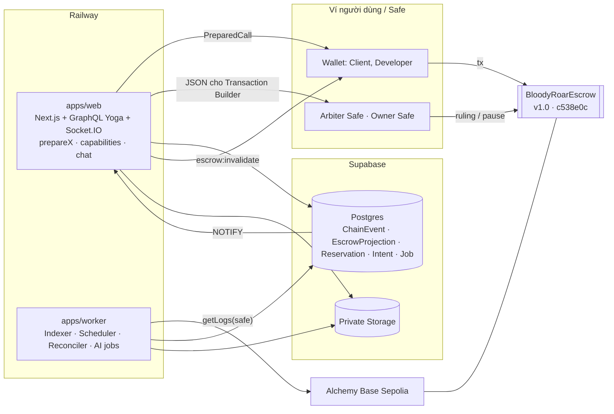

# Kế hoạch thực thi Backend + Smart Contract

**Ngày lập:** 27/09/2026 · **Bắt đầu dự kiến:** thứ Hai 28/09/2026
**Phạm vi:** hoàn tất toàn bộ logic backend và smart contract. Frontend làm sau cùng, dựa trên API đã đóng băng (mục 5) và prototype UI (https://claude.ai/artifact/5DgZDzkgGs2jpDtrybe8TL, đã rà soát lại theo các quyết định dưới đây).
**Tài liệu liên quan:** danh sách task chi tiết `BACKEND_REMAINING_TASKS.md` (ID `BE-xx`), chiến lược AI `AI_STRATEGY_V1_V2.md`, spec UI `UI_REDESIGN_SPEC.md`.

---

## 1. Định nghĩa "Done" cho backend + contract

Backend và contract được coi là xong khi **không cần giao diện** mà vẫn chứng minh được toàn bộ tiêu chí của Proposal §15, bằng script và test:

- [ ] Script E2E trên chain local chạy hết **6 kết cục** của contract: `RELEASE`, `MISSED_DELIVERY_REFUND`, `REVIEW_TIMEOUT`, `SETTLEMENT`, `RULING` (có và không có challenge), `ARBITER_TIMEOUT_SPLIT`. Mỗi kết cục kết thúc bằng `claim()` và projection khớp với số dư on-chain.
- [ ] Mọi thay đổi trạng thái liên quan đến tiền chỉ xảy ra khi Indexer fold một `ChainEvent` canonical ở safe head. Không mutation nào đánh dấu thành công dựa trên tx hash.
- [ ] Test reorg: event bị reorg được đánh dấu non-canonical và projection được dựng lại đúng.
- [ ] Ma trận authz: mỗi mutation × {guest, người ngoài, client, developer, admin, bị khóa} có test; truy cập trái phép bị từ chối ở API, Socket.IO và contract.
- [ ] Contract đã deploy lên Base Sepolia bằng script có guard, với 3 Safe 2-of-3, đã verify trên BaseScan; manifest ghi địa chỉ, constructor args, chain ID, tx hash, deploy block.
- [ ] CI chạy: lint, typecheck, unit, integration (Postgres), contract (compile, test, fuzz/invariant, coverage, slither, deploy dry-run), E2E chain local.
- [ ] Web + worker chạy trên Railway, health check đủ field theo §9.6, smoke test trên Base Sepolia pass.
- [ ] GraphQL schema được đóng băng thành file SDL + fixture cho từng state, để frontend làm sau không phải đoán.
- [ ] Không có secret trong repo; backend không giữ key nào có thể ký thay người dùng.

---

## 2. Các quyết định đã chốt

Nguyên tắc chọn: **ưu tiên giữ nguyên contract** (đã có 35 test Hardhat, fuzz 10.000 lần mỗi case, invariant, coverage 98,85% dòng), vì mỗi lần sửa contract phải test và review lại từ đầu. Chỗ nào Proposal lệch contract thì sửa Proposal, trừ khi contract sai về nghiệp vụ.

### 2.1 Smart contract và luật lifecycle

| ID | Quyết định | Lý do |
| --- | --- | --- |
| QĐ-01 | **Đóng băng logic contract ở commit `c538e0c`** (bản PR #11) làm v1.0. Chỉ sửa khi slither hoặc review chéo tìm ra lỗi thật. | Đã test kỹ; không có yêu cầu nghiệp vụ nào bắt buộc phải sửa (xem QĐ-02..06). |
| QĐ-02 | **Giữ phí 2,5% trên phần của Developer ở mọi kết cục.** Hoàn tiền 100% cho client tự động là 0 phí. Sửa Proposal UC-02 bước 3, UC-04, UC-05 bước 5, §9.3 invariant 3 thành: "Phần trả cho Developer luôn chịu phí 2,5%; phần hoàn cho Client không chịu phí." | Nếu settlement và ruling miễn phí như Proposal viết, hai bên có thể lách phí bằng cách settle 0/100 thay cho release. Một công thức duy nhất dễ kiểm và dễ giải thích. Test contract đã assert đúng hành vi này. |
| QĐ-03 | **Giữ toàn bộ mốc thời gian của contract:** review = delivery deadline + 7 ngày; evidence 72h; challenge 7 ngày; final notice 24h; arbiter stall 30 ngày tính từ lúc raise **hoặc** lúc challenge. Sửa Proposal UC-05 và `packages/shared` theo. | 7 ngày cho challenge hợp lý với Safe multisig nhiều người ký; stall tính từ lúc raise bảo đảm arbiter không thể "ngâm" dispute vô hạn. |
| QĐ-04 | **Giữ pull-payment** (`claimable` + `claim()`). Backend project `ClaimableBalance` và cung cấp `prepareClaim`. | Một người nhận bị USDC chặn (blacklist) không làm kẹt tiền của người khác; đã có test. |
| QĐ-05 | **Giữ `escrowId` kiểu `string`.** Backend sinh `escrowKey` dạng `br_<issueId>_<n>` (ASCII, ≤ 64 ký tự) và lưu `escrowIdHash = keccak256(utf8(escrowKey))` ngay khi tạo reservation, để Indexer tra ngược từ topic. | Tránh sửa contract; tra hash rất đơn giản. Deposit không đi qua backend được lưu dạng `orphan`. |
| QĐ-06 | **Giữ luật challenge:** chỉ bên nhận ít hơn toàn bộ principal được challenge, và chỉ một lần. | Đúng tinh thần Proposal; ghi rõ vào Proposal. |
| QĐ-07 | **Thiết lập Safe trên Base Sepolia:** 3 Safe v1.4.1 2-of-3 riêng biệt (Owner, Arbiter, Fee recipient) với tập signer không trùng nhau, tức 9 ví test. Mỗi thành viên giữ 1–2 ví ký riêng (profile trình duyệt riêng hoặc ví cứng). Kiên phụ trách. | `deployment-checks.ts` từ chối Safe sai version, có module/guard, hoặc trùng role. |

### 2.2 Kiến trúc

| ID | Quyết định | Lý do |
| --- | --- | --- |
| QĐ-08 | **Tạo workspace `apps/worker`** (TypeScript, chạy bằng bun) cho Indexer, scheduler deadline, reconciler và AI job. Deploy thành Railway service riêng, dùng chung `@bloody-roar/database` và `@bloody-roar/shared`. | Đúng topology §9.6; tách được lỗi RPC khỏi web. |
| QĐ-09 | **Dùng viem ở backend** (web và worker) để encode calldata, verify EIP-712, đọc chain. Thirdweb/ethers v5 chỉ còn ở phía ví trên frontend. | viem có kiểu mạnh từ ABI, hỗ trợ tag `safe`, không phụ thuộc thirdweb. |
| QĐ-10 | **Không dùng Redis.** Hàng đợi job = bảng Postgres với `FOR UPDATE SKIP LOCKED`; sự kiện giữa worker và web = Postgres `LISTEN/NOTIFY`. Web chạy 1 replica. | §9.6 để Redis ở trạng thái Deferred; bớt một hạ tầng phải vận hành. |
| QĐ-11 | **Finality:** chỉ fold log tới block của tag `safe`. Poll mỗi 4 giây, range `getLogs` mặc định 2.000 block, tự chia đôi khi RPC báo lỗi giới hạn. Trạng thái "pending" trên UI đến từ `TransactionIntent` và receipt. | Base (OP stack) hỗ trợ tag `safe`; đúng invariant 6 của Proposal. |

### 2.3 Hợp đồng API (để frontend làm sau không phải đoán)

| ID | Quyết định | Lý do |
| --- | --- | --- |
| QĐ-12 | **Mỗi hành động on-chain = một mutation `prepareX`** trả về `PreparedCall { intentId, chainId, to, method, args (JSON, số dạng string), data (calldata hex đã encode), value, expiresAt }`. Sau khi ví gửi tx, frontend gọi `recordTransactionSubmitted(intentId, txHash)`. | Frontend chỉ cần `sendTransaction({to, data})`, không phải tự encode ABI. Backend pre-check đầy đủ để tránh tx thất bại tốn gas. |
| QĐ-13 | **Backend tính sẵn quyền và hành động.** `Issue.viewerCapabilities` (canApply, canSelect, canFund, canSubmit, canRelease, canDispute, …) và `Escrow.availableActions[{action, enabledAt, reasonDisabled}]`, tính từ projection + thời gian chain. | Một nguồn sự thật duy nhất; UI không tự suy luận state (nguồn gây lệch nhiều nhất). |
| QĐ-14 | **Tiền và tỉ lệ:** `TokenAmount { raw: String!, decimals: Int!, symbol: String!, formatted: String! }`; tỉ lệ là `Int` bps (0–10.000); bounty nhập dạng chuỗi thập phân `"1250.00"` và parse bằng `parseUnits`. Xóa mọi `Float` liên quan tiền. `formatted` giữ đủ độ chính xác (ví dụ `853.125`), không làm tròn. | NFR numeric safety của Proposal; contract floor đến đơn vị nhỏ nhất. |
| QĐ-15 | **Hash tài liệu:** `termsHash`, `deliveryHash`, `evidenceManifestHash`, `decisionHash` = `keccak256(utf8(JCS(json)))` theo RFC 8785 (thư viện `canonicalize`). Đặt trong `@bloody-roar/shared/hashing` kèm test vector. Tài liệu gốc lưu trong DB, file đính kèm trong bucket private. | Proposal §9.5; FE, BE, worker dùng chung một hàm. |

### 2.4 Luồng nghiệp vụ

| ID | Quyết định | Lý do |
| --- | --- | --- |
| QĐ-16 | **Selection tạo Funding Reservation 24h** (`AWAITING_FUNDING`); các application khác giữ `PENDING`; mỗi issue chỉ một reservation active; client được hủy reservation; hết hạn thì Issue về `OPEN`. | UC-01. |
| QĐ-17 | **Deposit đến muộn hoặc lệch điều khoản:** nếu deposit đến sau khi reservation hết hạn mà Issue vẫn `OPEN` và không có reservation khác thì chấp nhận (chain là sự thật). Nếu terms (developer, amount, deadline, termsHash) khác reservation, hoặc Issue đã chọn người khác, thì đánh dấu `MISMATCHED`, không gán developer, báo hai bên và admin. Hai bên xử lý bằng settlement hoặc chờ missed-delivery refund. | Contract không có đường hủy; không được để tiền "mồ côi" mà không ai biết. |
| QĐ-18 | **Ký EIP-712 ở bước fund, không ở bước đăng bài**, vì lúc đăng bài chưa biết developer. Domain `{name: "BloodyRoarEscrow", version: "1", chainId, verifyingContract}`; message `FundingIntent {escrowId, client, developer, token, amount, deliveryDeadline, termsHash, intentExpiry, nonce}`; hạn 30 phút. Đăng bài không cần chữ ký. | UC-01 bước 1 yêu cầu intent khớp Developer và deadline hiện tại. |
| QĐ-19 | **`deliveryDeadline` là ngày giờ tuyệt đối** do client đặt khi đăng bài (sửa được khi còn `OPEN`). Lúc chọn developer, deadline phải sau thời điểm hết reservation ít nhất 48h và không quá 180 ngày; nếu không, client phải cập nhật (tạo `termsVersion` mới). | Tránh trường hợp fund muộn làm developer mất gần hết thời gian làm. |
| QĐ-20 | **Nội dung `termsHash`:** `{issueId, termsVersion, title, descriptionSha256, category, acceptanceCriteria (chỉ tiêu chí đã approve, sắp theo id), token, amountRaw, deliveryDeadline, githubRepo}`. **Bắt buộc ít nhất 1 tiêu chí đã approve** mới được chọn developer (client có thể tự viết, AI không bắt buộc). | Gốc của tranh chấp là tiêu chí mơ hồ (Proposal §2). |
| QĐ-21 | **Bỏ chặn theo role Client/Developer.** Một tài khoản vừa đăng bài vừa ứng tuyển được; ràng buộc tính theo từng Issue (không ứng tuyển bài của mình; contract yêu cầu developer ≠ client). Trường `role` chỉ còn nghĩa "workspace mặc định" cho giao diện; `ADMIN` giữ nguyên và **không** được đăng bài hay ứng tuyển. | Proposal §10 định nghĩa participant theo ví trên từng escrow, không theo role toàn cục. |
| QĐ-22 | **Submission:** bản nháp off-chain → manifest → `deliveryHash` → `submitWork` on-chain. Được thay bản mới đến hết deadline (bản cũ thành `SUPERSEDED`). "Request changes" là ghi chú off-chain. "Approve" chính là `releaseFunds`, không còn trạng thái duyệt off-chain riêng. | Khớp contract (release áp dụng cho hash mới nhất). |
| QĐ-23 | **IssueStatus:** thêm `AWAITING_FUNDING`. Trạng thái cuối là `COMPLETED` + trường `outcome` (`ResolutionKind`) copy từ projection; `CANCELLED` chỉ trước khi fund. `IN_PROGRESS`, `DISPUTED`, `COMPLETED` chỉ worker được set. | Ít thay đổi enum nhất; UI hiển thị kết cục cụ thể qua `outcome`. |
| QĐ-24 | **Chat:** hai bên được viết ở `AWAITING_FUNDING`, `IN_PROGRESS`, `DISPUTED`; chỉ đọc sau khi kết thúc. Admin chỉ đọc, và chỉ khi `DISPUTED`. Tin nhắn gửi sau lúc raise dispute được gắn cờ `afterDispute` để arbiter biết. | Hai bên cần trao đổi trước khi fund, và cần thương lượng settlement trong lúc tranh chấp (contract cho phép settlement ở mọi phase). |
| QĐ-25 | **Dispute:** bản ghi `Dispute` do worker tạo khi thấy `DisputeRaised`. Web admin chỉ là người **chuẩn bị hồ sơ**: `draftRuling` lưu decision document, tính `decisionHash`, xuất JSON cho Safe Transaction Builder để Arbiter Safe import và ký. Xóa `proposeDisputeResolution` và `challengeDisputeResolution` hiện tại. | §9.4: web ADMIN tách hẳn khỏi Arbiter Safe. Xuất JSON đơn giản và chắc chắn hơn tích hợp Safe API Kit; có thể nâng cấp sau. |
| QĐ-26 | **Evidence:** manifest `{escrowId, side, statement (lưu text + sha256), files[{key, sha256, mime, size, name}], chatRange {fromMessageId, toMessageId, transcriptSha256}}`. Mỗi bên thấy evidence của bên kia sau khi hash đã lên chain; admin thấy tất cả qua signed URL, có ghi log. | Hash đã công khai on-chain; minh bạch để bên thua có cơ sở challenge. |
| QĐ-27 | **Notification** do worker tạo khi fold event, idempotent theo `dedupeKey = chainEventId:userId`. Email ngoài phạm vi. | Replay Indexer không sinh thông báo trùng. |
| QĐ-28 | **Storage:** Supabase Storage qua API tương thích S3, một bucket private, prefix theo purpose. Với file DELIVERY và EVIDENCE, worker tự tính sha256 sau upload và so với giá trị client gửi. | Toàn vẹn của manifest phụ thuộc vào hash file. |
| QĐ-29 | **GitHub:** sửa OAuth (BUG-1); webhook chỉ cập nhật trạng thái PR làm evidence; **không** auto-pay. GitHub App đọc repo để lùi sang phase AI. | §5.2, §9.4. |
| QĐ-30 | **Admin bootstrap** bằng env `ADMIN_WALLETS` + CLI `grant-admin`. | Hiện không đăng nhập được admin (BUG-3). |
| QĐ-31 | **Merge `origin/main` trước mọi việc khác**, giải quyết conflict theo hướng giữ code của nhánh này. | Code nhánh này mới hơn và chặt hơn; làm muộn thì conflict càng lớn. |
| QĐ-32 | **AI làm sau luồng tiền và có thể cắt**, trừ các lỗ hổng bảo mật của AI Guard (tin FILE bỏ qua guard, hash không salt): phải sửa ngay ở tuần 1. | Proposal §14; lỗ hổng bảo mật không được chờ. |

---

## 3. Kiến trúc đích

---

## 4. Lộ trình theo milestone

Giả định: Kiên (contract, Safe, review các thay đổi liên quan tiền), Khôi (kiến trúc, worker/Indexer, hạ tầng, AI), Hiếu (schema, GraphQL mutations). Hân và Trâm hỗ trợ viết test backend và fixture vì frontend làm sau.

### M0 — Nền móng và dọn nợ · Tuần 1 (28/09 – 04/10)

| Việc | ID | Người | Ghi chú |
| --- | --- | --- | --- |
| Commit WIP, pull 2 commit trên remote, merge `origin/main` | BE-00 | Khôi | QĐ-31 |
| Sửa Proposal và backlog theo QĐ-02..06, QĐ-18, QĐ-21..25, bỏ auto-pay | BE-71 | Kiên + Khôi | Proposal phải khớp contract trước khi code |
| Sửa bug: GitHub OAuth, vòng lặp dispute (tạm), admin bootstrap, bind `0.0.0.0`, hằng số shared | BUG-1,2,3,5,11 | Hiếu | |
| Lỗ hổng AI Guard: guard mọi loại message và tên file; HMAC thay SHA-256; xóa `AI_GUARD_PATTERNS` | (AI P0) | Khôi | QĐ-32 |
| Env schema, rate limit, hardening Yoga | BE-60, BE-72, BE-73, BE-01 | Hiếu | |
| Test harness (Postgres tạm) + CI web + CI contract (có slither) | BE-80, BE-85, BE-86 | Hân + Kiên | |
| Tạo 9 ví test, 3 Safe trên Base Sepolia; chạy slither, review chéo contract | QĐ-07 | Kiên | |
| Tạo `apps/worker` rỗng (entrypoint, config, health) | BE-40 | Khôi | |

**Tiêu chí xong M0:** CI xanh trên nhánh; Proposal đã sửa; Safe đã tạo; admin đăng nhập được.

### M1 — Data model, deploy contract, plumbing · Tuần 2 (05/10 – 11/10)

| Việc | ID | Người |
| --- | --- | --- |
| Migration schema mới: Reservation, Intent, ChainEvent, Checkpoint, EscrowProjection, RulingRecord, SettlementProposal, ClaimableBalance, ContractConfig, EvidenceManifest, ReconciliationFinding, AIJob; Issue/Submission/Attachment/Notification thêm field | BE-41, BE-75, BE-77, BE-14 | Hiếu |
| `@bloody-roar/shared`: hashing RFC 8785 + test vector, `computeTermsHash`, hằng số sinh từ contract, ABI export, typed-data EIP-712 | BE-15, BE-30, BE-32 (spec) | Khôi |
| Scalar tiền `TokenAmount`, bps; bỏ `Float` | BE-17, BUG-4 | Hiếu |
| Deploy contract lên Base Sepolia bằng script có guard, verify BaseScan, manifest có `deployBlock` | S2-ESC-14 | Kiên |
| Escrow GraphQL module: types, `PreparedCall`, `TransactionIntent`, `recordTransactionSubmitted` | BE-33, BE-35 | Hiếu |
| Storage adapter Supabase + upload purpose + sha256 | BE-50, BE-50a, BE-50b | Hân |

**Tiêu chí xong M1:** contract có địa chỉ đã verify; migration chạy sạch từ đầu; test vector hash giống nhau giữa TS và Solidity (dùng `keccak256` trong Foundry test để đối chiếu).

### M2 — Indexer + luồng fund chạy trọn · Tuần 3 (12/10 – 18/10)

| Việc | ID | Người |
| --- | --- | --- |
| Log scanner (safe head, range thích ứng, sort, insert idempotent, checkpoint) | BE-41a | Khôi |
| Hàm fold thuần cho cả 20 event + unit test dạng bảng | BE-41b, BE-82 | Khôi + Kiên (review) |
| Phát hiện reorg + rebuild; CLI replay | BE-41c, BE-41d | Khôi |
| Cầu `NOTIFY` → `escrow:invalidate` | BE-59b | Khôi |
| `selectDeveloper` + reservation + hết hạn + hủy | BE-23, BE-31, BE-37, BE-38 | Hiếu |
| `submitFundingIntent` (EIP-712) + `prepareEscrowDeposit` (approve + deposit) | BE-32, BE-34 | Hiếu |
| Fold `Deposited` → chốt selection; phát hiện lệch terms/deposit muộn | BE-36, BE-66c | Khôi |
| Reconciler cho TransactionIntent | BE-66b | Khôi |
| Harness chain local (hardhat + MockUSDC + deploy + worker) | BE-41e | Kiên + Hân |
| `viewerCapabilities` + `availableActions` | BE-20 | Hiếu |

**Tiêu chí xong M2:** script E2E "đăng bài → apply → chọn → ký intent → approve → deposit → Issue IN_PROGRESS" pass trên chain local; test reorg pass. **Đóng băng GraphQL SDL v1** (mục 5) và xuất fixture cho từng state.

### M3 — Giao hàng, release, timeout, claim, settlement · Tuần 4 (19/10 – 25/10)

| Việc | ID | Người |
| --- | --- | --- |
| Submission manifest + `prepareSubmitWork` + cho phép thay bản + fold `WorkSubmitted` | BE-39, BE-39a, BE-39b | Hiếu |
| `prepareReleaseFunds`, `requestChanges` | BE-42, BE-43 | Hiếu |
| Fold `EscrowResolved` (mọi kind) + `ClaimableBalance` + `prepareClaim` + `myClaimable` | BE-44, BE-48 | Khôi |
| `prepareClaimMissedDeliveryRefund`, `prepareClaimReviewTimeout` | BE-45, BE-46 | Hiếu |
| Settlement: 3 mutation + lịch sử | BE-49, BE-49a | Hiếu |
| Scheduler deadline + mở rộng NotificationType + gắn notification vào fold | BE-47, BE-61, BE-62 | Khôi |
| Review module + reputation | BE-12 | Hân |
| Chính sách chat mới | BE-59a | Hân |

**Tiêu chí xong M3:** E2E pass cho `RELEASE`, `MISSED_DELIVERY_REFUND`, `REVIEW_TIMEOUT`, `SETTLEMENT` (dùng `evm_increaseTime`), mỗi nhánh kết thúc bằng claim và số dư khớp.

### M4 — Dispute, ruling, Safe · Tuần 5 (26/10 – 01/11)

| Việc | ID | Người |
| --- | --- | --- |
| Schema dispute mới (bps, phase mirror) + gỡ luồng off-chain cũ | BE-51, BE-57 | Hiếu |
| Evidence manifest builder + `prepareRaiseDispute` + `prepareSubmitCounterpartyEvidence` | BE-52, BE-53 | Hiếu |
| `draftRuling` → decision document + `decisionHash` + JSON Transaction Builder | BE-54 | Kiên + Hiếu |
| `prepareChallengeRuling`, `prepareFinalizeRuling`, `prepareFinalizeArbiterTimeoutSplit` | BE-55 | Hiếu |
| Fold toàn bộ event dispute + thông báo | BE-56 | Khôi |
| Admin xem evidence (signed URL + log); `adminLogs`, `adminIssues` | BE-58, BE-64 | Hân |
| Reconciler định kỳ (`getEscrow`, `isSolvent`) | BE-66 | Khôi |
| Diễn tập: Arbiter Safe ký thật một ruling trên Base Sepolia | — | Kiên |

**Tiêu chí xong M4:** E2E pass cho `RULING` (không challenge; có challenge + final ruling) và `ARBITER_TIMEOUT_SPLIT` (từ `DISPUTED` và từ `CHALLENGED`); diễn tập Safe thành công.

### M5 — Vận hành, deploy, nghiệm thu backend · Tuần 6 (02/11 – 08/11)

| Việc | ID | Người |
| --- | --- | --- |
| Dockerfile, Railway web + worker, Supabase, guard môi trường | BE-88, BE-89, BE-90, BE-91 | Khôi |
| Correlation ID, metrics/health worker, cảnh báo | BE-93, BE-95 | Khôi |
| Ma trận authz + test resolver | BE-74, BE-81 | Hân + Trâm |
| `seed:demo-chain` tạo dữ liệu demo ở mọi phase | BE-76 | Hân |
| Smoke test trên Base Sepolia: một vòng release + một vòng dispute | S4-CICD-09 | Kiên |
| Ops queries cho admin; thống kê từ projection | BE-65, BE-67 | Hiếu |
| Cập nhật tài liệu: API, setup, trạng thái thật trong backlog | — | cả nhóm |

**Tiêu chí xong M5:** toàn bộ checklist mục 1.

### M6 — AI v1 (có thể cắt) · Tuần 7 (09/11 – 15/11)

Theo `AI_STRATEGY_V1_V2.md` mục 4: guard deterministic + quét file có quarantine; AIJob/AIArtifact; sinh test case có repo context và gắn vào `termsHash`; dispute brief mới (không prefill, có lịch sử version, bps). Frontend bắt đầu từ tuần 7–8 trên API đã đóng băng.

Các task P2 còn lại (BE-03/04/07/08/10/11/13/18/19/21/59c/59d/63/66a/68/69/70/92/94) làm khi còn thời gian, không chặn nghiệm thu.

---

## 5. Bề mặt API đóng băng cho frontend (cuối M2)

Frontend sau này chỉ dùng các operation dưới đây. Mọi thay đổi sau khi đóng băng phải cập nhật file SDL và fixture.

**Query:** `me`, `user(id)`, `issues(filter, sort, after)`, `issue(id)` (kèm `viewerCapabilities`, `reservation`, `escrow { phase, outcome, amounts, deadlines, availableActions, projectionVersion }`, `latestSubmission`), `myIssues`, `myApplications`, `applications(issueId)`, `testCases(issueId)`, `issueComments`, `submissions(issueId)`, `messages(issueId, after)`, `dispute(issueId)` (evidence, rulings, deadlines), `notifications`, `myClaimable`, `myTransactions`, `tokens`, `marketplaceStats`, `userStats`; admin: `adminUsers`, `adminIssues`, `adminDisputes`, `adminDispute(id)`, `adminLogs`, `aiLogs`, `indexerStatus`, `contractConfig`, `escrowExplorer`.

**Mutation off-chain:** `createIssue`, `updateIssue`, `cancelIssue`, `createTestCase`, `updateTestCase`, `deleteTestCase`, `applyToIssue`, `withdrawApplication`, `rejectApplication`, `selectDeveloper`, `cancelReservation`, `submitFundingIntent`, `createSubmissionDraft`, `requestChanges`, `createEvidenceManifest`, `draftRuling`, `submitReview`, `updateProfile`, `markNotificationsRead`, `banUser`, `unbanUser`, `adminHideIssue`, `recordTransactionSubmitted`.

**Mutation `prepareX` (trả `PreparedCall`):** `prepareEscrowDeposit` (gồm bước approve nếu cần), `prepareSubmitWork`, `prepareReleaseFunds`, `prepareClaimMissedDeliveryRefund`, `prepareClaimReviewTimeout`, `prepareProposeSettlement`, `prepareRevokeSettlement`, `prepareAcceptSettlement`, `prepareRaiseDispute`, `prepareSubmitCounterpartyEvidence`, `prepareChallengeRuling`, `prepareFinalizeRuling`, `prepareFinalizeArbiterTimeoutSplit`, `prepareClaim`.

**Socket:** `task:join`, `message:send`, `message:new`, `message:masked` (báo người gửi loại dữ liệu bị mask), `escrow:invalidate {escrowId, projectionVersion}`, `notification:new`.

**Enum dùng cho badge** (khớp prototype): `IssueStatus {OPEN, AWAITING_FUNDING, IN_PROGRESS, DISPUTED, COMPLETED, CANCELLED}`, `EscrowPhase`, `ResolutionKind`, `ReservationStatus`, `IntentStatus`, `ApplicationStatus`, `SubmissionStatus {DRAFT, PENDING_CHAIN, SUBMITTED, SUPERSEDED}` + cờ `changesRequested`, `DisputeSide`, `NotificationType` (mở rộng theo BE-61).

---

## 6. Quy trình làm việc

- Mỗi task một PR nhỏ, tham chiếu ID `BE-xx` hoặc `QĐ-xx`. PR đụng tới tiền, hash hoặc fold phải có Kiên review.
- Hàm fold và hashing viết dạng hàm thuần, test dạng bảng trước khi nối I/O.
- Không commit secret; Safe signer key không bao giờ nằm trong repo hay env của server.
- Mỗi thứ Sáu chạy E2E trên chain local và cập nhật trạng thái thật trong `PRODUCT_BACKLOG.md` (Proposal §11: chỉ Done khi có bằng chứng).

## 7. Rủi ro và phương án

| Rủi ro | Phương án |
| --- | --- |
| Alchemy giới hạn `getLogs` hoặc RPC chập chờn | Range thích ứng, backoff có giới hạn, giữ checkpoint; có RPC dự phòng (Base public RPC) chỉ để đọc |
| Thiếu người ký cho 3 Safe | Chuẩn bị 9 ví ngay tuần 1; ghi rõ ai giữ ví nào; diễn tập ký ở M4 |
| Proposal và contract lại lệch sau khi sửa | Hằng số trong `packages/shared` sinh từ contract; test so sánh hằng số với contract đã deploy |
| Indexer chậm làm UI "đơ" ở trạng thái pending | Hiển thị rõ 5 trạng thái tx; `indexerStatus` báo lag; cảnh báo khi lag > 5 phút |
| Trễ tiến độ | M6 (AI) và task P2 có thể cắt; M0–M5 là đường găng |
| Frontend làm sau bị lệch backend | SDL đóng băng cuối M2 + fixture theo state + prototype đã rà soát (mục 8) |

---

## 8. Rà soát prototype UI theo các quyết định

Prototype đã được cập nhật (cùng link) để không mâu thuẫn với kế hoạch này:

| Chỗ trong prototype | Trước | Sau | Theo |
| --- | --- | --- | --- |
| Landing, bước "How a bounty moves" | Client ký EIP-712 khi đăng bài | Đăng bài miễn phí, không ký; ký điều khoản ở bước fund | QĐ-18 |
| Create bounty wizard | Bước cuối "Review & sign", banner "ký hai lần, lần đầu khi đăng" | "Review & publish"; banner giải thích ký điều khoản + approve + deposit sau khi chọn developer | QĐ-18 |
| Fund escrow | 2 bước (Approve, Deposit); deadline epoch sai năm | 3 bước (Sign terms EIP-712, Approve USDC, Deposit); epoch đúng `1791828000` | QĐ-18 |
| Topbar, Issue detail, Settings | "Client mode / Developer mode", "Switch to developer", tab "Account mode" | "Client / Developer workspace" chỉ là chế độ xem; tab "Default workspace"; nút Post bounty cho mọi user đã đăng nhập | QĐ-21 |
| Dispute room, Messages | Chat chỉ đọc khi tranh chấp | Chat vẫn mở để thương lượng settlement, arbiter đọc được | QĐ-24 |
| Ruling console | Nút "Create Safe transaction", ô bps trống nhưng thanh chia tiền có số | "Export for Safe Transaction Builder"; ô bps do arbiter nhập (2000), ghi rõ AI không điền | QĐ-25 |
| Settlement | Số làm tròn `853.13 / 21.87` | Số chính xác `853.125 / 21.875` | QĐ-14 |
| Workroom client, dashboard, notifications (BR-1028) | Review timeout Oct 19 trong khi deadline là Sep 29 | Review timeout Oct 06 (deadline + 7 ngày) | QĐ-03 |
| Escrow state matrix | Trạng thái cuối "COMPLETED" | "COMPLETED + outcome"; S2 ghi chat đã mở | QĐ-23, QĐ-24 |
| Ghi chú màn Settlement, Workroom dev, State matrix | "Cần chốt" | Ghi quyết định đã chốt | QĐ-02, QĐ-22 |

Những phần đã khớp sẵn, không cần đổi: phí 2,5% trên phần developer (mọi breakdown), mốc 72h/7 ngày/24h/30 ngày, bước Claim, challenge chỉ cho bên thua, AI chỉ advisory và không prefill, tiêu chí đã approve được hash vào terms, thay bản giao đến hết deadline, request changes off-chain.
