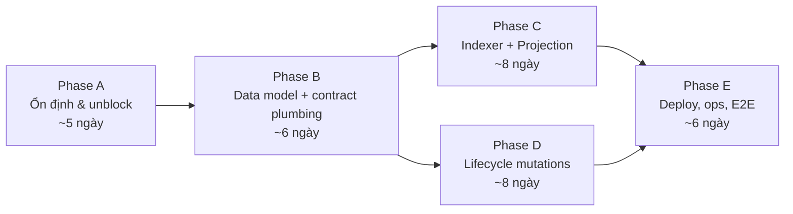
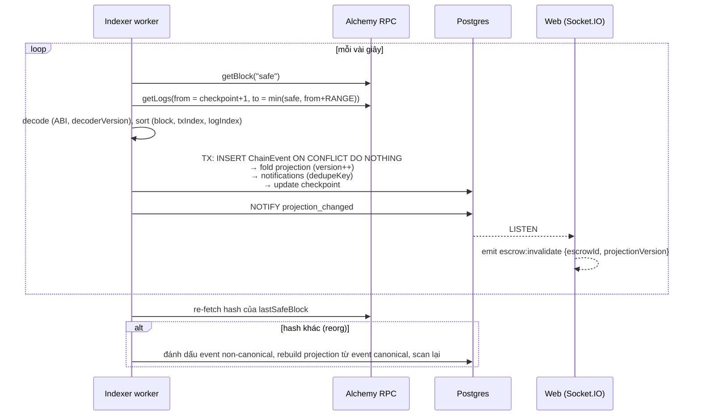

# Backend — Task còn lại để hoàn thiện (trừ AI)

**Ngày audit:** 27/09/2026 · **Nhánh:** `feat/ui-redesign-and-navbar` (gồm WIP chưa commit, sau khi pull PR #10/#11)
**Thứ tự và cách làm đã chốt:** xem [`BACKEND_EXECUTION_PLAN.md`](BACKEND_EXECUTION_PLAN.md). Khi có khác biệt, file đó là nguồn đúng.
**Nguồn yêu cầu:** `docs/PROPOSAL.md` v2.0 (UC-01..UC-05, FR-01..FR-11, §9.4–9.6, §15), `BloodyRoarEscrow.sol`.

**Quy ước**
- Priority: **P0** chặn tiêu chí nghiệm thu MVP (Proposal §15) · **P1** nên có trong MVP · **P2** sau MVP
- Size: **S** ≤ 1 ngày · **M** 1–3 ngày · **L** > 3 ngày (1 người)
- ID `BE-xx` là ID mới cho kế hoạch này; cột "Backlog" map sang ID trong `PRODUCT_BACKLOG.md` nếu có.

---

## 0. Tóm tắt

**Nửa marketplace đã tốt:** SIWE auth, profile, Issue CRUD, Application, chat (socket + persist), notifications, uploads, admin ban/unban, thống kê cơ bản. Authz ở resolver khá chặt, có xử lý race condition (serializable transaction, conditional `updateMany`).

**Nửa tiền (escrow) chưa có gì.** Không có ABI/address config, không có escrow GraphQL module (`graphql/schema.ts:28` vẫn comment), không có mutation trả calldata, Funding Reservation, Transaction Intent, bảng `ChainEvent`/`ProjectionCheckpoint`/`EscrowProjection`, Indexer worker, reconciliation hay timeout job. Bảng `Escrow` và `Transaction` chưa bao giờ được ghi, nên mọi thống kê dựa trên escrow luôn trả 0.

**Luồng off-chain hiện tại phải refactor, không chỉ bổ sung:** `assignDeveloper` chuyển thẳng `IN_PROGRESS`; approve submission chỉ lật cờ DB; dispute do web ADMIN "phán" bằng tỉ lệ float; Submission không có `deliveryHash`; Issue không có `deliveryDeadline`.

**Ước lượng:** khoảng 35–50 ngày công (1 người), trong đó Indexer + Projection + tích hợp escrow chiếm 20–25 ngày. Với 2 người backend (Khôi, Hiếu) và Kiên hỗ trợ tích hợp contract, cần khoảng 4–5 tuần.



---

## Phase A — Ổn định và unblock (tuần 1)

### A1. Đồng bộ nhánh

| ID | Task | P | Size | Ghi chú |
| --- | --- | --- | --- | --- |
| BE-00 | Commit WIP hiện tại, rồi merge `origin/main` (PR #6) vào nhánh. Giữ phần lớn code của nhánh này (mới và chặt hơn). Chỉ port `rejectApplication`, tùy chọn scalar `DateTime`, và viết lại kịch bản `e2e-application.ts` theo API mới. Bỏ quyền ADMIN thao tác Issue từ main (trái §9.4). Regenerate Pothos types, chạy typecheck + e2e. | P0 | S | Conflict dự kiến ~15 file: `application.module.ts`, `issue.module.ts`, `user.module.ts`, `chat.module.ts`, `schema.ts`, `context.ts`, `builder.ts`, `lib/auth.ts`, `lib/access.ts`, `socket/handlers.ts`, `login/route.ts`, `server.ts`, `schema.prisma`, `seed.ts`, `packages/shared/constants` |
| BE-71 | Sửa backlog/doc: bỏ auto-pay khi PR merged (S3-GH-07, US-8.4); sửa AC S1-MKP-08 theo UC-01; sửa S2-DSP-03 (admin chỉ draft); sửa `documentation_bloody-roar.md` §9 | P0 | S | Xem `README.md` mục 2–3 |

### A2. Bug cần sửa ngay (đã xác minh)

| ID | Lỗi | Bằng chứng | Cách sửa | P | Size |
| --- | --- | --- | --- | --- | --- |
| BUG-1 | Liên kết GitHub OAuth **luôn thất bại**: route start ký HMAC bằng chuỗi env raw, callback verify bằng key đã decode hex/base64url | `app/api/auth/github/start/route.ts:26` vs `callback/route.ts:12-17,40` | Dùng chung helper `keyBytes()` (chuyển vào `lib/github.ts`) + unit test | P1 | S |
| BUG-2 | Vòng propose→challenge dispute không giới hạn | `dispute.module.ts:410-418, 480-501` | Tạm thời chặn challenge lần 2; sau đó thay bằng luồng on-chain (BE-51..57) | P0 | S |
| BUG-3 | Không đăng nhập được admin: ví admin seed là `0x…dead`, không có cách nâng quyền | `packages/database/src/seed.ts:13-25`, `user.module.ts:14` | Env `ADMIN_WALLETS` đọc khi login/seed + CLI `scripts/grant-admin.ts` | P0 | S |
| BUG-4 | Tiền dùng GraphQL `Float` (input và output) | `issue.module.ts:92-95,302,339-340,506`, `analytics.module.ts:37,90`, `dispute.module.ts:32-39,387` | Scalar `Decimal` dạng string + type `TokenAmount {raw, decimals, formatted}` | P0 | M |
| BUG-5 | Server bind `localhost`, không truy cập được trong container Railway | `apps/web/server.ts:17` | Mặc định `0.0.0.0` khi production | P0 | S |
| BUG-6 | File generate lạc chỗ bị commit | `packages/database/apps/web/src/graphql/generated/pothos-types.ts` | Xóa, giữ một output duy nhất | P2 | S |
| BUG-7 | Query `issue(id)` tăng `viewCount` mỗi lần gọi (query có side effect) | `issue.module.ts:480-486` | Mutation `recordIssueView` hoặc dedupe theo session | P2 | S |
| BUG-8 | Sort `DEADLINE` bỏ qua `sortOrder` | `issue.module.ts:381-382` | Theo đúng chiều sort | P2 | S |
| BUG-9 | Nonce route log bằng `console.error` | `app/api/auth/nonce/route.ts:21` | Dùng pino logger | P2 | S |
| BUG-11 | Hằng số shared lệch contract: `ESCROW_TIMEOUT_DAYS = 30`, `DISPUTE_CHALLENGE_HOURS = 24`, `PLATFORM_FEE_PERCENT` float; payload socket `escrow:status` khác Proposal | `packages/shared/src/constants/index.ts:9-16`, `types/index.ts:108-112` | Module hằng số sinh từ contract (bps, giây) | P0 | S |
| BUG-12 | Socket vẫn sống sau khi JWT hết hạn/bị revoke | `socket/handlers.ts:65-80` | Kiểm session mỗi `message:send` hoặc hẹn disconnect tại `exp` | P1 | S |

### A3. Nền tảng an toàn và test

| ID | Task | P | Size | Backlog |
| --- | --- | --- | --- | --- |
| BE-60 | Env schema (zod) validate khi boot cho web và worker, fail-fast ở production; cập nhật `.env.example` (`ESCROW_ADDRESS`, `ESCROW_DEPLOY_BLOCK`, `CHAIN_ID`, `RPC_URL`, `USDC_ADDRESS`, `OWNER_SAFE`, `ARBITER_SAFE`, `FEE_RECIPIENT`, `S3_ENDPOINT`, `ADMIN_WALLETS`, `INDEXER_*`) | P0 | S | S0-FND-12 |
| BE-72 | Rate limiter (in-memory vì single replica theo §9.6, interface sẵn cho Redis) cho auth, uploads, GraphQL (theo cost), socket | P0 | M | NFR |
| BE-73 | Hardening GraphQL Yoga: `useCSRFPrevention`, giới hạn depth/complexity/alias (graphql-armor), tắt introspection ở production, giới hạn kích thước request | P0 | S | NFR |
| BE-01 | Rate-limit `/api/auth/nonce`, `/api/auth/login` theo IP + address | P0 | S | — |
| BE-02 | Kiểm `chain_id ∈ {84532, 31337}` và `domain` trong payload SIWE; map lỗi P2002 thành replay | P1 | S | S1-AUTH-02 |
| BE-05 | Bootstrap admin (BUG-3) | P0 | S | S0-FND-04 |
| BE-80 | Test harness: Postgres tạm (docker/testcontainers) + `prisma migrate reset` + test GraphQL qua `yoga.fetch` với fixture đã đăng nhập | P0 | M | S3-TST-04 |
| BE-85 | GitHub Actions: bun install → prisma generate → lint → typecheck → vitest → next build; service Postgres | P0 | M | S4-CICD-01 |
| BE-86 | Job CI cho contracts: compile, Hardhat test, forge fuzz/invariant, coverage gate, slither, deploy dry-run (bắt buộc theo §15) | P0 | S | S4-CICD-01 |

---

## Phase B — Data model và contract plumbing (tuần 2)

### B1. Schema mới (một migration `escrow_projection` + các migration phụ)

Giữ: `User`, `Token`, `Session`, `Issue` (+field), `Application`, `Message`, `Attachment` (+field), `Submission` (+field), `Review`, `IssueComment`, `Notification` (+`dedupeKey`), `AdminLog`, `TestCase`, `AILog`, `Attestation`.
Thay thế: `Escrow` → `EscrowProjection`; `Transaction` → `TransactionIntent`; bỏ enum `EscrowStatus`, `TransactionType`, `TransactionStatus`; `DisputeStatus` đổi thành mirror phase.

```prisma
enum IssueStatus { OPEN AWAITING_FUNDING IN_PROGRESS DISPUTED COMPLETED CANCELLED }
enum ReservationStatus { AWAITING_FUNDING FUNDED EXPIRED CANCELLED MISMATCHED }
enum EscrowPhase { NONE FUNDED DISPUTED INITIAL_RULING CHALLENGED FINAL_RULING RESOLVED }
enum ResolutionKind { NONE RELEASE MISSED_DELIVERY_REFUND REVIEW_TIMEOUT SETTLEMENT RULING ARBITER_TIMEOUT_SPLIT }
enum IntentStatus { AWAITING_SIGNATURE SUBMITTED PENDING_SAFE_HEAD CONFIRMED FAILED EXPIRED DROPPED }

model Issue { /* hiện có */ deliveryDeadline DateTime? termsVersion Int @default(1) termsHash String? }

model FundingReservation {
  id String @id @default(cuid())
  issueId String; applicationId String; clientId String; developerId String
  escrowKey String @unique        // chuỗi truyền vào deposit()
  escrowIdHash String @unique     // keccak256(utf8(escrowKey)) = topic trong event
  chainId Int; contractAddress String; tokenAddress String
  amountRaw Decimal @db.Decimal(78,0)
  deliveryDeadline DateTime; termsHash String; termsVersion Int
  intentSignature String?; intentNonce String? @unique; intentExpiresAt DateTime?
  status ReservationStatus @default(AWAITING_FUNDING)
  expiresAt DateTime              // now + 24h
  fundedAt DateTime?; createdAt DateTime @default(now()); updatedAt DateTime @updatedAt
  @@index([issueId, status])      // + partial unique index (1 reservation active / issue) bằng raw SQL
}

model TransactionIntent {
  id String @id @default(cuid())
  userId String; issueId String?; escrowKey String?
  chainId Int; contractAddress String; method String; args Json   // chỉ decimal string
  status IntentStatus @default(AWAITING_SIGNATURE)
  txHash String? @unique; submittedAt DateTime?; expiresAt DateTime
  failureReason String?; confirmedByEventId String?
  createdAt DateTime @default(now()); updatedAt DateTime @updatedAt
}

model ChainEvent {
  id String @id @default(cuid())
  chainId Int; contractAddress String; txHash String; logIndex Int
  blockNumber BigInt; blockHash String; txIndex Int
  eventName String; args Json; decoderVersion Int
  escrowIdHash String?
  canonical Boolean @default(true)
  firstSeenAt DateTime @default(now()); lastReconciledAt DateTime?
  @@unique([chainId, contractAddress, txHash, logIndex])
  @@index([escrowIdHash, blockNumber, txIndex, logIndex])
}

model ProjectionCheckpoint {
  chainId Int; contractAddress String
  lastScannedBlock BigInt; lastSafeBlock BigInt; lastCanonicalBlockHash String
  decoderVersion Int; replayStatus String; updatedAt DateTime @updatedAt
  @@id([chainId, contractAddress])
}

model EscrowProjection {
  id String @id @default(cuid())
  escrowIdHash String @unique; escrowKey String?; issueId String? @unique; reservationId String? @unique
  chainId Int; contractAddress String
  client String; developer String; arbiter String; feeRecipient String
  amountRaw Decimal @db.Decimal(78,0)
  depositedAt DateTime; deliveryDeadline DateTime; reviewDeadline DateTime   // deliveryDeadline + 7d
  termsHash String; deliveryHash String?
  phase EscrowPhase; resolutionKind ResolutionKind @default(NONE)
  clientAmountRaw Decimal? @db.Decimal(78,0); developerAmountRaw Decimal? @db.Decimal(78,0); platformFeeRaw Decimal? @db.Decimal(78,0)
  decisionHash String?; settlementProposer String?; settlementClientBps Int?
  disputeRaisedBy String?; disputeRaisedAt DateTime?; raiserEvidenceHash String?; counterpartyEvidenceHash String?
  challengedAt DateTime?
  orphan Boolean @default(false)          // deposit không đi qua backend
  projectionVersion Int @default(0); lastProjectedBlock BigInt
  updatedAt DateTime @updatedAt
}

model RulingRecord { id String @id @default(cuid()); escrowIdHash String; kind String /*INITIAL|FINAL*/; clientBps Int; decisionHash String; arbiter String; postedAt DateTime; noticeEndsAt DateTime; chainEventId String @unique }
model SettlementProposal { id String @id @default(cuid()); escrowIdHash String; proposer String; clientBps Int; status String /*PENDING|REVOKED|ACCEPTED|VOIDED*/; proposedEventId String @unique; closedEventId String? }
model ClaimableBalance { chainId Int; contractAddress String; address String; amountRaw Decimal @db.Decimal(78,0); updatedAt DateTime @updatedAt; @@id([chainId, contractAddress, address]) }
model ContractConfig { chainId Int; contractAddress String; paused Boolean; owner String; pendingOwner String?; arbiter String; pendingArbiter String?; feeRecipient String; pendingFeeRecipient String?; updatedAt DateTime @updatedAt; @@id([chainId, contractAddress]) }
model EvidenceManifest { id String @id @default(cuid()); disputeId String; submittedById String; manifest Json; manifestHash String @unique; storageKey String; onChainEventId String?; createdAt DateTime @default(now()) }
model ReconciliationFinding { id String @id @default(cuid()); escrowIdHash String?; kind String; expected Json; actual Json; blockNumber BigInt; resolvedAt DateTime?; createdAt DateTime @default(now()) }
// Submission: + deliveryHash String? @unique, manifest Json?, supersededAt DateTime?, onChainEventId String?
// Attachment: + purpose, sha256 String?, status (PENDING|ATTACHED), scanStatus (xem file AI)
// Notification: + dedupeKey String? @unique
// Dispute: tỉ lệ → Int bps; bỏ ANALYZING khỏi lifecycle (tách aiStatus riêng)
```

| ID | Task | P | Size | Phụ thuộc | Backlog |
| --- | --- | --- | --- | --- | --- |
| BE-41 | Thêm các model trên + migration đổi tên/bỏ bảng `escrows`/`transactions` chưa dùng | P0 | M | BE-30 | S2-ESC-05/06 |
| BE-75 | Bộ migration + bỏ header "FROZEN" trong `schema.prisma`, cập nhật `KHOI_TASKS.md` | P0 | M | BE-41 | — |
| BE-77 | Cột tiền raw dạng `Decimal(78,0)` trong bảng projection; `Issue.bountyAmount Decimal(20,6)` scale rõ ràng | P0 | S | BE-41 | NFR numeric |
| BE-14 | `Issue.deliveryDeadline`, `termsVersion`, `termsHash`; làm rõ `expiresAt` = hạn nhận application | P0 | S | — | S2-ESC-05 |
| BE-15 | `computeTermsHash(issue, approvedTestCases)` = keccak256(RFC 8785 canonical JSON) trong `packages/shared` (FE và BE dùng chung) | P0 | M | BE-14 | US-4.1, US-11.3 |
| BE-17 | API tiền: scalar Decimal string; `bountyAmount` nhận string; trả thêm `bountyAmountRaw` | P0 | M | — | NFR |

### B2. Contract plumbing

| ID | Task | P | Size | Phụ thuộc | Backlog |
| --- | --- | --- | --- | --- | --- |
| BE-30 | Module config contract: export ABI JSON từ artifacts vào `packages/shared/contracts/`; `{address, deployBlock, token}` theo chain từ env/manifest; thêm `deployBlock` vào manifest của `deploy.ts`. Backend chỉ cần RPC read-only + ABI (bỏ "Thirdweb SDK backend" trong backlog). Web đang dùng ethers v5 (thirdweb v4); worker dùng viem để độc lập. | P0 | S | Kiên deploy | S2-ESC-01 |
| BE-33 | `escrow.module.ts`: type `EscrowProjection`, `FundingReservation`, `TransactionIntent`, `PreparedCall {contractAddress, chainId, method, typedArgs (decimal string), value, intentExpiry}` | P0 | M | BE-30 | S2-ESC-07 |
| BE-35 | `TransactionIntent` + `recordTransactionSubmitted(intentId, txHash)`. State machine `AWAITING_SIGNATURE → SUBMITTED → PENDING_SAFE_HEAD → CONFIRMED / FAILED / EXPIRED / DROPPED`. Chỉ indexer/reconciler được set CONFIRMED/FAILED. | P0 | M | BE-33 | S2-ESC-06 |
| BE-41f | Sinh `escrowKey` và lưu `escrowIdHash` lúc tạo reservation (quyết định D7) | P0 | S | BE-31 | — |

---

## Phase C — Indexer và Projection (tuần 3, song song Phase D)

Thiết kế: process riêng (`apps/indexer` hoặc `apps/web/worker.ts`), chạy thành Railway worker service, dùng chung `@bloody-roar/database` và `@bloody-roar/shared`.



| ID | Task | P | Size | Phụ thuộc | Backlog |
| --- | --- | --- | --- | --- | --- |
| BE-40 | Skeleton worker: entrypoint, config, graceful shutdown, HTTP `/health` (last safe head, checkpoint age, RPC latency, retry queue, projection lag), scheduler cho reservation/deadline/cleanup | P0 | M | BE-60 | S2-ESC-13 |
| BE-41a | Log scanner (safe head, chia range theo giới hạn Alchemy, sort, insert idempotent, checkpoint) | P0 | M | BE-40, BE-41 | S2-ESC-13 |
| BE-41b | Hàm fold thuần (không I/O) `fold(projection, event) → projection'` cho cả 20 event; số tiền `EscrowResolved` lấy từ event | P0 | L | BE-41 | FR-11 |
| BE-41c | Phát hiện reorg + rollback + rebuild projection | P0 | M | BE-41a | FR-11 |
| BE-41d | CLI replay `indexer replay --from <block>` + decoder versioning | P1 | S | BE-41b | FR-11 |
| BE-41e | Harness tích hợp: hardhat node + MockUSDC + deploy + chạy script lifecycle → assert projection; mô phỏng reorg (`evm_revert` / anvil) | P0 | L | BE-41a..c | S3-TST-08 |
| BE-82 | Unit test fold (table-driven cho mọi event và transition; số phí theo event) | P0 | M | BE-41b | FR-11 |
| BE-59b | Cầu nối invalidation: worker `NOTIFY` sau mỗi commit fold → web `LISTEN` → `io.to("task:{issueId}").emit("escrow:invalidate", {escrowId, projectionVersion})`. Redis vẫn deferred theo §9.6. | P0 | M | BE-41 | NFR realtime |
| BE-66b | Reconciler cho TransactionIntent: lấy receipt các intent SUBMITTED → FAILED (status 0, decode custom error cho UI), DROPPED/EXPIRED sau N block; không bao giờ set CONFIRMED chỉ từ receipt | P0 | S | BE-35 | §4.2, invariant 6 |
| BE-66 | Reconciler định kỳ: gọi `getEscrow/getDispute/getSettlement/claimable` ở safe block, so với projection, ghi `ReconciliationFinding`; kiểm `isSolvent()` và `accountedBalance()` | P1 | M | BE-41b | §9.5 |
| BE-66c | Phát hiện deposit không khớp reservation (terms khác) | P0 | S | BE-36 | UC-01 |

Event lạ (deposit không đi qua backend): lưu event, projection `orphan = true`, báo admin. Event governance (`Paused/Unpaused`, `Ownership*`, `Arbiter*`, `FeeRecipient*`) fold vào `ContractConfig`.

---

## Phase D — Lifecycle mutations (tuần 3–4)

**Nguyên tắc:** chỉ indexer (fold projection) được đưa Issue ra khỏi `AWAITING_FUNDING`, `IN_PROGRESS`, `DISPUTED`. Mutation GraphQL chỉ tạo bản nháp off-chain (nội dung submission, evidence manifest, settlement draft) và trả calldata. Backend không giữ key, không broadcast, không ký thay (Proposal §4.2).

```
Issue: OPEN ──selectDeveloper──► AWAITING_FUNDING ──Deposited (canonical)──► IN_PROGRESS (FUNDED)
         ▲                             │ reservation hết hạn / client hủy
         └─────────────────────────────┘
IN_PROGRESS: WorkSubmitted (n lần) · Settlement* · DisputeRaised → DISPUTED
DISPUTED: DISPUTED / INITIAL_RULING / CHALLENGED / FINAL_RULING · vẫn cho Settlement
Terminal: EscrowResolved(kind) → COMPLETED + outcome · sau đó Claimed giảm ClaimableBalance
CANCELLED: chỉ từ OPEN / AWAITING_FUNDING
```

### D1. Selection và funding (UC-01)

| ID | Task | P | Size | Phụ thuộc | Backlog |
| --- | --- | --- | --- | --- | --- |
| BE-31 | Model `FundingReservation` + `IssueStatus.AWAITING_FUNDING` | P0 | M | BE-14 | S2-ESC-05 |
| BE-23 | Thay `assignDeveloper` bằng `selectDeveloper(issueId, applicationId, deliveryDeadline)` → tạo reservation 24h, **giữ nguyên** các application khác (PENDING), thông báo "được chọn, chờ fund" | P0 | M | BE-31 | S1-MKP-08 (sửa AC) |
| BE-32 | Spec EIP-712 `FundingIntent` dùng chung (QĐ-18: ký ở bước fund, domain `{name: "BloodyRoarEscrow", version: "1", chainId, verifyingContract}`, message `{escrowId, client, developer, token, amount, deliveryDeadline, termsHash, intentExpiry, nonce}`, hạn 30 phút) + verifier backend (viem) + mutation `submitFundingIntent` + chống replay nonce | P0 | M | BE-15, BE-31 | S2-ESC-02/04 |
| BE-34 | `prepareEscrowDeposit(reservationId)`: trả 2 bước (ERC-20 `approve` nếu allowance thiếu, rồi `deposit(escrowKey, developer, amountRaw, deliveryDeadline, termsHash)`), kiểm số dư qua RPC, kiểm contract không paused, ghi `TransactionIntent` | P0 | M | BE-32, BE-33 | S2-ESC-08 |
| BE-36 | Fold `Deposited`: xác minh client/developer/amount/deadline/termsHash khớp reservation → Issue `IN_PROGRESS`, set `developerId`, application ACCEPTED, các application khác REJECTED, thông báo | P0 | M | BE-41 | UC-01 bước 5 |
| BE-37 | Job hết hạn reservation → `EXPIRED`, Issue về `OPEN`, thông báo. Chính sách cho deposit đến **sau** khi hết hạn: nếu Issue vẫn OPEN và chưa gán thì chấp nhận, ngược lại hiển thị để hai bên settle (contract không có cancel). Ghi rõ vào tài liệu. | P0 | S | BE-40 | UC-01 bước 5 |
| BE-38 | `cancelReservation` (client) | P1 | S | BE-31 | US-3.6 |
| BE-16 | `updateIssue`: material edit tăng `termsVersion`, từ chối khi có reservation active, yêu cầu chữ ký mới | P1 | S | BE-31 | §9.4 |

### D2. Submission, release, timeout, claim (UC-02, UC-03)

| ID | Task | P | Size | Phụ thuộc | Backlog |
| --- | --- | --- | --- | --- | --- |
| BE-39 | `Submission.deliveryHash`, `manifest`, `supersededAt`, `onChainEventId`. Manifest = RFC 8785 JSON `{issueId, submissionId, descriptionSha256, prUrl, commitSha, attachments[{key, sha256, mime, size}]}`, `deliveryHash = keccak256` | P0 | M | BE-15 | S1-SC-04 |
| BE-39a | `submitWork` → tạo bản nháp + trả calldata `prepareSubmitWork`; **cho phép thay** đến hết deadline (hiện đang chặn khi còn bản chờ review, trái contract); từ chối sau deadline | P0 | M | BE-33, BE-39 | FR-07 |
| BE-39b | Fold `WorkSubmitted` (match theo hash; hash lạ → lưu "external delivery") + thông báo client | P0 | S | BE-41 | UC-02 |
| BE-42 | `prepareReleaseFunds` (client, phase FUNDED, có deliveryHash on-chain) | P0 | S | BE-33 | S2-ESC-09 |
| BE-43 | `reviewSubmission(approved:false)` → `requestChanges` (ghi chú off-chain + thông báo); "approve" chính là release | P1 | S | BE-42 | — |
| BE-44 | Fold `EscrowResolved` (mọi kind) → trạng thái terminal + outcome + số tiền từ event + ghi có `ClaimableBalance` | P0 | M | BE-41 | FR-08 |
| BE-45 | `prepareClaimMissedDeliveryRefund` (FUNDED, không có delivery, now > deadline) | P0 | S | BE-33 | S1-SC-06 |
| BE-46 | `prepareClaimReviewTimeout` (FUNDED, có delivery, now ≥ deadline + 7d, cố định) | P0 | S | BE-33 | S1-SC-07 |
| BE-48 | `prepareClaim(recipient)` + projection `ClaimableBalance` (cộng từ `EscrowResolved`, trừ từ `Claimed`) + query `myClaimable` | P0 | M | BE-44 | D5 |
| BE-47 | Scheduler deadline trong worker: thông báo khi một exit mở (missed delivery, review timeout, hết challenge, hết final notice, arbiter stall, sắp hết evidence window); `EscrowProjection.availableActions` tính ở server từ projection + thời gian chain | P1 | M | BE-40 | US-10.1 |

### D3. Settlement (UC-04)

| ID | Task | P | Size | Phụ thuộc | Backlog |
| --- | --- | --- | --- | --- | --- |
| BE-49 | `prepareProposeSettlement(issueId, clientBps 0..10000)`, `prepareRevokeSettlement`, `prepareAcceptSettlement` + pre-check (participant, phase ≠ RESOLVED, chỉ 1 proposal, counterparty mới được accept) | P1 | M | BE-33 | S2-ESC-10 |
| BE-49a | Model lịch sử `SettlementProposal`; fold `SettlementProposed/Revoked`, đánh dấu ACCEPTED khi `EscrowResolved(SETTLEMENT)`; thông báo | P1 | S | BE-41 | UC-04 |

### D4. Dispute và ruling (UC-05) — thay luồng off-chain hiện tại

| ID | Task | P | Size | Phụ thuộc | Backlog |
| --- | --- | --- | --- | --- | --- |
| BE-51 | Schema: `Dispute` giữ phần case off-chain; thêm `EvidenceManifest`, `RulingRecord` (INITIAL/FINAL); `DisputeStatus` thành mirror phase; tỉ lệ Int bps | P0 | M | BE-41 | S2-DSP-01 |
| BE-52 | Builder evidence manifest (canonical JSON, hash nội dung file đã upload) + private storage + mutation `createEvidenceManifest` | P0 | M | BE-50, BE-15 | S2-ESC-11 |
| BE-53 | `prepareRaiseDispute(issueId, manifestId)`, `prepareSubmitCounterpartyEvidence` (kiểm cửa sổ 72h, 1 lần) | P0 | S | BE-52, BE-33 | FR-10 |
| BE-54 | Admin "draft ruling": `draftRuling(issueId, clientBps, rationale)` → lưu decision document, tính `decisionHash`, trả JSON Safe Transaction Builder cho `postInitialRuling`/`postFinalRuling`. **Không ký.** Bỏ state mutation của `proposeDisputeResolution`. | P0 | M | BE-51 | S2-DSP-03 (viết lại) |
| BE-55 | `prepareChallengeRuling` (chỉ bên mất principal, 1 lần, trước `challengeEndsAt`), `prepareFinalizeRuling`, `prepareFinalizeArbiterTimeoutSplit` (cả 2 phase) | P0 | S | BE-33 | S2-DSP-04 |
| BE-56 | Fold `DisputeRaised`, `CounterpartyEvidenceSubmitted`, `InitialRulingPosted`, `RulingChallenged`, `FinalRulingPosted`, `EscrowResolved(RULING / ARBITER_TIMEOUT_SPLIT)` + thông báo 2 bên | P0 | M | BE-41 | FR-10 |
| BE-57 | Gỡ luồng `raiseDispute` lật status off-chain và `challengeDisputeResolution` sau khi BE-53..56 xong | P0 | S | BE-56 | — |
| BE-58 | Admin xem evidence qua signed URL, ghi `AdminLog` | P1 | S | BE-52 | US-7.2 |

### D5. Bảng map contract → backend (checklist implement)

| Hàm contract (người gọi) | Mutation chuẩn bị | Pre-check (projection + thời gian chain) | Event | Hiệu ứng off-chain |
| --- | --- | --- | --- | --- |
| `approve` (client) | trong `prepareEscrowDeposit` | allowance < amount | — | — |
| `deposit` (client) | `prepareEscrowDeposit` | reservation còn hạn; intent hợp lệ; deadline tương lai; developer ≠ client; không paused | `Deposited` | Issue IN_PROGRESS, chốt selection, thông báo |
| `submitWork` (dev) | `prepareSubmitWork` | FUNDED, now ≤ deadline | `WorkSubmitted` | submission confirmed, báo client |
| `releaseFunds` (client) | `prepareReleaseFunds` | FUNDED, có deliveryHash | `EscrowResolved(RELEASE)` | COMPLETED, reputation, claimable |
| `claimMissedDeliveryRefund` (ai cũng được) | `prepareClaimMissedDeliveryRefund` | FUNDED, không delivery, quá deadline | `EscrowResolved(MISSED_DELIVERY_REFUND)` | thông báo |
| `claimReviewTimeout` (ai cũng được) | `prepareClaimReviewTimeout` | FUNDED, có delivery, ≥ deadline + 7d | `EscrowResolved(REVIEW_TIMEOUT)` | thông báo |
| `proposeSettlement` / `revokeSettlement` / `acceptSettlement` | `prepare*Settlement` | ≠ RESOLVED; 1 proposal; đúng người | `SettlementProposed/Revoked`, `EscrowResolved(SETTLEMENT)` | thông báo counterparty |
| `raiseDispute` (party) | `prepareRaiseDispute` | FUNDED | `DisputeRaised` | Issue DISPUTED, vào queue admin |
| `submitCounterpartyEvidence` | `prepareSubmitCounterpartyEvidence` | DISPUTED, counterparty, < raisedAt + 72h, chưa nộp | `CounterpartyEvidenceSubmitted` | báo queue arbiter |
| `postInitialRuling` (Arbiter Safe) | `draftRuling` → Safe tx JSON | DISPUTED, ≥ raisedAt + 72h, < raisedAt + 30d | `InitialRulingPosted` | báo 2 bên (challenge 7d) |
| `challengeRuling` (bên thua) | `prepareChallengeRuling` | INITIAL_RULING, < +7d, người gọi mất principal | `RulingChallenged` | thông báo |
| `postFinalRuling` (Arbiter Safe) | `draftRuling(final)` | CHALLENGED, < challengedAt + 30d | `FinalRulingPosted` | thông báo |
| `finalizeRuling` (ai cũng được) | `prepareFinalizeRuling` | INITIAL ≥ 7d hoặc FINAL ≥ 24h | `EscrowResolved(RULING)` | thông báo |
| `finalizeArbiterTimeoutSplit` (ai cũng được) | `prepareFinalizeArbiterTimeoutSplit` | DISPUTED ≥ raisedAt + 30d hoặc CHALLENGED ≥ challengedAt + 30d | `EscrowResolved(ARBITER_TIMEOUT_SPLIT)` | thông báo |
| `claim(recipient)` (ai cũng được) | `prepareClaim` | claimable > 0 | `Claimed` | báo recipient |
| `pause/unpause`, xoay role (Owner Safe) | chỉ hiển thị | — | `Paused/Unpaused`, `*Transfer*` | banner admin, chặn reservation mới khi paused |

---

## Các khu vực còn lại (làm xen kẽ)

### Issue, Application, User

| ID | Task | P | Size | Backlog |
| --- | --- | --- | --- | --- |
| BE-20 | Mở rộng `IssueRef`: `escrow`, `reservation`, `latestSubmission`, `viewerCapabilities { canFund, canRelease, canDispute, … }` để FE không tự suy luận | P1 | M | — |
| BE-22 | Port `rejectApplication` từ main | P1 | S | S1-MKP-07 |
| BE-18 | `publishIssue` / tạo dạng draft (hoặc bỏ `isDraft` khỏi API) | P2 | S | S1-MKP-04 |
| BE-19 | `attachIssueFile(issueId, key, …)` verify upload | P2 | S | S1-MKP-20 |
| BE-21 | Cursor pagination cho `myIssues`, `applications`, `notifications`, `adminDisputes`, `adminUsers` | P2 | S | NFR |
| BE-09 | **Đã chốt (QĐ-21):** bỏ chặn theo role ở `createIssue`/`applyToIssue`, suy quyền theo từng Issue; `role` chỉ còn nghĩa workspace mặc định; ADMIN không đăng bài/ứng tuyển. | P1 | S | US-2.2 |
| BE-12 | Module Review: `submitReview` sau khi terminal thành công; tính lại `reputationScore`/`completedTaskCount` trong fold | P1 | M | US-2.4 |
| BE-10 | `email` trong `updateProfile` | P2 | S | S1-AUTH-06 |
| BE-11 | Upload avatar | P2 | M | S1-MKP-17 |
| BE-13 | Khi ban: tự hủy issue OPEN/application pending hoặc ẩn khỏi marketplace | P2 | S | US-9.2 |
| BE-03 / BE-04 | Session refresh + `mySessions`/`revokeSession`; job dọn session hết hạn | P2 | M/S | US-2.3 |
| BE-06 / BE-07 / BE-08 | Sửa BUG-1; `unlinkGithub` + lỗi `GITHUB_ALREADY_LINKED`; ngừng lưu access token (scope `read:user` không cần) | P1/P2 | S | S3-GH-02/03 |

### Chat, notifications, uploads

| ID | Task | P | Size | Backlog |
| --- | --- | --- | --- | --- |
| BE-59 | Rate limit socket (ví dụ 10 tin / 10 giây / user) + `maxHttpBufferSize` | P0 | S | NFR |
| BE-59a | **Đã chốt (QĐ-24):** chat viết được ở `AWAITING_FUNDING`, `IN_PROGRESS`, `DISPUTED`; gắn cờ `afterDispute`; chỉ đọc sau khi kết thúc | P1 | S | FR-05 |
| BE-59c / BE-59d | Sửa/xóa mềm tin nhắn; unread count theo room | P2 | S | — |
| BE-61 | Mở rộng `NotificationType` (FUNDING_REQUIRED, RESERVATION_EXPIRED, DEPOSIT_CONFIRMED, WORK_SUBMITTED, CHANGES_REQUESTED, SETTLEMENT_PROPOSED/REVOKED, EVIDENCE_SUBMITTED, RULING_POSTED, RULING_CHALLENGED, ESCROW_RESOLVED, FUNDS_CLAIMABLE, DEADLINE_APPROACHING) + `dedupeKey @unique` | P1 | S | S3-ANL-03 |
| BE-62 | Gắn notification vào fold (idempotent theo dedupeKey) và cầu NOTIFY | P1 | M | S3-ANL-05 |
| BE-63 | Chat notification dùng chung `createNotification` | P2 | S | — |
| BE-50 | Storage adapter hỗ trợ `S3_ENDPOINT`, `S3_FORCE_PATH_STYLE` (Supabase S3 API) + bucket private | P0 | S | S1-CHAT-04 |
| BE-50a | "Purpose" cho upload (`CHAT`, `ISSUE_IMAGE`, `DELIVERY`, `EVIDENCE`, `AVATAR`) + bản ghi pending + tính/verify sha256 | P0 | M | FR-10 |
| BE-50b | Phân quyền tải file DELIVERY/EVIDENCE (participant + admin khi dispute) | P0 | S | §9.5 |
| BE-50c | Job xóa upload không gắn sau 24h | P2 | S | — |

### Admin, analytics, GitHub

| ID | Task | P | Size | Backlog |
| --- | --- | --- | --- | --- |
| BE-64 | `adminLogs`, `adminIssues`, `adminHideIssue` | P1 | S | S3-ANL-07 |
| BE-65 | Query ops: `indexerStatus`, `reconciliationFindings`, `stuckIntents`, `contractConfig` | P1 | M | §9.6 |
| BE-66a | `setUserRole` (ADMIN, không tự hạ quyền, ghi AdminLog) | P2 | S | US-9.2 |
| BE-67 | Tính lại mọi thống kê tiền từ `EscrowProjection`/`ClaimableBalance` (tổng integer dạng decimal string) | P1 | S | S3-ANL-01 |
| BE-68 | `userStats(userId)` public; `adminStats` thêm tỉ lệ dispute, thời gian giải quyết, phí thu, user theo tuần | P2 | M | S3-ANL-02, US-9.4 |
| BE-69 | Dedupe `X-GitHub-Delivery` + dung sai thời gian 5 phút | P2 | S | S3-GH-06 |
| BE-70 | PR merged → chỉ thông báo client (evidence, không release) | P2 | S | S3-GH-07 (viết lại) |

### Test, deploy, observability

| ID | Task | P | Size | Backlog |
| --- | --- | --- | --- | --- |
| BE-74 | Tài liệu ma trận authz + test resolver (mỗi mutation × {anon, non-participant, client, developer, admin, banned}) | P1 | M | §15 |
| BE-81 | Test resolver Issue/Application/Submission/Dispute/Notification/Admin, gồm race (apply/assign song song) | P1 | M | S3-TST-01/04 |
| BE-83 | E2E lifecycle trên chain local: reserve → ký intent → deposit → submit → release → claim; thêm nhánh missed delivery, review timeout, settlement, dispute (`evm_increaseTime`) | P0 | L | S3-TST-08/09 |
| BE-84 | Chuyển các script `e2e-*.ts` thành job CI | P1 | S | S2-TST-01/02 |
| BE-87 | `prisma migrate diff` kiểm drift trong CI; secret scanning (gitleaks/betterleaks) | P1 | S | §15 |
| BE-76 | Seed: đọc `ADMIN_WALLETS`; token local lấy từ deploy manifest; script `seed:demo-chain` chạy trọn lifecycle trên hardhat để có dữ liệu demo mọi phase | P1 | M | S0-FND-04 |
| BE-88 | Dockerfile (bun, multi-stage, `next build`, chạy `server.ts`), bind `0.0.0.0`, graceful shutdown | P0 | M | S4-CICD-04 |
| BE-89 | Railway: service web + worker (cùng image, khác start command), healthcheck, `prisma migrate deploy` trước deploy, env group | P0 | M | S4-CICD-05 |
| BE-90 | Supabase: Postgres (pooled `DATABASE_URL` + `DIRECT_URL`), bucket private, service key chỉ ở server | P0 | S | S4-CICD-03 |
| BE-91 | Guard môi trường: từ chối start nếu `CHAIN_ID` khác manifest hoặc không có bytecode tại address | P1 | S | §9.6 |
| BE-92 | Runbook rollback (redeploy image trước; contract không upgrade) | P2 | S | §9.6 |
| BE-93 | Correlation ID (`x-request-id` → AsyncLocalStorage → pino mixin) cho HTTP/GraphQL/socket; plugin Yoga log tên op, thời gian, lỗi; field chuẩn §9.6 | P1 | S | §8.2 |
| BE-94 | Sentry (web + worker) có lọc PII | P2 | S | S4-CICD-02 |
| BE-95 | Metrics/health worker + hook cảnh báo | P1 | S | §9.6 |

---

## Phân công gợi ý (theo Proposal §12)

| Người | Trọng tâm |
| --- | --- |
| Kiên | Chốt D1–D7, deploy Base Sepolia (S2-ESC-14), BE-30, BE-86, hỗ trợ BE-41b/41e, review mọi thay đổi liên quan tiền |
| Khôi | BE-00, Phase C (indexer, reconciler, NOTIFY), BE-40, BE-88..95, sau đó AI |
| Hiếu | Phase B schema, Phase D mutations (reservation, EIP-712, submission, settlement, dispute), BE-17, BE-74 |
| Hân / Trâm | Ma trận E2E theo state (xem `UI_REDESIGN_SPEC.md`), tích hợp FE với `PreparedCall` + 5 trạng thái transaction |

---

## Checklist AI (tách riêng, không tính vào kế hoạch trên)

Chi tiết phân tích và hướng xử lý v1/v2 nằm trong [`AI_STRATEGY_V1_V2.md`](AI_STRATEGY_V1_V2.md).

**Đã có code**
- [x] Model router `apps/web/src/ai/model-router.ts` (OpenAI-compatible: `AI_BASE_URL` → Groq → OpenAI, timeout theo task, `AILog` chỉ lưu hash)
- [x] AI Guard cho text chat: 21 regex (`ai/guard/scanner.ts`) + LLM pass thứ hai (`ai/guard/service.ts`), gắn vào `socket/handlers.ts:268`
- [x] Sinh test case: `generateTestCases`, `testCases`, `updateTestCase` (`graphql/modules/ai/ai.module.ts`)
- [x] Phân tích dispute 1 lần gọi, advisory: `analyzeDispute` (`dispute.module.ts:199-379`)
- [x] Model `AILog`

**Còn thiếu / cần sửa**
- [ ] Guard bỏ qua tin nhắn `type: "FILE"` (nội dung do client gửi, không được mask) và tên file
- [ ] Không quét nội dung file upload trong chat (server không đọc bytes; zip/tar không được kiểm)
- [ ] Hash SHA-256 không salt của nội dung gốc (`Message.originalHash`, `AILog.inputHash`) → chuyển sang HMAC với khóa server
- [ ] Regex `0x` + 64 hex bắt nhầm tx hash / bytes32 / `termsHash` / `decisionHash`
- [ ] Không có regex seed phrase (nên dùng wordlist BIP-39 + checksum)
- [ ] Guard chưa áp dụng cho comment, mô tả issue, mô tả submission, lý do dispute, cover letter
- [ ] Guard gửi toàn bộ chat tới provider bên thứ ba mà không có consent; timeout 2,5s × 3 provider nối tiếp (tối đa ~7,5s)
- [ ] `AI_GUARD_PATTERNS` trong `packages/shared` không dùng và quá rộng → xóa
- [ ] Sinh test case chưa dùng repo context (`githubRepo` có nhưng không đọc); không có `createTestCase`/`deleteTestCase`; criteria đã approve chưa được đưa vào `termsHash`
- [ ] Chưa có đánh giá mức độ hoàn thành submission (không code, không schema, không prompt)
- [ ] Dispute AI: chưa chống prompt injection; prefill tỉ lệ vào form admin (anchoring); ghi đè report khi phân tích lại (không lịch sử, không prompt version); tỉ lệ float 0–100 thay vì bps; dispute có thể kẹt ở `ANALYZING`; participant đọc được `aiReport` qua query `dispute`
- [ ] Không có rate limit/quota cho AI; `costUsd` không được tính; không có dashboard AI cho admin
- [ ] File prompt `.md` trong `ai/prompts/` không được code load (lệch với prompt inline)
- [ ] `GOOGLE_GENERATIVE_AI_API_KEY` khai báo nhưng không dùng
- [ ] Không có bộ eval (50+ case guard, 10+ kịch bản dispute, độ ổn định output)
- [ ] Multi-agent debate (Epic 12) chưa có; theo Proposal §5.2 đây không phải cam kết MVP
